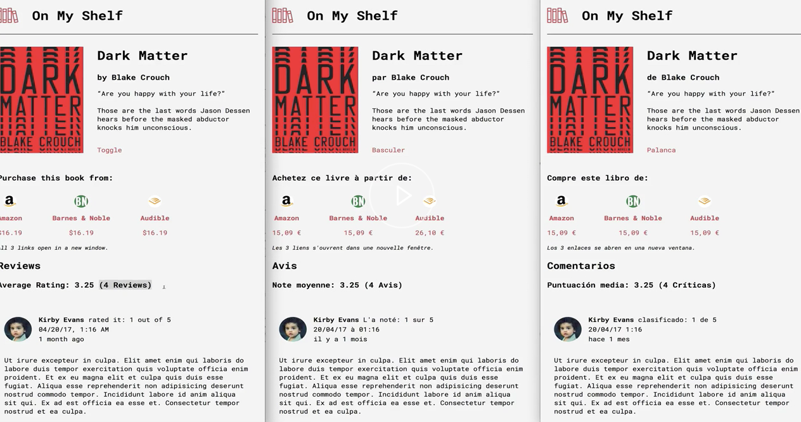

[00:02] Let's take a look at rendering a complex message. Currently, no matter how many reviews a book has, even if it's zero, our app always renders the number of reviews than the word reviews.

[00:14] Let's change this to be a bit more friendly. First, let's update this average rating constant to be a ternary operator. We'll say `book.reviews.length` which means if there are reviews in the `book.reviews` array, then return that average. Otherwise, if `book.reviews.length` is falsy, meaning there are no reviews, we'll return `0`. 

```javascript
const avgRating = book.reviews.length ? round(meanBy(book.reviews, (r) => r.rating), 2) : 0;
```

I'll add another entry into the `averageRating` `FormattedMessage` component, and I'll just format that here. I want to add another `values` key, and I'll say `count`. To the `count` key I'll add `book.reviews.length`, and I'm also going to delete this text in the parentheses, as we'll be moving that into the messages file which we'll take a look at now.

```HTML
<FormattedMessage id="detail.averageRating" 
values={{ avg: avgRating , count: book.reviews.length} } />
```      

[01:19] Instead of always rending a number and then the word reviews, we'll render something different, depending on the number. I'll add the parentheses back and we'll add an INTL placeholder tag, and that's just the curly braces. I'll pass our `count` prop, I'll add a comma, and the key word of `plural`.

```javascript
export default {
  'en-US': {
    detail: {
      author: 'by {author}',
      toggle: 'Toggle',
      purchase: 'Purchase this book from:',
      window: '<small><em>All {numMerchants} links open in a new window.</em></small>',
      reviewsHeading: 'Reviews',
      averageRating: 'Average Rating: {avg} ({count, plural})',
      userRating: '{name} rated it: {rating} out of 5',
      inputPlaceholder: 'What did you think? Enter your review here.'
    }
  }
},
...
```

[01:39] `plural` gives us the ability to render different messages based on the value of count. Next I'll add another comma, and we'll say if `count = 0` then we'll render another INTL placeholder tag, and we'll render the text no reviews yet.

```javascript
averageRating: 'Average Rating: {avg} ({count, plural, =0 {No Reviews Yet!}})',
```

[02:01] I'll go past the placeholder tag there, and we'll type the key word of one. If there's one review or in this case if count is one, we'll pass another INTL placeholder tag. This time we're going to say `# Review`.

```javascript
averageRating: 'Average Rating: {avg} ({count, plural, =0 {No Reviews Yet!} one {# Review}})',
```

[02:22] What this means is this `#` is a token that will be replaced with `count`. If there's one review, the number one will replace the pound symbol here. Then we'll have the word review. I'll add a space and then I'll say other, and another placeholder tag. I'll add another `#` with the word `Reviews`, plural.

```javascript
averageRating: 'Average Rating: {avg} ({count, plural, =0 {No Reviews Yet!} one {# Review} other {# Reviews}})',
```

[02:48] If `count = 0` we'll render no reviews yet. If there's 1 review, we'll say 1 review. Otherwise, we'll say the number of reviews and then the word reviews. I'll add this in the different languages, and now we can see our average rating is still displayed, and we've got the number of reviews in the parentheses.

```javascript
averageRating: 'Puntuación media: {avg} ({count, plural, =0 {No hay comentarios todavía!} one {# Crítica} other {# Críticas}})',
averageRating: 'Note moyenne: {avg} ({count, plural, =0 {Pas encore de commentaires!} one {# La revue} other {# Avis}})',
```

[03:13] Just so we can see, I'll update this book to have 0 reviews. With that change we can see the no reviews yet text is displayed. I'll update this book to have one review now. You can see that text is displayed now as well.

