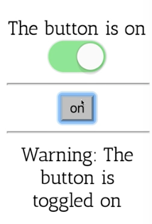

Instructor: [00:01] Your `Toggle` component's been around for a while. People have started using it, and somebody comes to you and says, "Hey, listen. I've got this `MyToggle` implementation that has a `render` method with a button, and it's pretty cool."

[00:11] Then I added a `static` property on this `MyToggle` called `toggleMessage`. Then when I went down to `render` it inside the `Toggle` component, I said `MyToggleWrapper.ToggleMessage`. I expected that to work, but it didn't. It threw this giant error, and I have no idea what's going on.

[00:30] It says that this is undefined or something. What's the deal? You say, what's actually happening is `MyToggleWrapper` is not the same thing as `MyToggle`. The `ToggleMessage` is available on `MyToggle`, but it's not available on `MyToggleWrapper`.

[00:47] Then you say, I'm exporting the `MyToggleWrapper`. I'm not actually exporting `MyToggle`, and I don't want to have to decide which is which. I basically want to have it so that when `MyToggle` is wrapped with this `withToggle` higher order component factory, what I get back is going to have all the same static properties that I expect exist on `MyToggle`.

[01:08] I can use it just like `MyToggle` was, and the fact that it's using a higher order component is not really observable. We're trying to solve the problem that using a higher order component is observable. We want to make that as in-observable as possible.

[01:21] We want to make it so that when people use this, it's as natural as possible. Basically, we need to take all of the static properties on the component that we're wrapping, and add them to the wrapped version of that component.

[01:34] We could just iterate through all the keys on the component, and apply those to the wrapper, but we don't want all of those things. If we specify a `displayName` on `MyToggle`, then I don't want to override the wrapper's display name.

[01:46] Also, `contextTypes`, I want to keep those. We pretty much want to keep all the React-specific ones, and only hoist up the non-React ones. There's actually a library for this for `hoist-non-react-statics`. I'm going to go ahead and add a `script` tag up here at the top of the page for that.

[02:05] Then we can go down here to our wrapper implementation, and instead of returning the `Wrapper`, we're going to `return hoistNonReactStatics(Wrapper, Component)` with the wrapper and the component. With that, everything should be working just fine.

```js
return hoistNonReactStatics(Wrapper, Component)
```

[02:21] We get that warning when we turn the button on and off. What this library is essentially doing is it's taking all of the static properties of the class that we pass in and applying those to the `Wrapper` class, but only those which are not React static properties, like `displayName`, `contextTypes`, or `PropTypes`.



[02:42] Doing this makes the fact that we're using a higher order component when we export the `MyToggleWrapper` a little less observable, so that folks using the `MyToggleWrapper` can use all of the statics that are available on the underlying component without having to worry about the fact that they're actually using the wrapped component. We're doing this using the `hoist-non-react-statics library` (linked in lesson description).