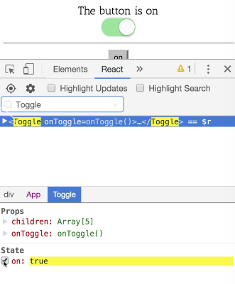

[00:00] The React Dev Tool is a really handy tool to allow us to interact with our live React application. For example, if I wanted to interact with the Toggle component, I just simply search for it there and then I can toggle the `onState` of the Toggle component and it updates my app in real time, which is pretty cool.



[00:15] Now let's say I wanted to interact with the `MyToggle` component. I'll just search for that and I get no search results. Why is that? What's going on here? The way that React works with the component tree here is it's going to take the name of the component and in this case, this component is a function. The name property of App is going to be `App`.

[00:35] Now, if we didn't like that we could actually change it by adding a `displayName` prop. We said `App.displayName = 'MyApp'`. We save that and we're going to get myApp instead. That's handy. It'll use the name prop by default and if we want to override it we can use `displayName`. But I like the default so we'll just get rid of that.

```js
App.displayName = 'MyApp'
```

[00:54] Next, if we jump into the `App` component we're going to see `toggle`. `Toggle` is a class. If we scroll up to the `Toggle` class we'll see the `class` name for the `Toggle` class is `toggle` and that's why we're seeing `<Toggle />` there.

[01:06] Then if we go a level deeper we're going to see a `<div>` with a whole bunch of `Wrapper`s. Why is that? This is because we're using `withToggle` for all the components that we're rendering as children of the `Toggle` component. `withToggle` creates a new component called `Wrapper`, and the name property of wrapper is going to be `Wrapper`.

[01:25] If I go in here -- this is where the`myToggle` component lives -- we get `<Unknown />`. That's because the `component` that's being rendered here actually doesn't have a name property. There's no way to infer the name from this anonymous arrow function. It simply puts `<Unknown />`.

[01:43] One thing that we could do to improve this a little bit is by just pulling this out and making a new component called `MyToggle` and that's the actual `Toggle` component that's rendering things. Then we put it inside this `withToggle` call and then we'll call this `myToggleWrapper` and then down here we'll render `myToggleWrapper`.

```js
const MyToggle = ({toggle: {on, toggle}}) => (
    <button onClick={toggle}>
        {on ? 'on' : 'off'}
    </button>
)
```

```js
const MyToggleWrapper = withToggle(MyToggle)
```

[02:04] Now if we expand these all the way down to this wrapper, we're going to get `myToggle` there. What's going on here is this arrow function is getting an inferred name property and so `myToggle.name` is going to be `MyToggle`.

[02:16] But this `Wrapper` is still not all that useful. It could be a wrapper for anything. What if I have another higher-order component that uses the function name `Wrapper`? What I could do here is I could say `Wrapper.displayName = 'withToggle'`. Then I can open up the app, `Toggle`, and see I have all of these `withToggle` components.

```js
Wrapper.displayName = 'withToggle()'
```

[02:37] We could make it even more useful by putting the component's name right inside of there. Let's make this a template string. We'll say`Component.displayName`. We save that. We go `<App />`, `<Toggle />`, and we're going to get undefined for a lot of these. That's because in this case it's actually the name property, not the `displayName`. One thing we could do is just say `MyToggle.displayName = 'myToggle'`. That would solve it for this case, `myToggle` right there. Perfect.

```js
Wrapper.displayName = `withToggle(${Component.displayName})`


MyToggle.displayName = 'myToggle'

```

[03:11] Or we could just say we're going to use the `displayName` or the `name`. Now if we open up `<App />` and` <Toggle />`, then we're going to get a couple that don't actually have a name. But we'll also get this one that does. The reason that these ones don't have a name is that these are inline arrow functions. They're totally anonymous, which is unfortunate. That's just one of the problems of higher-order components, is that the display name can be a little bit tricky.

```js
Wrapper.displayName = `withToggle(${Component.displayName || Component.name})`
```

[03:37] Some popular libraries will expose a Babel plugin that will automatically add a `displayName` prop to this so that it can have something more useful for you. But it's definitely a challenge to give a good display name for everything. One thing that we could do is we'll just extract this just like we did below. Then this is going to be a little bit nicer, but then we have to reassign this and use that one instead. It can be a little bit of a pain.

```js
ToggleOn.displayName = ''
```

[04:07] What we're going to do, we're going to remove the `withToggle` wrapping around all of these. Then we'll add the `withToggle` wrapping here. Now if we look at the `displayName` it's going to be a lot more helpful.

add pic

[04:23] In review, if you want to have a good display name for your higher-order components, then you need to monkey-patch a displayName property right on the wrapper, so that it overrides the default name property from the wrapper and gives React dev tools and warnings in the React console to have something that's a little bit more useful.