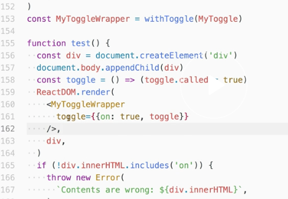

Instructor: [00:00] Here, I have a basic `test function`. In here, I create a `<div>`. I append it to the `body`. I create a `mock function` for the `toggle behavior`, and then I use `ReactDOM.render` to render to that `div` `MyToggleWrapper`.



[00:12] Here, I'm going to pass the `toggle` information I initialize `{on: true, toggle}`. This way, I can test that this component is functioning properly. I ensure that the `(!div.innerHTML.includes('on'))` rather than  `off`, and that when the `button.click()`, `if (!toggle.called)` function is called.

```js
<MyToggleWrapper
    toggle={{on: true, toggle}}
/>
```

[00:35] Here's the problem that I'm having. We're failing because the `toggleContext` that's marked as `required` is not provided. That's an issue because we're rendering the `MyToggleWrapper`, which is going to give us back this `Wrapper`, which defines `.contextTypes` to have the `[TOGGLE_CONTEXT]` be required.

[00:53] We could get around this a couple different ways. First of all, we could simply just render the `MyToggle` component, the underlying component itself, and that'll make our test pass.

[01:02] That's fine, although it's not entirely ergonomic, because people who are using our higher order component will normally only want to export the wrapped version of that component and use that render throughout their application.

[01:16] If we require that they test the functionality with the underlying component, then that requires that they will export this also. That's a pretty common pattern in Redux applications. There's another way to do this, and that would be to wrap everything in a `Toggle` component, and then pass props to the `Toggle` component to initialize the `Toggle` component state.

[01:36] That's not entirely ergonomic, either. Our tests are going to fail, because currently, the `Toggle` component doesn't support any way to initialize the state, anyway. Let's go ahead and look at another alternative way that we could do this.

[01:47] What if our higher order component were to somehow give us access to the underlying component that it represents? We could do something simple like this. We'd say `Wrapper.WrappedComponent = Component`.

[02:03] Then we can take that `Wrapped` component, and on our `MyToggleWrapper`, just reference the `Wrapped` component, and render that instead. That will get our test to pass. This is effectively the same thing as what we had here, however this time, people aren't going to have to export the `MyToggleComponent` themselves.

```js
<MyToggleWrapper.WrappedComponent
    toggle={{on: true, toggle}}
/>
```

[02:20] They can simply export default this component (`MyToggleWrapper`), and then they can reference that `MyToggleWrapper.WrappedComponent` to make things a little bit easier for testing. This also could make things a little bit nicer if we wanted to use this in something like Storybook.

[02:34] In review, all that we really need to do to give our wrappers a reference to the wrapped component is simply take the `Wrapper`, add a `WrappedComponent` property on it, and assign it to the `Component` that we're given.