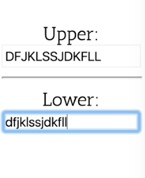
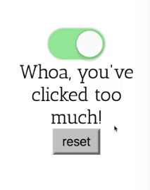

Instructor: [00:00] Here we have two inputs. The first is just going to be upper case, and the second will just be lower case. Whether I press shift or even if I'm in caps lock, it's always going to be upper and lower.



[00:13] The way that we accomplish that is we store the `value` of these `inputs` in `state`. Then we use that state to set the value of the inputs. It doesn't matter what the user is typing, the value is always going to be what I specify it is. That means if I neglect to handle changes on the input, it's impossible for me to type in this input.

[00:32] This is called a controlled component. It means that you are responsible for handling state changes and updating the state. In the case of the input, the state is the value, but we can create our own components that allow state to be controlled.

[00:46] I've given my `App` some `state` to keep track of how many times we click (`timesClicked`) and whether or not we want the toggle button to be on. Every time we click on the toggle, it increments the count. Once we've hit more than four, we're going to say, "Whoa, you've clicked too much," and we can reset it if we want to.



[01:02] We want to make it so that the user can no longer toggle the button until they've clicked reset. Just like the input where we specified the value and we want it to be controlled, here we're going to specify the `on` state. When that's specified, we want to control the on state ourselves.

[01:17] The first thing that we're going to do is come up here to our implementation of `Toggle`. Instead of getting the `on` state from the `state`, we're going to get it from `props`. With that, we actually get the functionality that we're looking for.

```js
on: this.props.render({
    
})
```

[01:30] We want to make sure that this works for both use cases where `on` is controlled inside the component or `on` can be controlled from outside the component. Here we'll simply say, `this.props.on !== undefined ? this.props.on : this.state.on`. Just like that, everything is working great.

[01:52] We should probably clean things up a little bit because now we're managing state internally as well as externally. If we're controlling the state of the `on` prop, then we probably shouldn't be updating our internal state.

[02:03] I'm going to make a little helper method for this because we're going to be doing this a couple times. I'll call this `isOnControlled`. Then we'll just return `this.props.on !== undefined`. Then here we can call `this.isOnControlled()`.

```js
isOnControlled() {
    return this.props.on !== undefined
}
render() {
    return this. props.render({
        on: 
         this.isOnControlled() 
         ? this.props.on 
         : this.state.on,
    })
}
```

[02:15] Then anywhere we're going to call `setState`, like with `reset` and with `toggle`, we should check first whether on state is controlled. If it is, then we're not going to call `setState`. We'll simply call the `onToggle` and `onReset` callbacks. Let's go ahead and do that. We'll make this a multi-line arrow function.

[02:33] We'll say, `if(this.isOnControlled)`, then we'll call `this.props.onReset` with what the on state should be, so `!this.props.on`. Otherwise, we'll do what we were doing before. We'll do the same thing with the `toggle` callback. Let's say, `if(this.isOnControlled)`, then `this.props.onToggle(!this.props.on)`, so what it should be. Otherwise, we'll do what we did before. Everything is still working.

```js
if(this.isOnControlled()) {
    this.props.onReset(!this.props.on)
} else {
    this.setState(this.initialState, () =>
    this.props.onReset(this.state.on),
    )
}

if(this.isOnControlled()) {
    this.props.onToggle(!this.props.on)
} else {
    this.setState(
        ({on}) => ({on: !on}),
        () => this.props.ontoggle(this.state.on),
    )
}
```

[03:07] Now, the key here is that it still works for the new use case as well as the old use case. If I no longer control the `on` state, I'll get rid of `on={on}`, then I should be able to continue to toggle it indefinitely because now the state is being controlled within the component instead of without the component. Great.

[03:27] In review, to make a controlled component, you take the part of the state that you want to enable users to control. Any time you're going to reference it, you're going to first check whether or not the user is controlling that component. If they are, then you reference the `props` version of the state. If they're not, then you reference your own version of the state.

[03:46] In addition, any time you call `setState` with that state, you first want to check whether that state is being controlled by a prop. If it is, then you're going to notify the caller that the state should change, but you don't change it yourself. Otherwise, you change that state yourself.

[03:59] That pattern is called control props. It gives users of your component a whole lot of control over how your component interacts with the user.