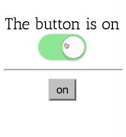

Instructor: [00:00] Now we have this `<Toggle />` component, and we have a couple of built-in components that we can use in tandem with the `<Toggle />`component to render things where we want and when we want.

[00:22] Something that we could do is we could use the `contextTypes`, just like we do with the built-in component, to wire this up. If we're going to be exposing the `<Toggle />` component for other people to use, we don't want to have to force them to use `context` themselves. We'd like to abstract that API away a little bit.

[00:40] Especially since the context API is actually an experimental API in React, it would be nice to shield the user from that API in case there are any unexpected changes that come to the context API in the future.

[00:51] What we can do to abstract away the context API is we can actually take this `ToggleButton` function and come back down here. We're going to make a factory for components that are wired up with the toggle context. We're going to call this `withToggle`. It's going to take a `(Component)`.

[01:08] Here we'll paste in the `ToggleButton` and change this to `Wrapper`. Then we're going to `return Wrapper`. Instead of destructuring on and toggle here, we'll just call this `toggleContext`. Instead of rendering the `<Switch />`, we'll render whatever`<Component />` people are passing to us.

[01:23] We'll forward along all the `...toggleContext` and all the `...props`. Then we can take this `withToggle` function and put it around the `<MyToggle />` component. If I save that, everything works. The cool thing is that I can actually bring back the `Toggle.Button`, and they're referencing the exact same state. I can update one toggle, and it updates the other.

```js
function withToggle(Component) {
    function Wrapper(props, context) {
        const toggleContext = context[TOGGLE_CONTEXT]
        return (
            <Component {...toggleContext} {...props} />
        )
    }
    Wrapper.contextTypes = {
        [TOGGLE_CONTEXT]: PropTypes.object.isRequired,
    }
    return Wrapper
}
```

```js
const MyToggle = withToggle(({on, toggle}) => (
    <button onClick={toggle}>
    {on ? 'on' : 'off'}
    </button>
))
```



[01:45] This pattern is called a higher-order component. This `function` takes a component and returns a new component with some enhanced behaviors that renders the component that it's given. We could also pass options here if we needed to. Many higher-order component factories do that.

[01:58] The other cool thing about this `withToggle` higher-order component is we can use it in our own internal components that we have to find up here. Let's go ahead and do that. We'll refactor this a little bit.

[02:08] For each one of these functions, we're going to make them an assignment too `withToggle`. We'll change these to `=>`. We can get rid of the `contextTypes` for each one of those.

```js
const ToggleOff = withToggle(({children}, context) => {
    const {on} = context[TOGGLE_CONTEXT]
    return on ? null : children
})
```

[02:18] Then we wire things up a little bit differently. We don't know about `context` or care about `context` anymore for any of these components, so for both of these we're going to get the `on` state right from our props. We can get rid of the `context` reference there.

```js
const ToggleOff = withToggle(({children, on}) => {
    return on ? null : children
})
```

[02:32] For this one, we'll go ahead and destructure `on, toggle`, and the rest of the props we'll call `...props`. We can get rid of the context reference there and then save that. Everything is still working just as it was before, except now it's a little bit nicer because we don't have to worry about the context API.

```js
const ToggleButton = with Toggle(({on, toggle, ...props}) => {
    return (
        <Switch on={on} onClick={toggle} {...props}>

    )
})
```

[02:49] In review, to enhance an existing component, we create a higher-order component. That's a function that creates a component for us with all the enhancements, returns that component, and then it accepts a component which it is responsible for rendering with all the relevant props.

[03:05] The component that it creates could be a function component, like we have here, or it could be a class component if we wanted to take advantage of the React lifecycle hooks for our enhancements. The component that we pass, which is being enhanced, can be a function component, like we have here, or a class component to take advantage of the lifecycle hooks too.