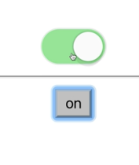

Instructor: [00:00] We have a `Switch` component that looks nice, and then we have this `button` component that can also control the state. There's one problem with this button, and that's that it's not very accessible. It's missing this `aria-expanded` prop.

[00:11] I'm going to go ahead and bring that up here, and we'll say `aria-expanded={on}` that one. Now, this is accessible, that's accessible. That's nice, but I'm going to go ahead and actually move this up, because we're going to be spreading the `...props` anyway.

[00:25] I can put this prop right up here, and now we actually have two switches, or two buttons, that control the `toggle` state that have two props that are identical. Often when you're using `render` props in this way, you're going to have certain elements that you expect people to render, and you want to have certain attributes or props applied to those elements.

```js
<Toggle
 onToggle={on => console.log('toggle', on)
 render={({on, toggle}) => (
     <div>
      <Switch
      on={on}
      aria-expanded={on}
      onClick={toggle}
      />
      <hr />
      <button
      aria-expanded={on}
      onClick={toggle}
      >
       {on ? 'on' : 'off'}
      </button>
     </div>   
 )}
 />
```

[00:47] To make the common use cases easier, you can provide a collection of props that people can apply to certain elements. In our use case, we are creating a toggle button. It's probably really common for people to create buttons that they want to have `aria-expanded` applied to, and `onClick`.

[01:03] We can create this collection of props that we could have people just spread across the element that they're going to be rendering for the toggling. I'm going to go ahead and `togglerProps`. With `togglerProps`, we can just cut this out, get `...togglerProps`.

[01:20] We'll do the same for our button, and then we'll go ahead and inside of our `render` call, we'll add a `togglerProps` property. Then we'll have `'aria-expanded': this.state.on`, and `onClick: this.toggle`. Now, everything's working exactly as it was before.

```js
<Toggle
 onToggle={on => console.log('toggle', on)
 render={({on, toggle}) => (
     <div>
      <Switch
      on={on}
      {...togglerProps}
      />
      <hr />
      <button
      {...togglerProps}
      >
       {on ? 'on' : 'off'}
      </button>
     </div>   
 )}
 />
```

```js
render() {
    return this.props.render({
        on: this.state.on,
        toggle: this.toggle,
        togglerProps: {
           'aria-expanded': this.state.on,
            onClick: this.toggle,
        }
    })
}
```



[01:40] Now, people don't have to worry about whether or not their button is going to be accessible with regard to the `aria-expanded` attribute, it's just going to be there for them. All they have to do is apply the `...togglerProps` on the element that they're going to be rendering.

[01:53] This pattern is called prop collections, and it allows you to take common use cases, collect the props that are applicable to those, allow users to just use those props and apply them to the elements that are relevant.