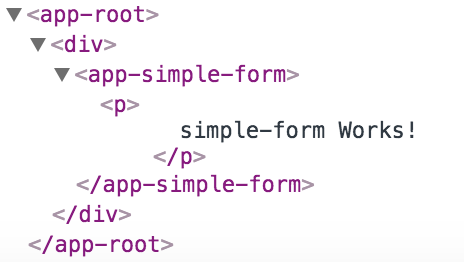

With the server running, I'm going to go ahead and open another terminal tab. In this same Angular2 fundamentals directory, I'm going to run `ng generate component`. The component I want to generate is called `Simple Form`, and I want to `--inline-template` and `--inline-style`. The `inline-style` flag and the `inline-template` flag will make it easier for me to show in a single file what's going on.

**terminal**
``` bash
 $ ng generate component simple-form --inline-template --inline-style
```
You can actually write this command. The way I'm going to do it is you can write it much shorter by saying `ng`, `g` for generate, `c` for component, and name of the component, so `simple-form` `-it -is`. This is the exact same as what we wrote before, just in a much shorter form.

**terminal**
``` bash
$ ng g c simple-form -it -is
```
I'll hit enter. This has generated two files. This `component` file and the `component.spec`. Let's look at this `component`.

In my project, in `src/app/` there's a `simple-form` directory and that has a `simple-form.component` inside of it. I'll open that up. You can see we have a `selector` of `app-simple-form`. 

**simple-form.component.ts**
``` javascript
@Component({
  selector: 'app-simple-form',
  template: `
    <p>
      simple-form Works!
    </p>
  `,
  styles:[]
})
export class SiompleFormComponent implements ngOnInit {
  constructor() { }
  ngOnInit(){
  }
}
```
In my `AppComponent`, in my `template` I'm just going to create a `div` and then inside of here say `<app-simple-form>` to create my component.

**app.component.ts**
``` javascript
@Component({
  selector: 'app-root',
  template: `<div>

<app-simple-form></app-simple-form> // simple-form Works!

</div>`
})
export class AppComponent {
  title = `Let's get started!`;
}
```
I'll hit save. Once the browser refreshes you'll see that its `simple-form works`. That's coming from this template inside of my `app-simple-form` component. You'll remember that I've named this `simple-form` this `app-` is coming from my configuration and Angular CLI-json. Look for the prefix.

This is just to ensure there's at least some prefix or name space for your project to avoid conflicts with other projects. You can name this to whatever you want.

If you look at the selectors from my `simple-form.component`, I have `app-simple-form`. In my selector and my `app.component` I have `app-root`, which is defined inside of my `index.html` file. 

**index.html**
``` html
<body>
  <app-root>Loading...</app-root>
</body>
```
You'll see `<app-root>` right here. If you open the Chrome dev tools, you'll see that same hierarchy of `app-root`, `app-simple-form`, and the content inside of each template.

