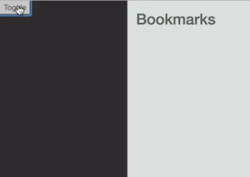

In this lesson, we are going to learn about **Angular lifecycle hooks** and how we can use them in our application. A component has an **internal** lifecycle that is managed by Angular.

What I mean by that is Angular is responsible for not only **creating** the component but **rendering** it, creating and rendering its **children**, checking when data bound properties change, and determining what needs to be cleaned up when the component is removed from the DOM.

Angular offers this component lifecycle hooks that gives us visibility into these key moments so that we can hook into them and perform bits of logic. If we look at the [documentation](https://angular.io/docs/ts/latest/guide/lifecycle-hooks.html#!#hooks-overview), we can see some of these hooks here -- so `ngOnInit()`, `ngOnDestroy()`, and `ngOnChanges()`. These are the once that we're going to use frequently in Angular 2, but you can see there's a pretty big list here.

The wonderful thing is that component lifecycle hooks have been ported back to Angular 1.5. We are going to see an example of how this works in an Angular 1 application. In our `app.html` we're going to create a button. We're going to give it a `Toggle` label. Then from here, on `ng-click`, we're going to toggle an `isVisible` property, and then we're going to add an `ng-if` to our categories component that's going to toggle visibility depending on the value of `isVisible`.

**app/app.html**
```html
<div class="app">
  <div class="container-fluid">
    <div class="row">
      <div class="col-sm-3 col-md-2 sidebar">
        <button ng-click"isVisible=!isVisible">Toggle</button>
        <categories ng-if="isVisible"></categories>
      </div>
      <div class="col-sm-9 col-md-10 col-sm-offset-3 col-mid-offset-2 main>
        <h1>Bookmark</h1>
      </div>
    </div>
  </div>
</div>
```
Let's hop into the browser and see what this looks like. We'll click toggle; you see it. Click it again, you don't. See it and you do not. 



This is a perfect candidate to hook lifecycle hooks into our `categories` component.

Let's go into our `CategoriesController` and we're going to add an `$onInit()` method and just a simple console log statement, but we'll also add an `$onDestroy` method and we'll do another console log so that this gets called when the element is removed from the DOM.

**categories/categories.controller.js**
```javascript
$onInit() {
  console.log('ON INIT FIRED!');
}

$onDestroy() {
  console.log('EVERY ONE IS DOOMED!');
}
```
Now that we've defined our lifecycle event hooks, let's put up the developer console. You can see as we toggle this, we are getting our console logs shown to us. 

**Console Output**
```javascript
// ON INIT FIRED!
// EVERY ONE IS DOOMED!
// ON INIT FIRED!
// EVERY ONE IS DOOMED!
```
This is an adorable example. But what is a practical use for lifecycle hooks? One of the main reasons why we use this is because its best practice to remove any **initialization logic** out of the `constructor()`.

We're going to move this categories model, getCategories call into the `OnInit()` event hook, and then we're going to reference `this.CategoriesModel = CategoriesModel`. Then also we need to reference `this.CategoriesModel` within our `OnInit()` lifecycle hook. 

**categories/categories.controller.js**
```javascript
class CategoriesController {
  constructor(CategoriesModel) {
    'ngInject';

    this.CategoriesModel = CategoriesModel;
  }

  $onInit() {
    console.log('ON INIT FIRED!');

    this.CategoriesModel.getCategories()
      .then(result => this.categories = result);
  }
}
```
We'll clean up the DOM here.

**app/app.html**
```html
<div class="col-sm-3 col-md-2 sidebar">
  <categories></categories>
</div>
```
Now that this is cleaned up, let's hop into the browser and you can see now that we were able to get the `categories` but we did it from the `$onInit()` lifecycle hook.

This is especially important when you have a component, a **sub-component** that has a **dependency** on a **parent** component that has **properties that may not exist** because they're part of an **asynchronous operation**. This is why you want to move these two in `$nInit()` lifecycle hook. This is how you leverage event lifecycle hooks within an Angular 1 application.