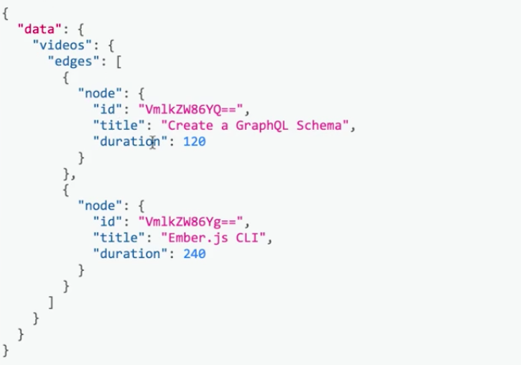

In order to be a Relay-compliant, GraphQL server, we need to be able to efficiently page through collections of items, in this case, we have a collection of videos that are being resolved in our `videos` field. And in **Relay** these are called **connections**. To get started converting our `videos` field into a connection, let's go and update what we're grabbing from the `graphql-relay` Package. So instead of just being the `globalIdField`, we'll also need to grab some collection helpers, namely, `connectionDefinitions`, `connectionFromPromisedArray`, and then, finally, `connectionArgs`, which will we'll be using to define our `videoConnection`.

**index.js**
```javascript
const { getVideosById, getVideos, createVideo } = require('./src/data');
const {
  globalIdField,
  connectionDefinitions,
  connectionFromPromisedArray,
  connectionArgs,
} = require('graphql-relay');
```

Now let's go and define our `videoConnection`. So we'll go down here and we'll create a `connectionType` and alias it to `videoConnection`. And this is going to be equal to `connectionDefinitions`, which takes an object. And here, we'll just say what the `nodeType` is of this connection, which is `videoType`.

**index.js**
```javascript
const videoType = new GraphQLObjectType({...});
exports.videoType = videoType;

const { connectionType: videoConnection } = connectionDefinitions({
  nodeType: videoType,
});
```

Next up, we'll update our `videos` field. And so, instead of having the type be a `GraphQLList`, that type is going to be `videoConnection`. For the arguments for this field, we're going to use the default `connectionArgs` that we imported from `graphql-relay`. And then, finally, we'll update our resolve statement, which now returns `connectionFromPromisedArray`. And this method expects the first argument to be a promise that resolves to an array of objects, in this case, our videos. And the second argument is going to be the `connectionArgs`.

**index.js**
```javascript
const queryType = new GraphQLObjectType({
  name: 'QueryType',
  description: 'The root query type.',
  fields: {
    node: nodeField,
    videos: {
      type: VideoConnection,
      args: connectionArgs,
      resolve: (_, args) => connectionFromPromisedArray(
        getVideos(),
        args,
      ),
    },
  ...
});
```

So let's try and query our new `videos` field inside of GraphQL. So we'll start up our server, go and visit our browser. And when we load up `GraphiQL` and try and query for videos, we can see that this returns a connection, which has the fields `edges` and `pageInfo`.


So in this case, we'll go through `edges` and then the `node` will be this specific video. And then, on this `node`, we can query for all of the typical video fields that we've been working with.

**GraphiQL Input**
```javascript
{
  videos {
    edges {
      node {
        id,
        title,
        duration
      }
    }
  }
}
```

And when we execute it, we get our collection of videos and all of the fields inside of each `node`.



We can also add additional fields to the `videoConnection`. So instead of just having the fields `edges` and `pageInfo`, we can add another one, such as `totalCount`, which could describe the count of all of the videos. So let's go and add that. When we switch back into our editor, and go to where we're using `connectionDefinitions`, we can also add an additional field on the `input` object called `connectionFields`, which is just a method that returns an object. In here, we'll add a field called `totalCount`, which in this case, the count will be the type `GraphQLInt`.

**index.js**
```javascript
const { connectionType: VideoConnection } = connectionDefinitions({
  nodeType: videoType,
  connectionFields: () => ({
    totalCount: {
      type: GraphQLInt,
      description: 'A count of the total number of objects in this connection.',
    },
  }),
});
```

The `description` will be `A count of the total number of objects in this connection.` And then, the `resolve` method will take in our current connection. And remember, the connection has the `edges` on it. So in this case, you can return the `conn.edges.link` value to get the total count of all the videos in our collection.

**index.js**
```javascript
const { connectionType: VideoConnection } = connectionDefinitions({
  nodeType: videoType,
  connectionFields: () => ({
    totalCount: {
      type: GraphQLInt,
      description: 'A count of the total number of objects in this connection.',
      resolve: (conn) => {
        return conn.edges.length;
      },
    },
  }),
});
```

So let's go and try this out now by restarting our server and revisiting our GraphiQL editor. And here, we'll just refresh the page. And now, when we query for the total count on the `videoConnection`, we'll get the numeric value of the total number of videos in our collection.


Finally, we also have access to the specific arguments for a connection. So here we have `first`, `after`, `before`, and `last`. And so, `first`, in this case, takes in a number, so we'll get the first video. And here, we'll export the `edges` and then the `node` itself, and we'll get the `title`. And so, here we'll get the first video. You can also change this to last and work backwards in our connection from the query, and we'll get the last video. And so, because we're using the `connectionArgs` Helper, we'll also get access to the `connectionArgs` on this field.

**GraphiQL Input**
```javascript
{
  video(last: 1) {
    edge {
      node {
        title
      }
    }
  }
}
```