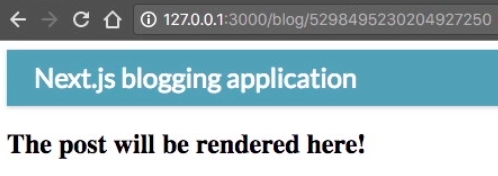

Instructor: [00:00] To finish up our custom server, let's create the routes for our blog post. To do this, we're going to define a `get` request to the `/blog/:id` route. We're going to set this up to render the post template that's going to live inside of our pages directory.

####server.js
```javascript
app.prepare().then(() => {
    const server = express();

    server.get('/blog', (req, res) => app.render(req, res, '/'));

    server.get('/', (req, res) => res.redirect(301, '/blog'));

    server.get('/blog/:id', (req, res) => {

    })

    server.get('/*', (req, res) => handle(req, res));

    server.listen(port, err => {
        if(err) throw err
        console.log(`> Read on Http://localhost:${port}`)
    });
})
```

[00:21] To do this, we're just going to use that `app.render` function that we used above when defined the blog route, and we're going to pass in `/post` as the third parameter list.

```javascript
server.get('/blog/:id', (req, res) => {
    return app.render(req, res, '/post')
})
```

[00:34] Since we'll need a waiter queries specific post, we can set up this route to send the id for each post using the request query object. By wiring up this `object.assign` call, we'll successfully pass the `id` parameter inside of the `req` object, each time this router receives an id.

```javascript
server.get('/blog/:id', (req, res) => {
    return app.render(req, res, '/post', Object.assign({id: req.params.id} req.query))
})
```

[00:56] Now that our blog id router is set up, let's add some configuration for handling calls to the post route. As we know, we want to make sure that the post page loads when individual blog post is requested. We're just going to using `if` statement to tell our application to `redirect` to the blog id route, if an id is present.

[01:21] If there is no id within the request query, then we'll lead the user back to our main blog page. 

```javascript
server.get('/post', (req, res) => {
    if(req.query.id) return res.redirect(`/blog/${req.query.id}`);
    res.redirect(301, '/blog');
});
```

Now that our routes are in place, we can modify our `index.js` file to include some links to each blog post. To do this, I'm just going to `import` next `Link` component from the `next/link` library.

####index.js
```javascript
import Link from 'next/link';
```

[01:42] Once imported, I can then place these `<Link>`'s inside of the raise button component. Inside our `<Link>`, we're going to want to add some "a" tags to ensure application recognizes our hyperlinks. 

```html
const Index = ({ posts }) =>
    <div>
    <Header />
        {
            posts.map(x => 
                <Card key={x.id}>
                    <CardHeader title={x.title} />
                    <CardText>
                        <RaisedButton fullWidth={true} primary={true}>
                        <Link>
                            <a>
                                Click to view post!
                            </a>
                        </Link>
                    </CardText>
                </Card>
            )
        }
    </div>
```

Inside of our link component, we're going to using the `href` attribute to actually pass the id parameter to our post route.

[02:06] This is according to Node.js's URL module. We're just going to parse this URL for us, so we can get the correct id for each route. Following this, we're going to use the `as` attribute to define how this route transition should display in the browser.

```html
<Link href={`/post?id=${x.id}`} as={`/blog/${x.id`}>
    <a>
        Click to view post!
    </a>
</Link>
```

[02:23] Each blog post will appear as /blog id with the id being whatever we get from the blogger API. Before we check this out, let's quickly go ahead and create this `post.js` file which as we know, it's going to be used to render our individual blog post.

[02:40] Inside here, I'm going to `import` the `Header` component as well as our `withMui` HOC. Below this, I'm just going to create a component name `Post`, and give it a `title` prop that are just renders in text to signify that this page is in fact being loaded when we click on each blog post button.

```html
import Header from '../components/header';
import withMui from '../shared/MUI/withMUI';

const Post = ({ title = 'The post will be rendered here!' }) =>
    <div>
        <Header />
        <h2>{title</h2>
    </div>;
```

[03:03] If you remember, MUI is going to be looking for `getInitialProps` calls within our components. Some also is going to scaffold down an empty `async` await function just we could see everything being rendered. OK, now you just need to `export` our component using our HOC. 

```javascript
import Header from '../components/header';
import withMui from '../shared/MUI/withMUI';

const Post = ({ title = 'The post will be rendered here!' }) =>
    <div>
        <Header />
        <h2>{title</h2>
    </div>;

Post.getInitialProps = async () => {

};

export default withMui(Post);
```

Now, we can restart development server and check out the page.

[03:27] Taking a look at our page, we should see that our `<a>` tags are being rendered its hyperlinks for us. 


If we click on these buttons, we'll see that are custom server config is in fact working, as next is taking us these new blogs/id routes as shown in the browser.

