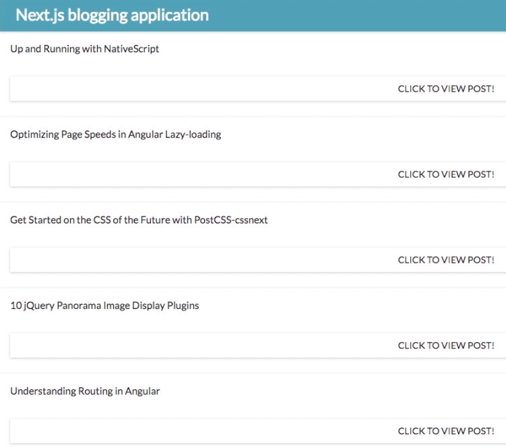

Instructor: [00:01] Inside of this `next.config.js` file, we're setting up some environment variables using `webpack` and `dotenv`. 

####next.config.js
```javascript
const webpack = require('webpack');
require('dotenv').config();

module.exports = {
  webpack: config => {
    config.plugins.push(
      new webpack.EnvironmentPlugin(['BLOGGER_URL', 'API_KEY'])
    );
    return config;
  }
};
```

At top of the page, we're using `('dotenv').config();` method which is going to allow us to load our desired environment variables.

[00:19] Following this, we're just defining this `webpack` instance so that we can create our environment variables for our `BLOGGER_URL` as well as our `API_KEY`. These values are going to be pulled from our `.env` file. This file is just going to hold any information that we want to secure as basic key value pairs.

####.env
```
BLOGGER_URL=https://www.googleapis.com/blogger/v3/blogs/4789269094064278868/posts
API_KEY=xxxYOUR_API_KEY
```

[00:43] Inside of our project, we'll be able to use these variables to make calls to the blogger API. Now to do this, we can use the `'isomorphic-fetch'` library. By importing inside of `index.js`, we're going to have access to the fetch global which we use in a minute.

[01:02] Following this, I'm going to import Material-UI's `Card` component, specifically the `Card`, `CardHeader`, and `CardText` imports, which we used to create a card for each post that we receive form our API. 

####index.js
```javascript
import 'isomorphic-fetch';
import { Card, CardHeader, CardText } from 'material-ui/Card';
```

We need to get our data before we create the UI. We can do so by hooking in our index component using Next `getInitialProps` life cycle hook.

[01:28] Since, we're using `async await` functionality, we're going to avoid have any chain call backs. Instead, we're are going to just create this `response` variable, and have an `await` our `fetch` call. Inside this fetch function, we're going to pass in the URL and API keys that we set up within web pack.

```javascript
Index.getInitialProps = async () => {
    const response = await fetch(`${process.env.BLOGGER_URL}?key=${process.env.API_KEY}`);
}
```

[01:50] Below our response variable, I'm just going to create this `data` constant. This is going to store our API `response`, once our promise object is finally resolved. To do this, we're just using JavaScripts `.json()` method.

[02:08] The last thing we need to do is pass the data that we receive from our API as props to our `Index` component. Now, the blogger API is going to give us our post inside of an `items` object. By assigning this data to the value of `posts`, we'll be able to use it within our component.

```javascript
Index.getInitialProps = async () => {
    const response = await fetch(`${process.env.BLOGGER_URL}?key=${process.env.API_KEY}`);
    const data = await response.json();
    return { posts: data.items }
}
```

[02:29] Now that, our API call is set up. We can use de-structuring to pull our `post` out of the `props` object. Once passed in, I'm going to iterate through our data using the `.map` function. Inside this map, we're just going to scaffold out the `Card` that we want our page to render.

[02:49] We then need to give each `<Card>` a specific key, and I'm just going to set that equal to the `id` being received. Below this, I'm just going to use the `<CardHeader>` import to render the title that we're receiving as the card header's `title` prop.

[03:06] The last thing I'm going to do is just use the `<CardText>` component. Inside here, I'm going to want to set up a `button` that's going to allow us to take users to each post. 

```html
const Index = ({ posts }) => 
    <div>
    <Header />
        {
            posts.map(x => 
                <Card key={x.id}>
                    <CardHeader title={x.title} />
                    <CardText>

                    </CardText>
                </Card>
            )
        }
    </div>;
```

I'm just going to `import` the `RaisedButton` component from `'material-ui'`, and have it inside of these card text tags.

```javascript
import RaisedButton from 'material-ui/RaisedButton';
```

[03:31] As you could see, I'm giving our button a ` ` of `"Click to view post!"`. I'm also going to set the `fullWidth` prop to `{true}`, so our button takes up all the space it can. 

```html
const Index = ({ posts }) => 
    <div>
    <Header />
        {
            posts.map(x => 
                <Card key={x.id}>
                    <CardHeader title={x.title} />
                    <CardText>
                        <RaisedButton label="Click to view post!" fullWidth={true} />
                    </CardText>
                </Card>
            )
        }
    </div>;
```

Now, if we visit our page, we should see a nice little UI being rendered on the page for us.

[03:54] We'll soon be getting an error here, and this is because we're using Next `getInitialProps` life cycle hook. However, the `subProps` that we set up inside of our Material-UI HOC is still commented out, in `withMUI.js`.

[04:10] Now that's fixed we can visit our page and see our desired result being rendered for us. 



As you could see, each card is displaying the title of each post just like we set up. Inside our card, we see Material-UI's `raisedButton` component displaying our label text.

[04:29] If we interact with our buttons, we see these nice little click and hover effects already in place for us. Before we wrap up, let's just see our easy Material-UI makes the process of changing our components.

[04:45] To do this, I'm just going to pass in the primary prop to our button which is going to make our button render using the primary color that we've set up inside our color pallet. For me it's just a shade of blue.

```html
posts.map(x => 
    <Card key={x.id}>
        <CardHeader title={x.title} />
        <CardText>
            <RaisedButton label="Click to view post!" fullWidth={true} primary={true} />
        </CardText>
    </Card>
)
```