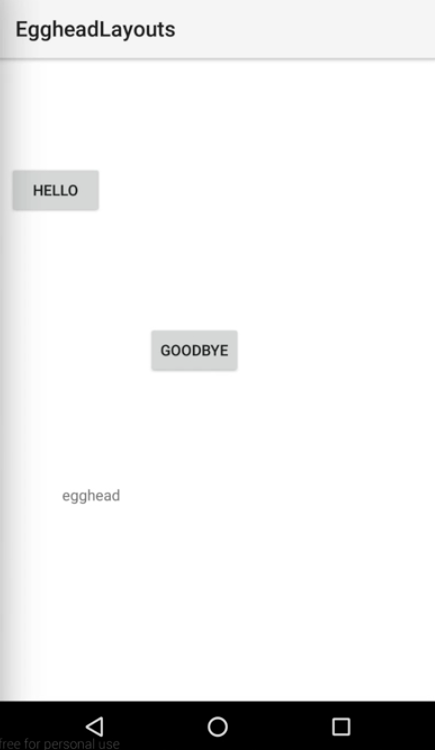

00:00 Start by adding an `<AbsoluteLayout>` to your `<Page>`. Inside of the `<AbsoluteLayout>`, we'll add a few view components. First, we'll add a `<Button>` with the `text` set to `"Hello"`. We need to set the left and top coordinates, so we'll use `left="10"` and `top="100"`.

#### absolute.xml
```xml
<Page>
    <AbsoluteLayout> 
        <Button text="Hello" left="10" top="100" />
    </AbsoluteLayout>
</Page>
```

00:30 We'll add another `<Button>` with the `text` set to `"Goodbye"` and the `left` position set to `"140"` and the `top` position to `"250"`. Last, let's add a `<Label>` with the `text` of `"egghead"` and the `left` value set to `"60"` and the `top` set to `"400"`. When we run this, these view components will be positioned absolute by their top left coordinates.

```xml
<Page>
    <AbsoluteLayout> 
        <Button text="Hello" left="10" top="100" />
        <Button text="Goodbye" left="140" top="250" />
        <Label text="egghead" left="60" top="400" />
    </AbsoluteLayout>
</Page>
```

01:06 Here they are. The `"Hello"` button is positioned 10 from the left and 100 from the top of the view. The `"Goodbye"` button is positioned 140 from the left and 250 from the top. Last, your `"egghead"` label is 60 from the left and 400 from the top of the page.



