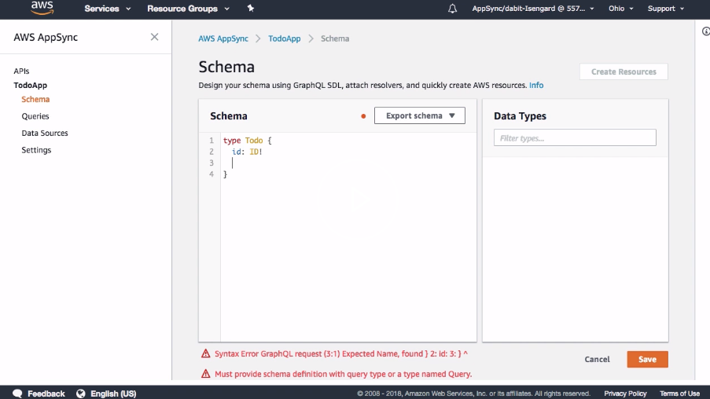
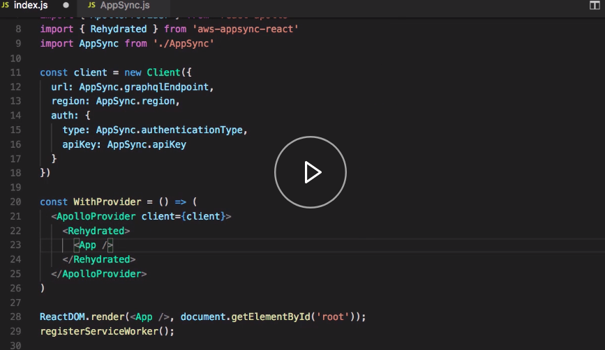

The goal of this course on AWS AppSync is to show you how to build a real-world scalable GraphQL API from the ground up. We'll start by creating a new API and the AWS AppSync dashboard. We'll create a schema with types, queries, mutations, and subscriptions.

We'll use the built-in graphical editor in the AWS AppSync console to test out queries and mutations. Once we are done creating the API, we'll create a new React application and configure the React application to work with our AWS AppSync API.

We'll use the AWS AppSync Apollo client to execute queries and mutations against the new API. We'll also firm up features like subscriptions and an optimistic response, and then show how to make the application offline ready.

By the end of this course, you will have a good understanding of how to create real-time offline ready React applications using AWS AppSync.