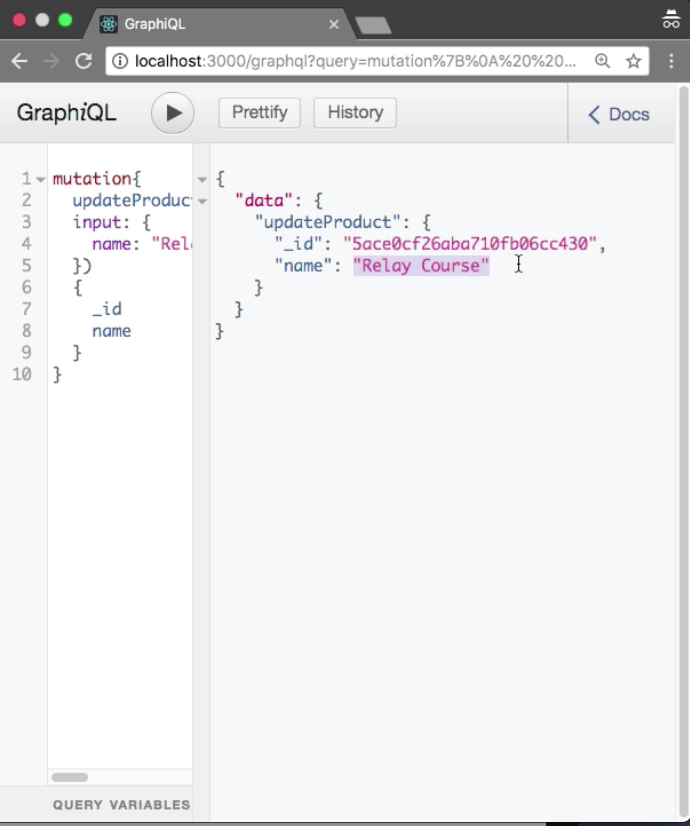

Instructor: 00:01 I want to update the product by `_id`. Let's create the `mutation` to update the `Product`. It will accept the `input` argument. The type of the `input` is `ProductInput`, and it will return a new `Product`.

00:15 Also, need `_id` in the argument because I want to update the `Product` by `_id`. The type of the `_id` is `ID!`. `_id` is required field.

#### schema.js
```javascript
const typeDefs = `
type Product {
    _id : ID
    name: String!
    qty: Int
}
 type Query {
     getProduct(_id: ID) : Product
     allProducts: [Product]
 }
 input ProductInput{
    name: String!
    qty: Int
 }
 type Mutation {
     createProduct(input: ProductInput) : Product
     updateProduct(_id: ID!, input: ProductInput) : Product
 }
`
```

00:26 Let's create the resolver. `UpdateProduct` and I don't have any `root` object here. I want to de-structure the `_id` and `input`. I am going to use `findOneAndUpdate` method. Product model has this method -- `findOneAndUpdate`.

00:51 The first argument is criteria object. We need to provide the `_id`. Both `key` and `value` are same, so I am going to use this `_id`.

00:59 The second argument is `input`. The third argument is we need to tell MongoDB, "I want to get a new record in the response."

01:10 I am going to apply `await` expression. If promise will be resolved, it will `return` a new updated `Product`.

#### resolver.js
```javascript
export const resolvers = {
    Query: {
        async allProducts() {
            return await Product.find()
        },
        async getProduct(_, { _id }) {
            return await Product.findById(_id);
        }
    },
    Mutation: {
        async createProduct(_, { input }) {
            return await Product.create(input);
        },
        async updateProduct(_, { _id, input }) {
            return await Product.findOneAndUpdate({ _id }, input, { new: true })
        }
    }
}
```

01:16 Let's try to test it. Let me show you the docs. We have `updateProduct` `mutation`.

01:23 Let's say I would like to update the name of the course, I would like to update the name of the product. We need to send the update `mutation` -- `updateProduct`.

01:34 First argument is `_id`, and the second argument is `input`. We need to update the `name`.

01:40 I am going to replace the `name` from `GraphQL` to `Relay Course`. I also want to see the `_id` and `name` in the response.

01:52 Incredible, a product has updated successfully. You can see that we have named Relay course.

