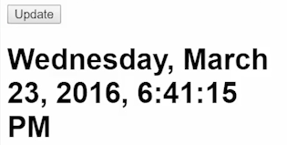

Since I want to control the clock, like move the time forward or backward or whatever, right now I'm just pushing a `new Date` every five seconds or every time I `click$`. What I need to do is actually track a date and then make changes to that date.

When you think I need to track something in RxJS, think, I want to `.startWith` an initial value. That's the initial value is a `new Date`. Every time some event comes through, I'm going to check for it and then change it. That new date is this accumulator, `acc`, and then I can use the current, `curr`, the thing that comes through, to change the accumulator however I want.

####app.ts
```javascript
constructor() {
    this.clock = Observable.merge(
        this.click$, 
        Observable.interval(5000)
    )
        .startWith(new Date())
        .scan((acc, curr)=>)
}
```

To start with, I'm just going to return the `acc` to see what happens, and I need to go ahead and `import` `startWith`, and `import` `scan`. 

```javascript
import 'rxjs/add/operator/startWith';
import 'rxjs/add/operator/scan';
```

Hit Save, refresh. You can see that it's going to give us one value, and no matter what I do, it's just going to return that same value. 



The clock is no longer updating, it's just set to that initial value. Every time, it's returning that same accumulated value.

To be able to update this, I need to say that when something comes through, I want to grab a copy. We'll say `const date = New date()`. We'll just grab the `acc`, `getTime`, and then `return date`.

```javascript
...
.startWith(new Date())
.scan((acc, curr)=> {
    const date = new Date(acc.getTime());

    return date;
    })
}
```

Since we have a copy of it, it's going to behave the exact same way, since it's just returning that copy. But what we can do is take that `date` and change it. I'll say `date.setSeconds`, `date.getSeconds`, and then add one.

```javascript
...
const date = new Date(acc.getTime());

date.setSeconds(date.getSeconds() + 1);

return date;
```

When I save and I refresh, you can see it starts with that initial date, and then every five seconds, it's going to update. It'll hit five and that updated to one second. When I click, it's going to move that forward and then five seconds, it pushed another value in.

```
Wednesday, March 23, 2016, 7:02:00 PM 
Wednesday, March 23, 2016, 7:02:01 PM {clicked}
Wednesday, March 23, 2016, 7:02:02 PM {clicked}
Wednesday, March 23, 2016, 7:02:03 PM {clicked}
Wednesday, March 23, 2016, 7:02:04 PM
```

I'll change this to one second so it looks more natural, refresh. You can see that every second, this is going to update. But I can also make it update even faster by clicking the button.