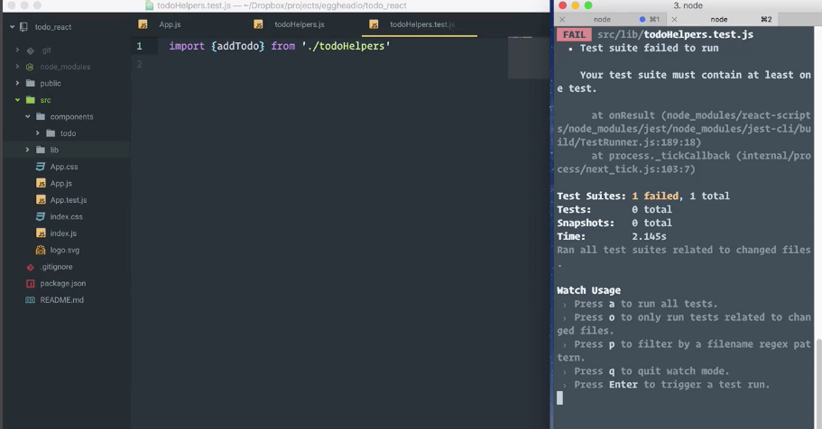
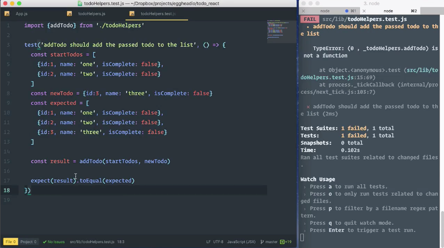
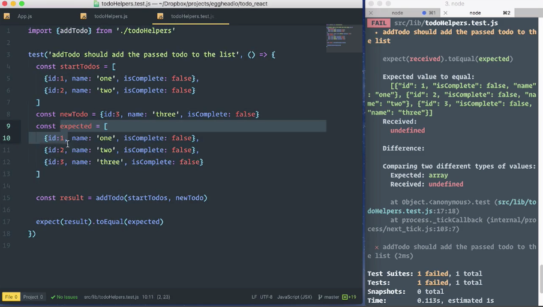
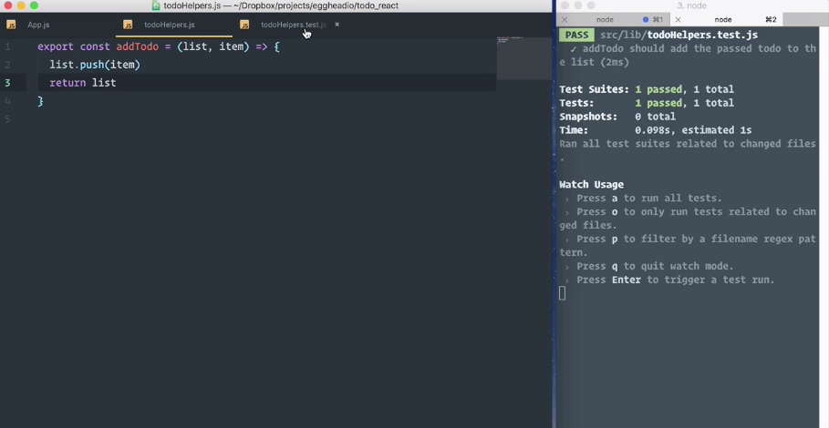
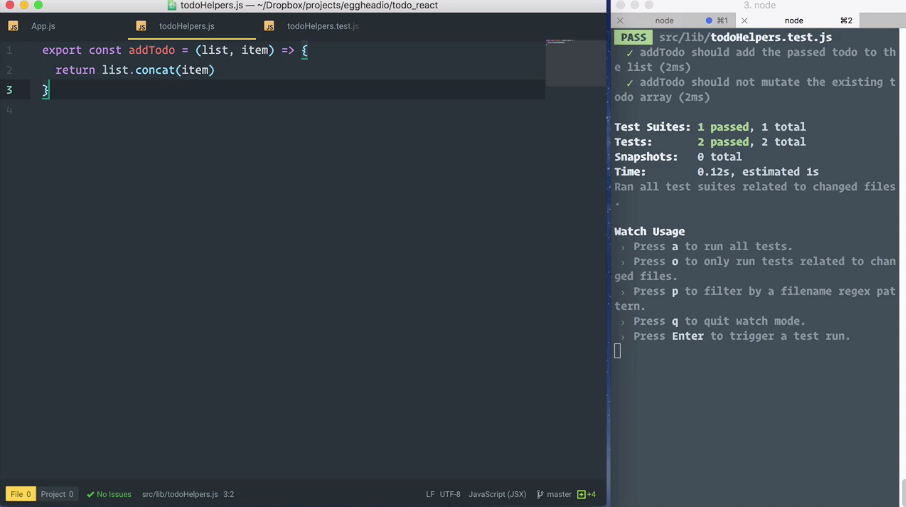

Right now, this list of `todos` is static. In order to start making it a little more dynamic, we need a way to add new `todos` to the list. For that, we'll create a helper function. Since **Create React App** comes preconfigured with **Jest** for testing, we'll build this helper function in a test driven style.

Let's start by adding a `lib` directory under `src`.

I'm going to add a file to `lib`, which I'll call `todoHelpers.js`, and I'll add a second file to `lib` called `todoHelpers.test.js`. At the top of the `todoHelpers.test.js` file, I'm going to add an `import {addTodo} from './todoHelpers'`. With that in place, I'm going to jump into the terminal and run `npm test` to fire up Jest.

####todoHelpers.test.js
```jsx
import {addTodo} from './todoHelpers'
```

You see that I have a failing test, and that's because my test suite must contain at least one test. I'm just going to paste in some test code that I have prepared, and let's take a look at it.



This test file is a pretty standard structure, often referred to as **Arrange, Act, Assert**.

```jsx
test('addTodo should add the passed todo to the list', () => {
  const startTodos = [
    {id:1, name: 'one', isComplete: false},
    {id:2, name: 'two', isComplete: false}
  ]
  const newTodo = {id:3, name: 'three', isComplete: false}
  const expected = [
    {id:1, name: 'one', isComplete: false},
    {id:2, name: 'two', isComplete: false},
    {id:3, name: 'three', isComplete: false}
  ]

  const result = addTodo(startTodos, newTodo)

  expect(result).toEqual(expected)
})
```

If we look at this test code, we have the *Arrange* portion of our test where we have a `startTodos` variable that has an array with two `todo` objects in it,

```jsx
const startTodos = [
    {id:1, name: 'one', isComplete: false},
    {id:2, name: 'two', isComplete: false}
]
```

a `newTodo`, which is going to be the object that we're going to try to add to our list. 

```jsx
const newTodo = {id:3, name: 'three', isComplete: false}
```

Then a `const` called `expected` that represents what we want the list to look like at the end of running `addTodo`.

```jsx
const expected = [
    {id:1, name: 'one', isComplete: false},
    {id:2, name: 'two', isComplete: false},
    {id:3, name: 'three', isComplete: false}
]
```

The second section is referred to as *Act*, and this is where we actually call the code that we're trying to test. Here we're assigning whatever comes out of `addTodo` to result, and we're passing it in `startTodos` and `newTodo`.

```jsx
const result = addTodo(startTodos, newTodo)
```

Then finally, we have the *Assert* part of the test, where we actually set our expectation. This is what's going to determine if the test passes or fails.

```jsx
expect(result).toEqual(expected)
```

With our test in place, I'm going to save that, **Jest** will automatically rerun our test. This time we're going to get a type error because `addTodo` is not a function. Because we haven't defined it yet.



Let's go to `todoHelpers`, and we'll add our `addTodo` function.

For that, I'm going to say `export const addTodo`, and I'm going to set that to equal a function. Now that our function's defined, we can save the file.

####todoHelpers.js
```jsx
export const addTodo = () => {
    
}
```

Jest will rerun, and we're still failing, but now we're failing for a different reason. We expected an array and we received `undefined`. We can scroll up a little bit here and we'll see that it actually expected a specific value, and that's based on what we assigned here to expect it.



*Let's make this test pass.*

I'm going to jump into `todoHelpers.js`, and if you remember from our test, where we call `addTodo`, we're passing in the array, which we'll just refer to as `list` here and then we're passing in the new object that we want added to the `list`.

```jsx
export const addTodo = (list, item) => {
    
}
```

Since I have an array, I can use array methods, so let's say I want to call `list.push` and I want to `push` that new item into the array, then I want to `return` the `list`. I save that, my test reruns and everything's passing.

```jsx
export const addTodo = (list, item) => {
    list.push(item)
    return list
}
```



I'm going to go back to `todoHelper.test.js`, and I'm going to add a second test. Going to scroll down and I'll paste this in, and we'll see that this test is called `'addTodo should not mutate the existing todo array'`.

####todoHelper.test.js
```jsx
test('addTodo should not mutate the existing todo array', () => {
  const startTodos = [
    {id:1, name: 'one', isComplete: false},
    {id:2, name: 'two', isComplete: false}
  ]
  const newTodo = {id:3, name: 'three', isComplete: false}
  const expected = [
    {id:1, name: 'one', isComplete: false},
    {id:2, name: 'two', isComplete: false},
    {id:3, name: 'three', isComplete: false}
  ]

  const result = addTodo(startTodos, newTodo)

  expect(result).not.toBe(startTodos)

})
```

I have the same setup with `startTodos` and `newTodo` and my `expected` array. I'm calling `addTodo` with the same arguments, getting the result back. But this time I'm checking to make sure that `startTodos` and `result` are not referring to the same array.

If I save this, we'll see that a test fails, and the problem here is that by calling `list.push` in this function, I'm mutating the original array. What I need to do is get a new array back that has the items from the first array plus the new object.

We can accomplish this by updating our code here, and using `concat` rather than `push`. We can just return the result of that, because `concat` will add the new item into a new array and `return` it. I'll save that and now we have two passing tests.

####todoHelper.js
```jsx
export const addTodo = (list, item) => {
    return list.concat(item)
}
```

Now that we have these unit tests in place, we can make all kinds of changes to this with confidence that if we change the behavior in such a way that our paths fail, it'll tell us right away.



I'm just going to do a little bit of refactoring, so I'm going to get rid of these curly braces and that `return` and I can make this a one line function. I'll save it, tests run again, and now you know I'm good.

```jsx
export const addTodo = (list, item) => list.concat(item)
```

Now let's say I wanted to change the way I'm doing this. Instead of using `concat`, I want to use the **spread operator**.

I'm just going to do this, and I'm going to say, I want the `list`, including the new item at the end of the `list`, and I'll save it. 

```jsx
export const addTodo = (list, item) => [...list, item]
```

Because my tests pass again, I know that this is a valid replacement that updates my array giving me the new item and also doesn't mutate the existing array.