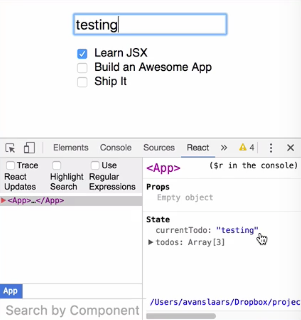

We're going to take the `todo` `form` that is currently defined in the `App` component and place in its own component. I've created a new directory under `src` called `components` and inside `components` another directory called `todo`.

In the `todo` directory, I'm going to create a new file and I'm going to call that `TodoForm.js`. At the top of my new file, I'm going to `import React from 'react'`.

####src/components/todo/TodoForm.js
```jsx
import React from 'react'
```

Instead of creating a class that extends component like in `App.js`, we can define this component as a plain JavaScript function. I'm going to declare `const` call `TodoForm` and I'll just define this as an arrow function, and our return value will go inside these parenthesis. 

```jsx
import React from 'react'

const TodoForm = () => ()
```

Our return value is going to be the JSX for a form, let's remove that out of `App.js` and paste it in here. Then, I'll clean that up a little bit.

```jsx
const TodoForm = () => (
    <form>
        <input type="text" 
            onChange={this.handleInputChange} 
            value={this.state.currentTodo}/>
    </form>)
```

We need to `export` our component, so we can use it in our `App`. I'll come up here right before the `const` and add an `export`. 

```jsx
export const TodoForm = () => (
    <form>
        <input type="text" 
            onChange={this.handleInputChange} 
            value={this.state.currentTodo}/>
    </form>)
```

Now that we're exporting our component, we can go into `App.js` and `import` it. For that, I'll type `import` and I'm going to put `TodoForm` in curly braces, because we exported it with a name. Then, we'll say `from`. Then, we need to provide a relative path. That component lives under `components/todo` in the `TodoForm` file. 

####App.js
```jsx
import React, { Component } from 'react';
import logo from './logo.svg';
import './App.css';
import {TodoForm} from './components/todo/TodoForm'
```

Now that we've imported the component, let's use it in our JSX. I'll come down here where that `form` was and I'm just going to add a reference to `TodoForm`.

```jsx
<div className="Todo-App">
  <TodoForm/>
  <div className="Todo-List">
    <ul>
      {this.state.todos.map(todo =>
        <li key={todo.id}>
          <input type="checkbox" defaultChecked={todo.isComplete}/> {todo.name}
        </li>)}
    </ul>
  </div>
</div>
```

I'm going to save this. When the browser refreshes it's going to be blank. The problem here is that we have some errors that we have to handle.

If we take a look at **DevTools**, we'll see that we have this error, `"Cannot read property 'handleInputChange' among undefined"` This is because when we took that form out of our `App` component and put it in its own stateless functional component, we lost access to things that were defined on `App` through this. `handleInputChange` still lives in `App.js` and `this.state` inside this `TodoForm` doesn't exist.

```jsx
export const TodoForm = () => (
    <form>
        <input type="text" 
            onChange={this.handleInputChange} 
            value={this.state.currentTodo}/>
    </form>)
```

We need to pass data into our component that's defined as a stateless functional component. We need to pass that down through **props**. We're going to update this function to accept a single argument which we'll call `props`. Then, we're going to update these references to `this`, we'll say, `props.handleInputChange` and instead of `this.state` this will also become `props`.

```jsx
export const TodoForm = (props) => (
    <form>
        <input type="text" 
            onChange={props.handleInputChange} 
            value={props.currentTodo}/>
    </form>)
```

In order for this update to work, I need to pass these props into the `TodoForm` component. I'll switch back to `App.js` and find my `TodoForm` tag. I'm going to add a couple of properties in the form of attributes. I'm going to say, `handleInputChange` and that's because this is what I refer to it as off of the `props` object.

I'm going to set that to equal a reference to the App's `this.handleInputChange`. I also need to get `currentTodo` into the `TodoForm`. We'll define a current todo property. We're going to set that to equal `this.state.currentTodo`. Now that everything updated, let's save this.

```jsx
<TodoForm handleInputChange={this.handleInputChange}
    currentTodo={this.state.currentTodo}/>
```

We'll let the browser refresh and we'll verify that everything still works as expected. Our page renders, we're on the right track. If I come into my `React` DevTools, I should be able to enter text into the form and see that it updates my Application `State`.

