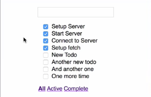

Our application handles removing items from the state, but those deletes aren't reflected on the server. If I delete some `todos` and then I refresh the browser, those deleted items will come back because they're still persisted on the server.



To persist these deletes, I'm going to add another call to `fetch` by adding another function to the `todoService`. I'm going to duplicate `saveTodo` and we're going to make a few changes to this.

####todoService.js
```jsx
export const saveTodo = (todo) => {
    return fetch(`${baseUrl}/${todo.id}`, {
        method: 'PUT',
        headers: {
            'Accept': 'application/json',
            'Content-Type': 'application/json'
        },
        body: JSON.stringify(todo)
    }).then(res => res.json())
}
```

First we'll rename it and we'll call this `destroyTodo`. Then we'll update this argument because we don't need the entire `todo` for `'DELETE'`, we just need it's `id`. Now, I'll update my URL because I'm only passing in the `id`. I can just reference it directly.

```jsx
export const saveTodo = (id) => {
    return fetch(`${baseUrl}/${id}`, {
        method: 'DELETE',
        headers: {
            'Accept': 'application/json',
            'Content-Type': 'application/json'
        },
        body: JSON.stringify(todo)
    }).then(res => res.json())
}
```

Now I'll update the method to be `'DELETE'` and we won't need the `body`, so we can delete this and we won't receive any JSON back, so we can delete our call to `.then`. 

```jsx
export const saveTodo = (id) => {
    return fetch(`${baseUrl}/${id}`, {
        method: 'DELETE',
        headers: {
            'Accept': 'application/json',
            'Content-Type': 'application/json'
        }
    })
}
```

With that defined, I'm going to save that and open `App.js`.
Then we're going to add an `import` for `destroyTodo` and then I'm going to scroll down and find my `handleRemove` method. Here, I'll add a call to `destroyTodo` and I'll pass in our `id` and then I'll add a call to `.then` and call `this.showTempMessage('Todo Removed')` when we get a response from the server. I'll save that.

####App.js
```jsx
handleRemove = (id, evt) => {
    evt.preventDefault()
    const updatedTodos = removeTodo(this.state.todos, id)
    this.setState({todos: updatedTodos})
    destroyTodo(id)
        .then(() => this.showTempMessage('Todo Removed'))
}
```

We'll let the browser reload. Now when I delete an item, I'll get the `'Todo Removed'` message. Now if I open up `db.json`, we'll see that I have four `todos` and the rest have been deleted.

