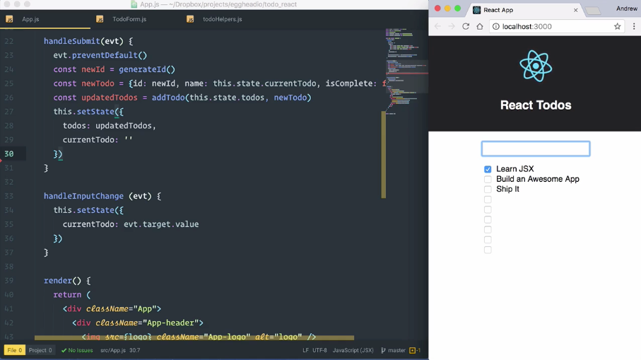

The submit handler for this form is pretty straight forward. We get a `newId`, and we create a `newTodo` using the `currentTodo` value on the `state` and we add it to the list. The submit handler does nothing about empty values though, so I can come into the form and I can press enter a bunch of times. It's going to generate todos with no name each time.

This behavior isn't what we want, so we should add some validation to the form. I could come into this `handleSubmit` form and I could say, if this.state.currentTodo, I could move all of this code into that. Then I could add an else statement, and then add a bunch of logic in here to handle the validation and updating the state show an error message.

Now I basically have a function that's twice as long and has two very different concerns. Since we're updating the `currentTodo` value, each time the value of the input changes we know if the form is valid or not before the form ever gets submitted. We can use that to our advantage and avoid having this ugly conditional code in our formSubmit handler.

I'm going to put this back the way it was, and let's see how we can move the handling of an invalid form into its own function. I'm going to drop down under `handleSubmit` and I'm going to create a new method called handleEmptySubmit. It's going to take an event just like the other one and I'm going to call event.preventDefault.

If this method gets called it means you're trying to submit an empty todo or a todo without a name. I'm going to call this.setState and I'm going to add an error message to the state. I will just make that say, "Please supply a todo name." Now that we have that defined, let's go down to the render method.

Before our return statement I'm going to create a new constant and I'm going to call it submitHandler. I'm going to set this to equal a ternary where I'm going say this.state.currentTodo. If that's truthy, it's going to be this.`handleSubmit` otherwise we're going to set submit handler to be this.handleEmptySubmit.

Then I'm going to come down here to where I'm passing this.`handleSubmit` into the todo form. I'm going to update it to use whatever value submit handler is assigned at the moment. In order for our handleEmptySubmit method to work we're going to need to come up here to our constructor and make sure it has the correct bindings.

With that in place I can save the file and we'll take a look at how this works in the browser. Take a look at React DevTools and I'm going to expand this out. I'm going to find my todo form component. We'll see that it has a `handleSubmit` property that's bound to handleEmptySubmit. That's because we have no value in here.

As soon as I add a value that binding is going to change to `handleSubmit`. That binding will stay put as long as I have content in currentTodo. If I back that out my binding will change back to handleEmptySubmit. Now we can take a look at the props, and our state, and our top level app component.

If I go to the form and I try to submit and empty todo, we'll see that our state is updated and it now has the error message that we specified in our handleEmptySubmit method. Let's update our render method to show our error message. I'll scroll down to render and right inside this todoApp div I'm going to throw in some curly braces. I'm going to reference this.state.errorMessage.

If that's true I'm just going to use double ampersand here, so if it evaluates to true it will then evaluate the statement that comes after it. I'm going to add a span with a class name of error. In that span I'm just going to display this.state.errorMessage. I'll save that. I'll go over here and I'll try to submit an empty form. We'll see that the error message is displayed. Now let's make it standout a little bit better, by defining this error class that we gave it in the span.

Open up app.css and down at the bottom I'll just define error and I'll make that text red, I'll give that a save. We'll see that it's updated right in place in the browser and everything works. The only problem with our current setup is once I'm showing an error message and I put in a valid entry and submit it the submission will work, but the error message hangs around. I'm going to come back over here to App.js and in my `handleSubmit` I'm just going to update this call to set state to set the error message value to an empty string.

Now an invalid submission will show the error message, but a valid one will add the new value and hide the error message.