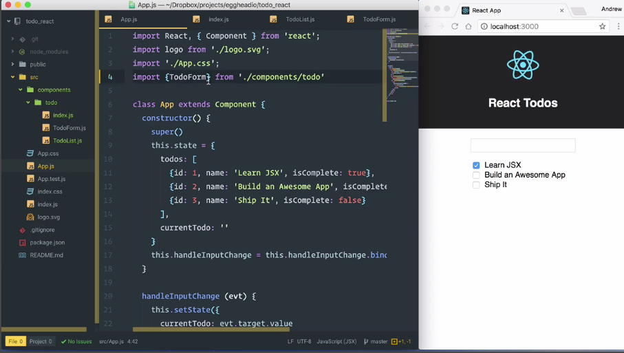
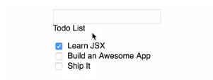

Currently the `"Todo-List"` output in this app is being rendered directly in the main `App` component's `render()` method. We can clean this up by refactoring it out to its own component. First I'll add a new file to the `component/todo` directory. I'll call it `TodoList.js`. I'll start the file with `import React from 'react'`. We are going to make this a stateless functional component.

####TodoList.js
```jsx
import React from 'react'
```

Let's just export a const. We'll call `TodoList` and that's going to equal an arrow function that takes `props`. We're going to have that return some **JSX**. For now we'll just make that a place holder that says `Todo List`.

####TodoList.js
```jsx
import React from 'react'

export const TodoList = (props) => {
    return (
        <div>Todo List</div>
    )
}
```

I'll just save that file, and then we're going to jump into `App.js`. Up at the top we'll see that we're importing this `TodoForm` component by specifying the complete path to that file.

We could create a second line to `import` the `TodoList` component and specify the full path to that but because we have multiple components related to the same piece of functionality and they live in a single directory we can clean this up a bit. I'm going to start by going to the `component/todo` directory and adding a new file. I'm going to call that file `index.js`.

We're going to use `index.js` to `import` all of our components and re-export them, so they're coming from a single source. We'll start with an `export` and we'll say were going to `export {TodoForm} from './TodoForm'`. We want to be able to also get our newly created `TodoList` component. Let's just duplicate that line and we'll update that so that we're also exporting `TodoList` from the `TodoList` component. 


####components/todo/index.js
```jsx
export {TodoForm} from './TodoForm'
export {TodoList} from './TodoList'
```

Now let's go update our `App.js` file. We're going to take this `import` where we are importing `TodoForm` from `'./components/todo/TodoForm'`. We are just going to cut that down to `component/todo`.

####App.js
```jsx
import React, { Component } from 'react';
import logo from './logo.svg';
import './App.css';
import {TodoForm} from './components/todo/'
```

We'll save this and when the browser reloads we'll know if our form still shows up. Everything appears in working order. 



We can also add our `TodoList` to that `import` and now we can jump down to the bottom of the file. 

```jsx
import {TodoForm, TodoList} from './components/todo/'
```

We'll add an instance of that `TodoList` component to our JSX just to make sure it shows up. Then we'll see when the browser refreshes that `TodoList` is in here. This is our place holder content, so our imports worked.

```jsx
<TodoForm handleInputChange={this.handleInputChange}
    currentTodo={this.state.currentTodo}/>
<TodoList/>
```



Now that we have that setup, let's take this entire `div` for our `"Todo-List"`. I'm going to cut it and also get those files out of the way. I'm going to go into the `TodoList.js` file and we're going to replace this place holder JSX with the markup for our `"Todo-List"`. 

####TodoList.js
```jsx
export const TodoList = (props) => {
    return (
        <div className="Todo-List">
            <ul>
                {this.state.todos.map(todo =>
                    <li key={todo.id}>
                      <input type="checkbox" defaultChecked={todo.isComplete}/> {todo.name}
                    </li>)}
            </ul>
        </div>
    )
}
```

Now that we've moved this JSX into a stateless functional component we can no longer get our `todos` through `this.state`. I'll have to update this to say `props.todos`. 

```jsx
{props.todos.map( todo => 
```

Then we're going to have to update `App.js` to pass `todos` into our `props`. I'll jump over to App.js and I'm going to add a `todos` attribute on this component. We're going to pass in `this.state.todos` and everything is working as expected.

```jsx
<TodoForm handleInputChange={this.handleInputChange}
    currentTodo={this.state.currentTodo}/>
<TodoList todos={this.state.todos}/>
```

Let's take another look at our `TodoList` component. We have an opportunity here to break this down even further.

Let's create a component that represents an individual `TodoList` item, so that we can map over that and make this code easier to read. We'll start by adding another file to our `todo` directory and we'll call this `TodoItem.js`. We'll start this file with `import React from 'react'`. I'm going to `export` constant called `TodoItem`.

That's going to be a function that takes `props` and return some JSX. For our JSX we'll just grab that from `TodoList`. I'm going to select this entire `<li>`. I'm going to cut that and I'm going to paste that into `TodoItem`.

####TodoItem.js
```jsx
export const TodoItem = (props) => {
    return (
        <li key={todo.id}>
          <input type="checkbox" defaultChecked={todo.isComplete}/> {todo.name}
        </li> 
    )
}
```

Now we need to refactor this because we've moved this into its own component. We don't have access to anything called `todo` anymore, so we're going to have to get these values from `props`.

```jsx
<li key={props.id}>
  <input type="checkbox" defaultChecked={props.isComplete}/> {props.name}
</li> 
```

I'll save that. We'll jump back into `TodoList.js`. Now we need to `.map` over our `todos` and we need to return a `TodoItem` from each of these. In order to use this we're going to need to `import` it. I'm going to jump up to the top here. I'm going to say, `import {TodoItem} from './TodoItem'`

I need to get my properties from my `todo` into the `TodoItem` component. If you remember we reference `props.name` and `props.id` to get those `todo` properties. What I could do is I could say, `id={}` and then grab the `id` off of the `todo` that's being passed in my `.map`. Then I could also say, `name={todo.name}`

This would work, but it's going to get very verbose. There's a much faster way to do this. I'm going to take these out of here and I'm going to replace them with a pair of curly braces surrounding a reference to `todo` preceded by the **spread operator**.

```jsx
<div className="Todo-List">
    <ul>
        {props.todos.map(todo => <TodoItem {...todo}/>)}
    </ul>
</div>
```

That's going to take all the properties of `todo` and spread them out and pass them into this component as their own individual properties. With that in place we can save.

When the browser reloads we'll see everything is still working. We haven't broken anything and all of our refactoring has been successful. There is one exception though. If I go into the browser and I open up the `DevTools` we're going to see that I have a warning about looping over items without a unique key prop.


We took care of that before, but if we go back into our `TodoItem` we'll see that the key is on this `<li>`. That worked when the `<li>` was directly in the loop, but because it's in its own component that's not where we want it anymore. I'm going to cut that out of `TodoItem.js`.

I'm going to go back into `TodoList.js` and now I'm going to give the `TodoItem` component a `key` property. I'm going to set that equal to `todo.id`. We'll save that. This time when the browser reloads, the error goes away.

####TodoList.js
```jsx
<div className="Todo-List">
    <ul>
        {props.todos.map(todo => <TodoItem key={todo.id} {...todo}/>)}
    </ul>
</div>
```