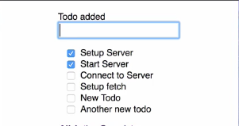
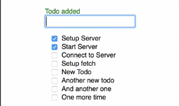

When an item is added to our `todos`, we're performing an optimistic UI update, meaning we're updating the `todos` in our state without waiting for a response from a server. This gives us a responsive UI, but it would be nice to have some kind of confirmation that our save was successful.

Let's add a `message` to the UI when we get a response from the server. I'll start by replacing this call `console.log` in `handleInputChange` with a call to `this.setState`. I'll set a property on the state called `message` to our `todo` Added text. Now our state has a `message` property, we need to `render` it out.

####App.js
```jsx
createTodo(newTodo)
    .then(() => this.setState({message: 'Todo added' }))
```

I'm going to duplicate this line. I'm going to say, if our `message` is defined then we'll `render` out a `<span>` with a `classname` of `'success'`, and its content will be `this.state.message`. I'll save this and after the browser reloads I'll add a new `todo`.

```jsx
<div className="Todo-App">
    {this.state.errorMessage && <span className='error'>{this.state.errorMessage}</span>}
    {this.state.message && <span className='success'>{this.state.message}</span>}
```

We should see `Todo Added` displayed. The problem with this is that `message` is going to sit there and it won't go away. 



Let's comeback into our code and let's make this a temporary `message`. I'm going to define a new method, I'll call `showTempMessage`.

This is going to accept the `msg` argument, and `showTempMessage` is going to call `this.setState`. We're going to use it to set the `message` property to the passed in `msg` value. Then we're going to call `setTimeout()`.

```jsx
showTempMessage = (msg) => {
    this.setState({message: msg})
    setTimeout()
}
```

`setTimeout` is going to call `this.setState` again, also setting the `message` property, but this time setting it to an empty string. `setTimeout` takes the time out value, so I'll make it two and a half seconds. 

```jsx
showTempMessage = (msg) => {
    this.setState({message: msg})
    setTimeout(() => this.setState({message: ''}), 2500)
}
```

I'm going to come up here to our `.then` after we call `createTodo`.
This time I'm going to call `this.showTempMessage`. I'll take the object out of here and we'll just pass in the text `"Todo added"`. 

```jsx
createTodo(newTodo)
    .then(() => this.showTempMessage('Todo added'))
```

I'll save this and I'll give the browser a chance to reload. After I've started up again I'll add another `todo`. Our `message` will be displayed, and after two and a half seconds, it will disappear.

We can clean this up just a little bit, so I'm going to open up `App.css`. Down here, along with our `error` class, I'm just going to paste in `.success` class, that will make the text `green`. We'll save that and I'll add another to do.

####App.css
```css
.success {
    color:green;
}
```

Everything's working as expected.

