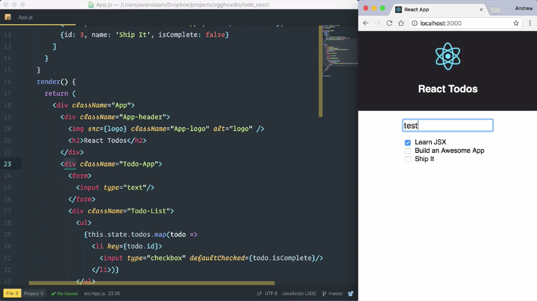
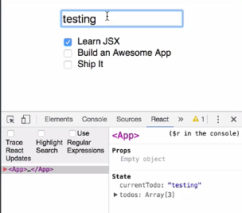

In **React**, our rendered view should be a function of the application state. This means the changes to our state should be reflected in the view. As we see with the checkbox being checked, for todo where `true` `isComplete` flag. This also means the changes that come from user input should be reflected in our state.

If I type something into this text box, we'll see that displayed in the view, but it isn't tracked in our state anywhere. We always want our state to be in sync with our view. Let's go ahead and fix this.



Let's start by adding another property to our application state. I'll add a `,` after our `todos` and I am going to create a value called `currentTodo` For now, I am going to set that to an empty string. 

```jsx
class App extends Component {
    constructor() {
        super()
        this.state = {
            todos: [
                {id: 1, name: 'Learn JSX', isComplete: false},
                {id: 2, name: 'Build an Awesome App', isComplete: false},
                {id: 3, name: 'Ship It', isComplete: false}
            ],
            currentTodo: ''
        }
    }
...
```

I'm going to scroll down to my `<form>` and in my `<input>`, I'm going to set the `value={this.state.currentTodo}`. After it refreshes we'll see that our input is empty.

```jsx
<div className="Todo-App">
    <form>
        <input type="text" value={this.state.currentTodo}/>
    </form>
    ...
</div>
```

Now, when I try to type into here, nothing is going to happen. That's because my `value` is set to that empty string, and currently, I have no way of changing that. In order to allow input, we need to create an **event handler** that can capture the input and assign the value to the current `todo` property in the `Component` state.

Let's start by adding a method to the component. I'm going to call that `handleInputChange`. That's going to accept an `evt`(event). It will get the value of the text input by calling `evt.target.value`. We want to use this to reassign the current `todo` property in our state.

```jsx
class App extends Component {
    constructor() {
        super()
        this.state = {
            todos: [
                {id: 1, name: 'Learn JSX', isComplete: false},
                {id: 2, name: 'Build an Awesome App', isComplete: false},
                {id: 3, name: 'Ship It', isComplete: false}
            ],
            currentTodo: ''
        }
    }

    handleInputChange (evt) {
        evt.target.value
    }

    ...
```

If you're new to React, you're first instinct might be to call this `this.state.curentTodo` and reassign it using this incoming value. Instead, what we want to do is call the component's `setState` method and pass in a new value.

First, I'll get rid of this reference to the current `todo`, and I'll call `this.setState()`. I'm going to pass `.setState` an object. This object is going to contain the key or the keys that I want to update, along with their new values.

```jsx
handleInputChange (evt) {
    this.setState({

    })
    evt.target.value
}
```

I want to update the `currentTodo` value and I want that to be this `evt.target.value`, so paste that in there. In order for this method to update our state, we have to do two things. First, we need to reference it in our `constructor` and `.bind` it to `this`.

```jsx
handleInputChange (evt) {
    this.setState({
        currentTodo: evt.target.value
    })
}
```

I'm going to move up into my `constructor` code. I'm going to call `this.handleInputChang` and I'm going to set it to `= this.handleInputChange` again. This time calling `.bind` and passing in `this` for our `this` context. This is to ensure that when we call `this.setState` inside our method, `this` refers to the correct context.

```jsx
constructor() {
    super()
    this.state = {
        todos: [
            {id: 1, name: 'Learn JSX', isComplete: false},
            {id: 2, name: 'Build an Awesome App', isComplete: false},
            {id: 3, name: 'Ship It', isComplete: false}
        ],
        currentTodo: ''
    }
    this.handleInputChange = this.handleInputChange.bind(this)
}
```

The second thing we need to do in order for this `handleInputChange` method to update our state is to set it as the handler for the `onChange` event over input. I'm going to drop down to where I have to find the `<input>` field. I'm going to add an attribute for the `onChange` event and I'm going to assign `this.handleInputChange`.

```jsx
<div className="Todo-App">
    <form>
        <input type="text" onChange={this.handleInputChange} value={this.state.currentTodo}/>
    </form>
</div>
```

I save my changes, the browser refresh. I'm going to open up my DevTools. I'm going to the `React DevTools`. We'll see that `currentTodo` is part of my state. I'm going to come up to my `input`. I'm going to start typing a value in.

As I type each character, we're going to see the `currentTodo` in our state down in DevTools gets updated to reflect the current value of our input.



By doing this, we've ensured that our view as a function of state, keeping the rendered output and the state data in sync.