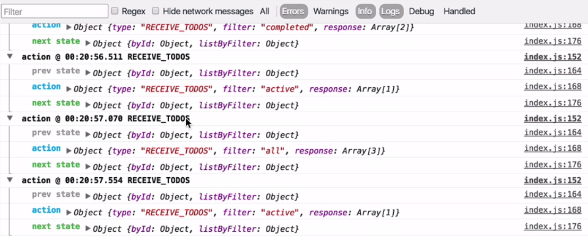

I'm increasing the delay in my fake API client to five seconds. This lets me notice a problem. 

**index.js -- api**
```javascript
export const fetchTodos = (filter) =>
  delay(5000).then(() => { ... })
```
We don't check if the tab is **already loading** before starting a request, and then a bunch of `RECEIVE_TODOS` action comes back, potentially resulting in a **race condition**.



To fix this, I can exit early from the `fetchTodos` action creator if I know that I'm already fetching the todos for the given `filter`. I will use the existing top level `getIsFetching` selector, that accepts the `store`, `state`, and the `filter` as arguments. If it returns `true`, I will exit early from my thunk without dispatching any actions.

**index.js**
```javascript
export const fetchTodos = (filter) => (dispatch) => {
  if (getIsFetching(getState(), filter)) {
    return;
  }

  dispatch(requestTodos(filter));

  return api.fetchTodos(filter).then(response => {
    dispatch(receiveTodos(filter, response));
  }); 
};
```
The `getIsFetching` selector is defined inside the top level reducer file. I will import it as a named import from `../reducers`. 

**index.js**
```javascript
import { getIsFetching } from '../reducers';
```
Another function I'm using that isn't defined in this file is `getState`, and it belongs to the `store` object, but I don't have access to it directly from the action creator.

However, I can make it so that the `thunk` middleware injects not just `store` dispatch function inside the `thunk` actions, but also `store.getState` function. This way, I can grab it as a second argument after dispatch inside my `thunk` action creator, so I'm adding `getState` as a second argument.

**configureStore.js**
```javascript
const thunk = (store) => (next) => (action) =>
  typeof action === 'function' ?
  action(store.dispatch, store.getState) :
  next(action)
```
The `fetchTodos` action creator now dispatches actions conditionally, and if I run the app, I can't get it to produce more than three concurrent requests.

**index.js**
```javascript
export const fetchTodos = (filter) => (dispatch, getState) => {
  if (getIsFetching(getState(), filter)) {
    return;
  }
```


Only after the corresponding `receiveTodos` actions come back, the `isFetching` flag gets reset, and we can request the new todos. This is a good way to avoid unnecessary network operations and potential race conditions.

This is a very common pattern, so you don't have to write the `thunk` middleware yourself. Instead, you can open up a terminal and run `npm install --save redux-thunk`.

**terminal**
```bash
npm install --save redux-thunk
```
It installs the thunk middleware that is very similar to the one I wrote here, so I can remove my version of thunk middleware, and instead, I can import `thunk` from `redux-thunk`.

**configureStore.js**
```javascript
import thunk from 'redux-thunk'
```
Finally, let's take a look at the return value of the `thunk`. It returns a promise. It doesn't have to, but it's convenient for the calling code, so I will change the early return to also return a promise that resolves immediately.

**index.js**
```javascript
export const fetchTodos = (filter) => (dispatch, getState) => {
  if (getIsFetching(getState(), filter)) {
    return Promise.resolve();
  }
```
The `thunk` middleware itself does not use this promise, but it becomes the return value of dispatching this action creator, so I can use it inside the component to schedule some code after the asynchronous action has completed.

**VisibleTodoList.js**
```javascript
fetchData() {
  const { filter, fetchTodos } = this.props;
  fetchTodos(filter).then(() => console.log('done!'));
}
```
Let's recap how we use `redux-thunk` to dispatch actions asynchronously and conditionally. In the component, we dispatch the `fetchTodos` action, which is implemented as an asynchronous action creator that returns a `thunk` that is a function that will get interpreted by the `redux-thunk` middleware.

**index.js**
```javascript
export const fetchTodos = (filter) => (dispatch) => {
  if (getIsFetching(getState(), filter)) {
    return Promise.resolve();
  }

  dispatch(requestTodos(filter));

  return api.fetchTodos(filter).then(response => {
    dispatch(receiveTodos(filter, response));
  }); 
};
```
I import `thunk` from the `redux-thunk` package I installed from `npm`, and I added `thunk` to the list of redux middlewares I use to create my store. The thunk middleware sees that I dispatched a `function` rather than an `action`, so it calls it with `dispatch `as an argument so that it can dispatch multiple times.

It also passes a second argument called `getState` that lets me get the current `state` of the redux store. I pass the `state` to the `getIsFetching` selector that I import as a top level named import from the reducers file.

I am passing the current `state` of the store and the `filter` to get `isFetching`, and if I am already fetching the todos for this filter, then I will exit early from the `thunk` so that I don't call the API or dispatch any actions.

**index.js**
```javascript
export const fetchTodos = (filter) => (dispatch, getState) =>
  if(getIsFetching(getState(), filter)) {
    return Promise.resolve();
  }
```
Finally, the `thunk` middleware has no opinion on what you return from the `thunk` itself. As a convention, I prefer to always return a `promise` that represents the corresponding asynchronous operation, whether or not it has called the server.

The return value of the `thunk` becomes the return value of dispatching this `thunk`, and I can use this to wait for the asynchronous operation to finish inside my component in order to show a message or start an animation.

**VisibleTodoList.js**
```javascript
fetchData() {
  const {filter, fetchTodos } = this.props;
  fetchTodos(filter).then(() => console.log('done!'));
}
```