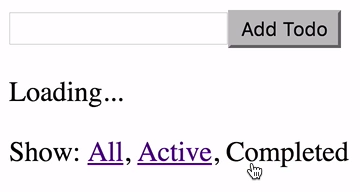
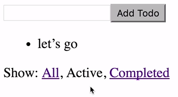

When the data is fetched **asynchronously**, we want to display some kind of **visual cue to the user**. I'm adding a condition to the `render` function that says that if we're fetching data, and we have no `todos` to show, we're going to return something like a loading indicator from the `render` function.

**VisibleTodoList.js**
```javascript
render() {
  const { toggleTodo, ...rest } = this.props;
  if (isFetching && !todos.length) {
    return <p>Loading...</p>;
  }
}
```
I will grab `todos` and `isFetching` from the **props**. In fact, `todos` is the only extra prop we need to pass to the `list`. Instead of using the [spread operator](https://egghead.io/lessons/ecmascript-6-using-the-es6-spread-operator), I'll just pass the `todos` directly. My `mapStateToProps` function already calculates the `visibleTodos`, and it includes the `todos` in the props.

**VisibleTodoList.js**
```javascript
return (
  <TodoList
    todos={todos},
    onTodoClick={toggleTodo}
  />
);

const mapStateToProps = (state, { params }) => {
  const filter = params.filter || 'all';
  return {
    todos: getVisibleTodos(state, filter),
    filter,
  };
};
```
I need to do something similar for `isFetching`. `GetIsFetching` accepts the current `state` of the app, and the `filter` for which we want to check if the todos are being fetched. It is declared alongside other top level selectors in the top level reducer file.

**VisibleTodoList.js**
```javascript
import { getVisibleTodos, getIsFetching } from '../reducers';

const mapStateToProps = (state, { params }) => {
  const filter = params.filter || 'all';
  return {
    todos: getVisibleTodos(state, filter),
    isFetching: getIsFetching(state, filter),
    filter,
  };
};
```
I am now switching to the **root** reducer file to add another exported named function, which is the new selector called `getIsFetching`. It accepts the `state` of the app and the `filter` as arguments. It delegates to another selector to find and create `list` that gets whether this `list` is currently being fetched. I am passing the state of this list, which I get from `state.listByFilter`. 

**index.js**
```javascript
export const getIsFetching = (state, filter) =>
  fromList.getIsFetching(state.listByFilter[filter]);
```
I am using a selector that I have not created yet. I will go to `createList.js` and add it. First, I need to modify the state shape of the list. Rather than assume the `state` is the array of IDs, I will assume it is an **object** that contains this array as a **property**.

**createList.js**
```javascript
export const getIds = (state) => state.ids;
export const getIsFetching = (state) => state.isFetching;
```
Now I can add another selector called `getIsFetching` that reads another property from the state object, which is a built-in flag called `isFetching`. I want my reducer to keep track of both of these fields. Rather than complicate the existing reducer, I will rename it to `ids`, because it manages just the `ids`.

**createList.js**
```javascript
const createList = (filter) => {
  const ids = (state = [], action) => { ... }
}
```
I will create a separate reducer called `isFetching` that manages just the `state` of the fetching flag. Its initial state is `false`, and it looks just like any other reducer. I am now scrolling up to add an import for the `combineReducers` utility from `redux`.

**createList.js**
```javascript
import { combineReducers } from 'redux';

const createList = (filter) => {
  const ids = (state = [], action) => { ... }

  const isFetching = (state = false, action) => {

  }
}
```
Now I can return a `combinedReducer` from `createList` that manages both `ids` and `isFetching`. The `isFetching` reducer implementation is very simple. We switch on the action type, and if it is `REQUEST_TODOS`, we'll return `true` because we started fetching.

**createList.js**
```javascript
const isFetching = (state = false, action) => {
  switch (action.type) {
    case 'REQUEST_TODOS':
      return true;
    case 'RECEIVE_TODOS':
      return false;
    default: 
      return state;
  }
}

return combinedReducer({
  ids,
  isFetching,
})
```
If it's `RECEIVE_TODOS`, we'll return `false` because the operation has finished. For any unknown action, we'll return the current `state`. Now I'm scrolling back up to the `ids` reducer, and I will copy the condition that tells it to ignore any actions with a `filter` that does not match the `filter` argument to `createList`.

**createList.js**
```javascript
const isFetching = (state = false, action) => {
  if (action.filter !== filter) {
    return state;
  }
  switch (action.type) {
    case 'REQUEST_TODOS':
      return true;
    case 'RECEIVE_TODOS':
      return false;
    default: 
      return state;
  }
}
```
Finally, I'm handling the `REQUEST_TODOS` action, but I'm not dispatching it anywhere. In the file where I define the action creators, I am adding a new exported function called `requestTodos` that takes the `filter` and returns an action object describing the `REQUEST_TODOS` action with the corresponding filter.

**index.js**
```javascript
export const requestTodos = (filter) => ({
  type: 'REQUEST_TODOS',
  filter,
});
```
Every exported action creator from this file will be available on the props of the `visibleTodoList` component. I can just structure `requestTodos` from the props, and I can call it right before starting the asynchronous operation with `fetchTodos`.

**VisibleTodoList.js**
```javascript
fetchData() {
  const { filter, requestTodos, fetchTodos } = this.props;
  requestTodos(filter);
  fetchTodos(filter)
}
```
If I run the app now, I will see not one, but two actions, `REQUEST_TODOS`, and `RECEIVE_TODOS`. If I look at the state after the `REQUEST_TODOS` action, I will see that inside the all list state, is fetching flag is set to true.


When the corresponding `RECEIVE_TODOS` action fires, the flag gets reset back to `false`, and the `ids` are not an empty array anymore. 


As I navigate the tabs for the first time, I see the loading indicator show up. 



However, if I visit them again, I already have cached data. I prefer to show that to a loading indicator.



Let's recap. In the component, I dispatch an action called `requestTodos` before fetching them. The `REQUEST_TODOS` action creator returns an action object with a type of `REQUEST_TODOS`, and the filter that I passed.

**index.js**
```javascript
export const requestTodos = (filter) => ({
  type: 'REQUEST_TODOS',
  filter,
});
```
I handle the `REQUEST_TODOS` action inside `isFetching` reducer, where it returns `true` if we began fetching. As soon as we receive the `todos`, it returns `false`, so that the loading indicator can reset. The `isFetching` reducer is combined with the `ids` reducer into a single reducer that is returned from `createList`.

**createList.js**
```javascript
const isFetching = (state = false, action) => {
  if (action.filter !== filter) {
    return state;
  }
  switch (action.type) {
    case 'REQUEST_TODOS':
      return true;
    case 'RECEIVE_TODOS':
      return false;
    default:
      return state;
  }

  return combineReducers({
    ids,
    isFetching,
  });
};
```
The state shape of the `combinedReducer` contains both `ids` and `isFetching`. We can use these fields in the corresponding selectors. State `isFetching` is returned by get `isFetching` selector inside `createList. Every list is independent.


**createList.js**
```javascript
export const getIds = (state) => state.ids;
export const getIsFetching = (state) => state.isFetching;
```
The top level selector calls it with a slice of the state corresponding to the list for the given filter. 

**index.js**
```javascript
export const getIsFetching = (state, filter) =>
  fromList.getIsFetching(state.listByFilter[filter]);
```
The top level `getIsFetching` selector is called from the component in `mapStateToProps`.

**VisibleTodoList.js**
```javascript
const mapStateToProps = (state, { params }) => {
  const filter = params.filter || 'all';
  return {
    todos: getVisibleTodos(state, filter),
    isFetching: getIsFetching(state, filter),
    filter,
  };
};
```
Finally, we use the `isFetching` prop inside the `render` function of our component to render a `Loading...` indicator if we are fetching, and there are no cached todos to show.

**VisibleTodoList.js**
```javascript
if (isFetching && !todos.length) {
  return <p>Loading...</p>;
}
```