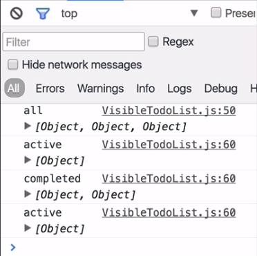

I'm removing the `fetchTodos` API call from my **entry point** because I want to fetch the todos inside my **component**. The component that displays and selects the todos is the `VisibleTodoList`. I'm placing the `fetchTodos` import into the `VisibleTodoList` file.
```javascript
// VisibleTodoList.js
import { fetchTodos } from '../api';
```
The `VisibleTodoList` component is generated by the `connect()`, and `withRouter()` calls that each generate an intermediate component that inject **props**. A good place to call the API would be inside `componentedDidMount` **life cycle hook**.

Since I can't override the life cycle hooks of generated components, I have to create a new React component. I'm importing React and the component base class from React, 
```javascript
import React, { Component } from 'react';
```
and I will declare a React `Component` class called `VisibleTodoList`.

It extends the React base `Component` class. I'm defining the `render()` method, and I still want to render the **presentational** to the `TodoList` component exactly. The only purpose of adding this new class is to add the life cycle hooks. I will pass any props down to the `TodoList`.
```javascript
// VisibleTodoList.js
class VisibleTodoList extends Component {
  render() {
    return <TodoList {...this.props}
  }
}
```
Since the `VisibleTodoList` is defined as a class above, I can't declare another constant with the same name, but I can reassign the `VisibleTodoList` binding to point to the wrapped component. Now I'm changing the `connect()` call to wrap my new class instead.
```javascript
// VisibleTodoList.js
VisibleTodoList = withRouter(connect( ... ));
```
The component generated by the `connect()` call will render the `VisibleTodoList` class I defined. The result of the `connect()`, and `withRouter` wrapping calls is the final `VisibleTodoList` component that I export from the file.

Now I will define the `componentedDidMount` life cycle hook inside my `VisibleTodoList` component class. When the component **mounts**, I want to fetch the todos for the current filter. It will be convenient to have the filter directly available as a prop.
```javascript
// VisibleTodoList.js
componentDidMount() {
  fetchTodos();
}
```
I am changing `mapStateProps` to calculate the `filter` from `params`, just like it used to, but to also pass it as one of the properties on the return object. I will get both the `todos` and the `filter` itself inside the `VisibleTodoList` component.
```javascript
// VisibleTodoList.js
const mapStateProps = (state, { params }) => {
  const filter = params.filter || 'all';
  return {
    todos: getVisibleTodos(state, filter),
    filter,
  }
};
```
Going back to the life cycle method, I can use `this.props.filter` inside `componentDidMount` now. 

When the todos are fetched, fetch todos returns a **promise**. I can use the `.then` method to access the resolved todos, and to log the current filter, and the todos I just received from the fake backend.
```javascript
// VisibleTodoList.js
componentDidMount() {
  fetchTodos(this.props.filter).then(todos =>
   console.log(this.props.filter, todos) 
  );
}
```
If I run the app now, I will see the `all` filter being printed, and the `todos` corresponding to the `all` filter. However, as I change the filter, nothing happens, because `componentedDidMount` only runs once. To fix this, I am adding a second life cycle hook called `componentDidUpdate`.

It receives the previous props as an argument. I can compare the current and the previous values of the filter. If the current filter is not the same as the previous filter, it's time to fetch the todos for the current filter.
```javascript
componentDidUpdate(prevProps) {
  if (this.props.filter !== prevProps.filter) {
    fetchTodos(this.props.filter).then(todos => 
      console.log(this.props.filter, todos)
      );
  }
}
```
I'm writing exactly the same code. When the todos are fetched, I want to print the current filter, and the corresponding todos. Clicking on a link now changes the route, and so it changes the filter prop. As a result, we fetch the data in the life cycle hooks. 

