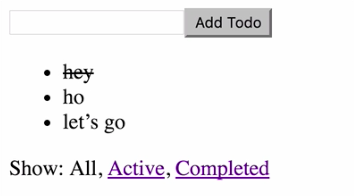

I'm using the links provided by **React Router** now, so when I click on a link, the URL gets updated. However, the content does not get updated because the `VisibleTodoList` component in its `mapStateToProps` function still depends on the `visibilityFilter` in the Redux store instead of reading it from the URL.


**VisibleTodoList.js**
```javascript 
const mapStateToProps = (state) => ({
  todos: getVisibleTodos(
    state.todos,
    state.visibilityFilter
  ),
});
```

I am adding an argument called `ownProps` to the `mapStateToProps` function, and I'm going to read the current `visibilityFilter` from `ownProps`. I will also change the `getVisibleTodos` function to use the current convention we use for the `filter` prop that is all `completed` or `active`.


**VisibleTodoList.js**
```javascript
const getVisibleTodos = (todos, filter) => {
  switch (filter) {
    case 'all':
      return todos;
    case 'completed':
      reutrn todos.filter(t => t.completed);
    case 'active':
      return todos.filter(t => !t.completed);
    default: 
      throw new Error('Unknown filter: ${filter}')
  } 
}
```

The `VisibleTodoList` component gets rendered from the app, so this is where we need to add the `filter` prop to make it available in the `mapStateToProps` function of the `VisibleTodoList`.


**App.js**
```html
const App = () => (
  <div>
    <AddTodo />
    <VisibleTodoList
      filter={filter}
    />
    <Footer />
  </div>
);
```

We want the `filter` prop to correspond to the current `filter` parameter in our route configuration. React Router makes such parameters available to the route handler components in a special prop called `params`, so I'm adding a `params` prop to the app, and now I can read the filter from `params.filter`.


**App.js**
```html
const App = ({ params }) => (
  <div>
    <AddTodo />
    <VisibleTodoList
      filter={params.filter}
    />
    <Footer />
  </div>
);
```

Since its empty on the root path, I'm passing `all` as a fallback to the `VisibleTodoList`. Now I'll refresh the app, and as I press the `visibilityFilter` links, not only does the URL update, but also the console updates, even if I use back and forward buttons in the browser.





**App.js**
```html
const App = ({ params }) => (
  <div>
    <AddTodo />
    <VisibleTodoList
      filter={params.filter || 'all'}
    />
    <Footer />
  </div>
);
```

One common problem after enabling routing is, if we go to another path and press refresh, your dev server may not be configured correctly to serve anything but the root path.


I'm using `Express` with `webpackDevMiddleware` in my development, so I just need to tell **Express** to serve index HTML no matter what the path is. This way, the dev server always serves the same HTML file, and React Router matches the route on the client.


**devServer.js**
```javascript
app.get('/*', (req, res) => {
  res.sendFile(path.join(__dirname, 'index.html'));
});
```

Now that the `visibilityFilter` is managed by React Router, I no longer need the `visibilityFilter` reducer. I'm just going to delete it and also remove it from the combined reducers declaration in reducers/index.js.


**reducers/index.js**
```javascript
import { combineReducers } from 'redux';
import todos from './todos';

const todoApp = combineReducers({
  todos,
});

export default todoApp;
```

Let's recap how React Router became the source of truth for the `visibilityFilter`. In the root component, I render the `Router`, and I only have a single route with an optional `:filter` parameter. The `:filter` parameter gets passed into the `{App}` component by React Router. React Router will make it available inside a special `{ params }` prop.


**Root.js**
```javascript
const Root = ({ store }) => (
  <Provider store={store}>
    <Router history={broswerHistory}>
      <Route path="/(:filter)" component={App} />
    </Router>
  </Provider>
);
```

**App.js**
```javascript
const App = ({ params }) => (
  <div>
    <AddTodo />
    <VisibleTodoList
      filter={parms.filter || 'all'}
    />
    <Footer />
  </div>
);
```

I am passing the `filter` param from the URL, or `'all'` if we are on the root path, to the `VisibleTodoList` component as a `filter` prop. The `VisibleTodoList` component now reads the `filter` from its props and not from the state, so it uses the `filter` specified by the app


**VisibleTodoList.js**
```javascript
const mapStateToProps = (state, ownProps) => ({
  todos: getVisibleTodos(
    state.todos, 
    ownProps.filter
  ),
});
```

I change the `getVisibleTodos` function to use the current filter names, `all`, `completed`, and `active`. For consistency, the footer component now also uses these names as the value of the filter prop for the 'FilterLink`, and I re-implemented the `FilterLink` to use the `Link` provided by React Router instead of our own implementation.


**FilterLink.js**
```javascript
const FilterLink = ({ filter, children }) => {
  <Link
    to={filter === 'all' ? '' : filter}
    activeStyle={{
      textDecoration: 'none',
      color: 'black',
    }}
  >
   {children}
  </Link>
};
```

Finally, I fix the dev server to correctly return index HTML no matter which path is requested, so that React Router can pick it up on the client.

**devServer.js**
```javascript
app.get('/*', (req, res) => {
  res.sendFile(path.join(__dirname, 'index.html'));
});
```

You might think that making the router in control of the `visibilityFilter` contradicts the idea of a single-state tree. However, in practice, what matters is that there's just one single source of truth for any independent piece of data.

We're using Redux as the source of truth for the todos, and we're using React Router as the source of truth for anything that can be computed from the URL. In our case, this is the current `visibilityFilter`.