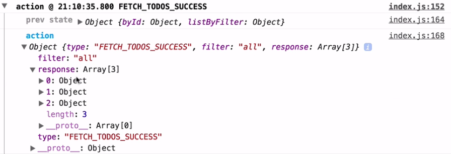
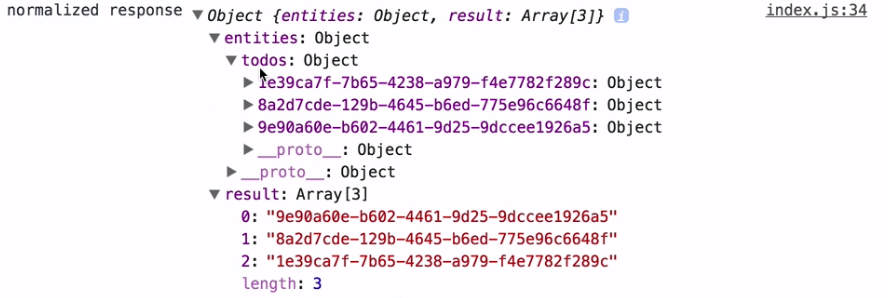
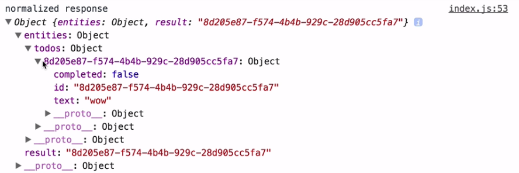
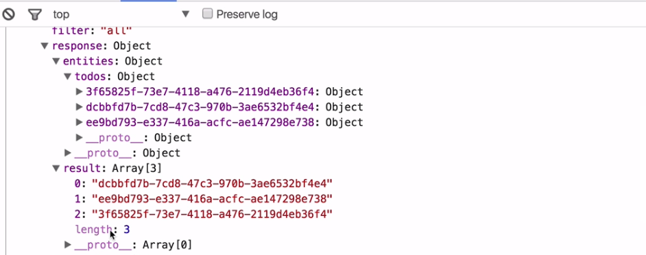

In the `byId` reducer, I currently have to **handle different server** actions in a different way, because they have different **response shape**. For example, the `FETCH_TODOS_SUCCES` action has a response, which is an array of todos.

**byId.js**
```javascript
const byId = (state = {}, action) => {
  switch (action.type) {
    case 'FETCH_TODOS_SUCCES':
    action.response.forEach(todo => {
      nextState[todo.id] = todo;
    });
    return nextState;
  }
}
```
I have to iterate over them and merge them one by one into the `nextState`. `ADD_TODO_SUCCESS` is different. The response for adding a `todo` is the `todo` itself. I have to merge a single `todo` in a different way.

**byId.js**
```javascript
  case 'ADD_TODO_SUCCESS':
    return {
      ...state,
      [action.response.id]: action.response,
    };
```
Instead of adding new cases for every new API call, I want to normalize the responses so the response shape is always the same.

I'm running `npm install --save normalizr`, which is a utility library that helps me **normalize API responses** to have the **same shape**. 

**terminal**
```bash
$ npm install --save normalizr
```
I'm creating a new file in the actions directory called `schema.js`. I'm importing a `Schema` constructor, and a function called `arrayOf` from Normalizr.

**schema.js**
```javascript
import { Schema, arrayOf } from 'normalizr';
```
I will export two schemas from this file. I create a schema for the `todo` objects, and specify `todos` as the name of the dictionary in the normalized response. I also create another schema called `arrayOfTodos` that corresponds to the responses that contain arrays of `todo` objects.

**schema.js**
```javascript
export const todo = new Schema('todos');
export const arrayOfTodos = arrayOf(todo);
```
Next, I am opening the file where I define action creators, and I am adding a named import for a function called `normalize` that I import from Normalizr. I also add a namespace import for all the schemas I defined in the schema file.

**index.js**
```javascript
import { normalize } from 'normalizr';
import * as schema from './schema';
```
I'm scrolling down to the `FETCH_TODOS_SUCCES` callback, and adding a normalized response log so that I can see what the normalized response looks like. I'm calling the `normalize` function with the original response as the first argument, and the corresponding schema -- in this case, array of todos -- as the second argument.

**index.js**
```javascript
return api.fetchTodos(filter).then(
  response => {
    console.log(
      'normalized respone',
      normaliz(response, schema.arrayOfTodos)
    );
    dispatch({
      type: 'FETCH_TODOS_SUCCES',
      filter,
      response,
    });
  },
)
```
Next, I'm scrolling down to the `ADD_TODO_SUCCESS` handler. When the response comes back, I want to log the normalized response by calling the `normalize` function with the original response as the first argument, and the corresponding schema -- in this case, a schema for a single `todo` -- as the second argument.

**index.js**
```javascript
export const addTodo = (text) => (dispatch) =>
  api.fetchTodos(text).then( response => {
    console.log(
      'normalized respone',
      normaliz(response, schema.todo)
    );
    dispatch({
      type: 'ADD_TODO_SUCCESS',
      response,
    });
  },
)
```
If I run the app now and look at the response in the action, I will see an array of todo objects, 



however, a normalized response for fetch todo success action looks differently. It contains two fields called entities and result. Entities contains a normalized dictionary called `todos` that contains every `todo` in the response by its `id`. Normalizr found these `todo` objects in the response by following the array of todos schema. Conveniently, they are indexed by `ids`, so they will be easy to merge into the lookup table.



The second field is the `result`. It's an array of `todo ids`. They are in the same order as the `todos` in the original response array. However, Normalizr replaced each `todo` with its `id`, and moved every `todo` into the `todos` dictionary.

Normalizr can do this for any API response shape. For example, let's add a todo. The original action response object will be the todo itself, as returned by the server. 


The normalized response will contain two fields, just like before, `entities` and `result`.



Like before, the `entities` object will contain the `todos` dictionary, this time with a single item. In the `result` field, we will see just the `id` of the todo, because the original response is just the single `todo`, and Normalizr replaced it with its `id` in the `result` field.

I will now change the action creator so that they pass the normalized response in the response field, instead of the original response.

**index.js**
```javascript
return api.fetchTodos(filter).then(
  response => {
    dispatch({
      type: 'FETCH_TODOS_SUCCES',
      filter,
      response: normalize(response, schema.arrayOfTodos),
    });
  },
  error => { ... });

export const addTodo = (text) => (dispatch) =>
  api.fetchTodos(text).then( response => {
    dispatch({
      type: 'ADD_TODO_SUCCESS',
      response: normalize(response, schema.todo),
    });
  },
)
```
As a reminder, we have to pass the schema as the second argument, and its schema `todo` for the single `todo`, and its schema array of todos for the array of todo objects in the response.

Now, I can open the by ID reducer, and I can delete these special cases, because the **response shape** is going to be very **similar**. Rather than switch by `action.type`, I will check if the action has a response object on it.

I will return a new version of the lookup table that contains all existing entries, as well as any entries inside `entities.todos` in the normalized response. For other actions, I will return the lookup table as it is.

**byid.js**
```javascript
const byId = (state = {}, action) => {
  if (action.response) {
    return {
      ...state,
      ...action.response.entities.todos,
    };
  }
  return state;
}
```
Now, I need to switch to the `ids` reducer to amend it to understand the new action response shape. For fetched `todos`, it used to be an array of `todos`. For `ADD_TODO_SUCCESS`, it used to be the `todo` itself.

**createList.js**
```javascript
switch (action.type) {
  case 'FETCH_TODOS_SUCCES':
    return filter === action.filter ?
    action.response.map(todo => todo.id) :
    state;
  case 'ADD_TODO_SUCCESS':
    return filter !== 'completed' ?
      [...state, action.response.id] :
      state;
    default:
      return state;
}
```
Now, the action response has a `result` field, which is already an array of `ids`, in case of `FETCH_TODOS_SUCCES`, and our single id of the fetched `todo` in case of `ADD_TODO_SUCCESS`.

**createList.js**
```javascript
switch (action.type) {
  case 'FETCH_TODOS_SUCCES':
    return filter === action.filter ?
    action.response.result :
    state;
  case 'ADD_TODO_SUCCESS':
    return filter !== 'completed' ?
      [...state, action.response.result] :
      state;
    default:
      return state;
}
```
I can run the app now, and inspect the action response. I can see that, for `FETCH_TODOS_SUCCES`, the response contains the `entities` which contains the `todos` by their `ids`, and the `result` is an array of `ids` in the same order as they were in the original response.



I can also add a todo, and the action response will also contain the `entities` and the `result`, where the `entities` contains the `todos` by their IDs, in this case, a single todo. The result is the id of the added todo.

///////////// 6:03 could add screenshot if necessary but it will be very similar to the above photo

Let's recap how to work with normalized responses. `FETCH_TODOS_SUCCES` original response contained an array of `todos`. Normalizr replaces them with an array of their `ids` in the `result` field. The `ADD_TODO_SUCCESS` original response was a single `todo`, so action response `result` becomes its `id`.

**createList.js**
```javascript
switch (action.type) {
  case 'FETCH_TODOS_SUCCES':
    return filter === action.filter ?
    action.response.result :
    state;
  case 'ADD_TODO_SUCCESS':
    return filter !== 'completed' ?
      [...state, action.response.result] :
      state;
    default:
      return state;
}
```
Inside the `byId` reducer, I removed all the special cases for different action types. I just check if the action contains a normalized response. The `entities` field will contain different dictionaries. In this example, I only have a single `todos` dictionary, which corresponds to the objects with a `todo` schema.

**byid.js**
```javascript
const byId = (state = {}, action) => {
  if (action.response) {
    return {
      ...state,
      ...action.response.entities.todos,
    };
  }
  return state;
}
```
I use the [object spread operator](https://egghead.io/lessons/ecmascript-6-using-the-es6-spread-operator?course=learn-es6-ecmascript-2015) to merge the old lookup table and the newly-fetched `todos`. The name of the dictionary inside entities corresponds to the string argument that I passed to the schema constructor when I created the `todo` schema.

**schema.js**
```javascript
export const todo = new Schema('todos');
export const arrayOfTodos = arrayOf(todo);
```
I have two kinds of API responses in my app, a single todo, and an array of todos. I use the `arrayOf` function from Normalizr to create a corresponding array schema.

Finally, in the action creators, I call the normalize function to get the normalized response from the original response, and the schema that I know corresponds to this API endpoint.

**index.js**
```javascript
return api.fetchTodos(filter).then(
  response => {
    dispatch({
      type: 'FETCH_TODOS_SUCCES',
      filter,
      response: normalize(response, schema.arrayOfTodos),
    });
  },
  error => { ... });
```
I know that the original response from `FETCH_TODOS_SUCCES` is an array of `todo` objects. I pass the array of `todos` schema. The `ADD_TODO_SUCCESS` response shape is a single `todo` item. I pass the schema for a single `todo` to the normalize function that I import from Normalizr.

**index.js**
```javascript
export const addTodo = (text) => (dispatch) =>
  api.fetchTodos(text).then( response => {
    dispatch({
      type: 'ADD_TODO_SUCCESS',
      response: normalize(response, schema.todo),
    });
  },
)
```