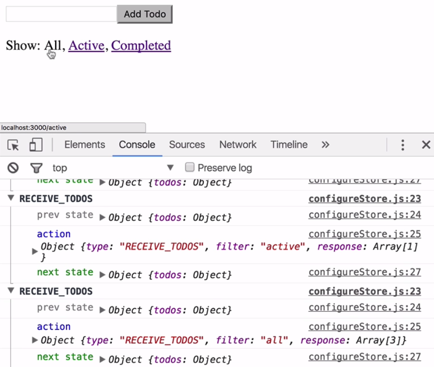
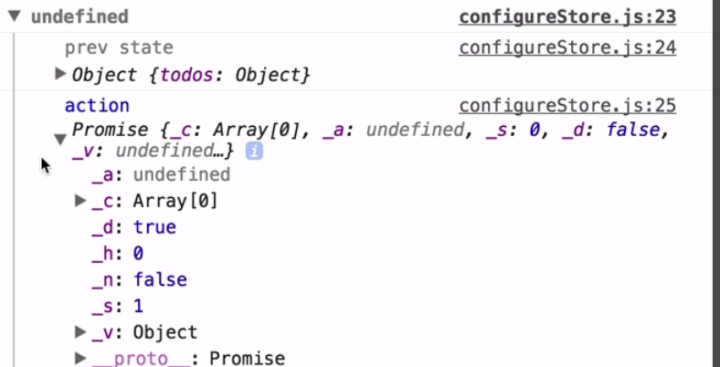

The `receiveTodos` action creator is not very useful by itself because anytime we call it, we want to fetch the `todos` first. Also, they accept the same argument so it would be great if we could group this code into a **single action creator**.


**VisibleTodoList.js**
```javascript
fetchData() {
  const { filter, receiveTodos } = this.props;
  fetchTodos(filter).then(todos =>
    receiveTodos(filter, todos)
  );
}
```
I'm opening the file where I define the action creators and I'm adding a new `import` there. It will make all functions in the `API` module available on the **API namespace import object**.


**index.js**
```javascript
import * as api from '../api';
```
I'm adding a special kind of action creator that I'm going to call an asynchronous action creator. It takes `filter` as an argument and it calls the API `fetchTodos` method with it. I'm using the promise `.then` method to transform the result of the promise from the `response` to the action object generated by `receiveTodos` given the `filter` and the `response`.


**index.js**
```javascript
export const fetchTodos = (filter) =>
  api.fetchTodos(filter).then(response =>
    receiveTodos(filter, response)
  );
```
`ReceiveTodos` return an action object synchronously but `fetchTodos` returns a promise that resolves through the action object. I can stop exporting `receiveTodos` because I'll change the components to use `fetchTodos` directly.

I'm going back to my component file and I can use the `fetchTodos` prop injected by `connect()` which corresponds to the new asynchronous `fetchTodos` action creator. 


**VisibleTodoList.js**
```javascript
fetchData() {
  const { filter, fetchTodos } = this.props;
  fetchTodos(filter);
}
```
I'm removing the direct import of `fetchTodos` function from API because from now on I'll be using the `fetchTodos` action creator, which is injected into the props by `connect()`.

Let's take another look at what happens in the action creators. The `fetchTodos` action creator calls the `fetchTodos` function from the API but then it transforms its result into a Redux action generated by `receiveTodos`.

However, by default, Redux only allows dispatch in **plain objects** rather than promises. We can teach it to recognize promises by using the same trick that we use for `addLoggingToDispatch`.

`addLoggingToDispatch` is the function we wrote before that creates the dispatch from the store and returns a new version of dispatch that logs every `action` and the state. In a similar fashion, I can create a function called `addPromiseSupportToDispatch` that takes the `store` and returns a version of dispatch that supports promises.


**configureStore.js**
```javascript
const addPromiseSupportToDispatch = (store) => {

}
```
First, we will write the `rawDispatch` function at it is defined on the store so that we can call it later. We return a function that has the same API as a dispatch function that is, it takes an action.


**configureStore.js**
```javascript
const addPromiseSupportToDispatch = (store) => {
  const rawDispatch = store.dispatch;
  return (action) => {

  };
}
```
We don't know if the action is a real action or a promise of action, which check if it has a `.then` method that is a function, which is a way to tell if something is a promise. If it is a promise, we wait for it to resolve to an action object that we pass through `rawDispatch`. Otherwise, we'll just call `rawDispatch` right away with the action object we received. 


**configureStore.js**
```javascript
const addPromiseSupportToDispatch = (store) => {
  const rawDispatch = store.dispatch;
  return (action) => {
    if (typeof action.then === 'function') {
      return action.then(rawDispatch);
    }
  };
}
```
Now, we can dispatch both actions and promises that resolve to actions. Finally, I need to use the function I just wrote to write the dispatch function one more time before returning the store to the app.


**configureStore.js**
```javascript
if (process.env.NODE_ENV !== 'production') {
  store.dispatch = addLoggingToDispatch(store);
}

store.dipatch = addLoggingToDispatch(store);
```
If I run the app now, I will still see the `receiveTodos` action being dispatch when the response is ready. However, the component uses a more convenient API that encapsulates the asynchronous logic in the asynchronous action creator.



One thing to remember is that the order in which we override the `dispatch` function is important. If we change it, the action will first be printed and then the promise will be processed so action type is undefined and we see the promise instead of the action, which is not very useful.


**configureStore.js** 
```javascript
store.dipatch = addLoggingToDispatch(store);

if (process.env.NODE_ENV !== 'production') {
  store.dispatch = addLoggingToDispatch(store);
}
```



This is why I'm changing the auto back so that the promises are resolved before the action is locked. Let's recap how we added the **promise support** to the `dispatch` function.

We override store `dispatch` two times. Once to add the login and second time to add the promise support. The function that adds the promise support accepts the store an argument and it reaches the previous value of the dispatch function.

**configureStore.JS**
```javascript
const addPromiseSupportToDispatch = (store) => {
  const rawDispatch = store.dispatch;
  return (action) => {
    if (typeof action.then === 'function') {
      return action.then(rawDispatch);
    }
    return rawDispatch(action);
  };
};
```
It returns a function that looks like a `dispatch` function because it accepts the action but if the action is not really an action but a `promise`, we're going to wait for that `promise` to resolve to the real action, which will pass through `rawDispatch`.

Finally, if the action is not a promise, we'll just dispatch it right away by calling `rawDispatch`. Let's see what happens when we try to dispatch the result of call and `fetchTodos` asynchronous action creator.

**index.js**
```javascript
const receiveTodos = (filter, response) => ({
  type: 'RECEIVE_TODOS',
  filter,
  response,
});

export const fetchTodos = (filter) =>
  api.fetchTodos(filter).then(response =>
    receiveTodos(filter, response)
  );
```
First of all, it calls the `fetchTodos` function from the API module, which I import as a namespace `import`. It waits for the promise to resolve with the response and rather than return the response, it returns the result of calling `receiveTodos` action creator, which returns an **action object**.

This is why `fetchTodos`, itself, returns a promise that resolves through the action returned by `receiveTodos`. The wrapped dispatch function recognizes that this is a promise and not an action so it waits for the promise to resolve and passes it on through the `rawDispatch` function with dispatches the action object returned by `receiveTodos`.

**configureStore.js**
```javascript
const addPromiseSupportToDispatch = (store) => {
  const rawDispatch = store.dispatch;
  return (action) => {
    if (typeof action.then === 'function') {
      return action.then(rawDispatch);
    }
    return rawDispatch(action);
  };
};
```
I remove the export from `receiveTodos` because it is only used as part of the asynchronous `fetchTodos` action creator. Being a named export, it becomes available as part of the actions object, which is the namespace import invisible `TodoList`.

**VisibleTodoList.js**
```javascript
import * as actions from '../actions';
```
The actions object gets passed as a second argument through the `connect` function. This has me call these props `fetchTodos` from my component without thinking whether it is backed by a synchronous or an asynchronous action creator.

**VisibleTodoList.js**
```javascript
VisibleTodoList = withRouter(connect(
  mapStateToProps,
  actions
)(VisibleTodoList));
```