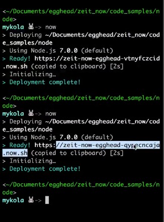
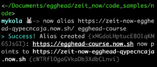

**Now**'s immutable deploys are powerful. To remind you what we're talking about, let's say I deploy a given instance of my application. I'm going to get a URL for it, and then I make some kind of a change. Let's say, we're going to go back to the retro `Hello World!` Instead of `Hello Universe!` And then deploy it.



Let's go visit the old one first. That's going to say `Hello Universe!` And then let's grab this new one. That's going to say `Hello World!` That's the problem. Which URL should my customers be going to? I'm confused now. What should I do?

The answer is neither. Obviously, you don't want to share a URL that looks like this. `https://zeit-now-egghead-qypecncaja.now.sh` Instead, we're going to create a Now `alias` which is built-in support for this and this is an important part of the Now workflow.

To use it, we're going to type `now alias`, and then we're going to paste the URL that we want to be pointing to. In this case, it's our most recent deploy `https://zeit-now-egghead-qypecncaja.now.sh`, and then we're going to give it a name. In this case, let's say `egghead-course`.

```bash
$ now alias https://zeit-now-egghead-qypecncaja.now.sh/ egghead-course
```



Now, look what it said. It says `Alias created https://egghead-course.now.sh`.

Now, if I go here to `egghead-course.now.sh`, I see that I'm getting the same thing that I was getting here. Great. I can alias to a URL. How does that actually help me solve my problem? The trick is that I never give this URL to anyone ever. This is internal. This is a reference. `https://zeit-now-egghead-qypecncaja.now.sh`

Think of this as almost like a `git commit` **hash**. That's effectively what this is. This is a specific snapshot of my logic and I don't want any of my customers to be looking at snapshots. What I want them to be looking at is a nice user-friendly URL. `https://egghead-course.now.sh`

Let's say I go through then and I make some more edits. I say `Hello World!` I add a paragraph here. `"This is a new paragraph of content!"`.

####index.js
```javascript
app.get('/', (req, res) => {
    res.send('<h1>Hello World!</h1>
        <h2>The current time is: ${new Date().toISOString()}!</h2>
        <p>This is a new paragraph of content!</p>');
});
```

I'm going to deploy this. I'm going to get yet another URL. That's running. Let's paste that new URL in here. `This is a new paragraph of content!`

Our alias is still pointing at the old one, so this is crucial. Once I see that this deployment works the way I expect it to work, all I have to do is go back and type `now alias` with the new URL, the name `egghead-course`.

```bash
$ now alias https://zeit-now-egghead-ynpxdiwkmq.now.sh egghead-course
```

What that's going to do is change the pointer. Now, when I refresh `egghead-course`, it's now pointing at this new endpoint instead of at the old one. This is how this works with immutable deploys. You have any number of these instances that are spun-up, deployed, and running around in the wild, but the alias is the thing that you care about.

On a free account, this is totally free. You get your 20 deploys a month for free right now as of this recording. You're allowed to alias to any phrase and the URL that you get is going to be that `{phrase}.now.sh`.