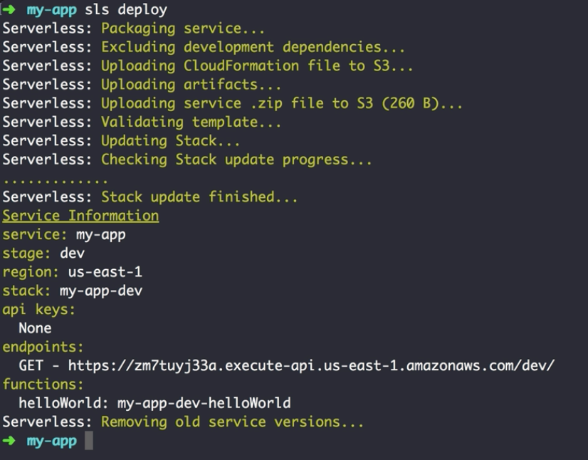
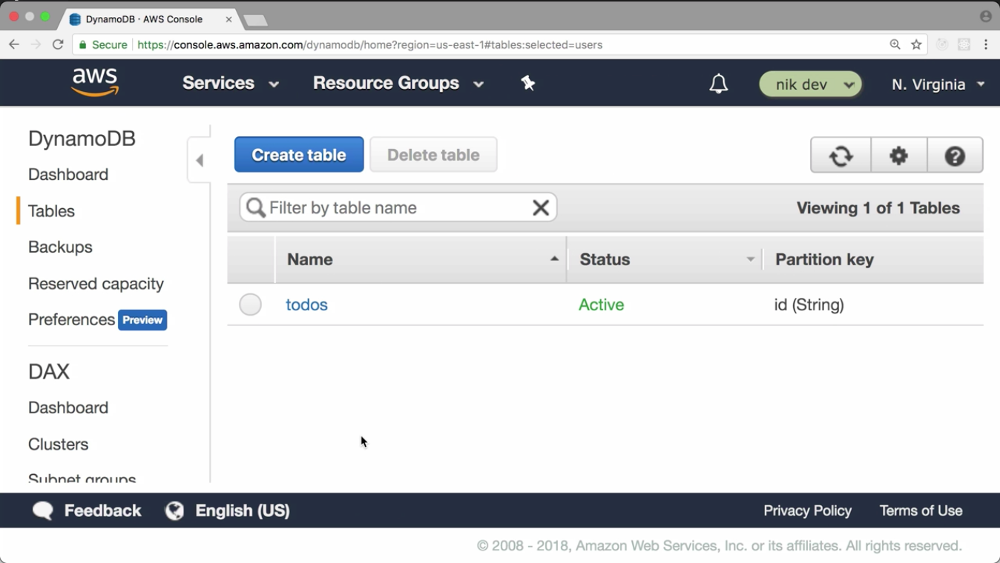

00:00 In order to store data, we need a database. One convenient way of doing so in AWS is DynamoDB. To add a DynamoDB table, we can leverage the `resources` section in the `serverless.yml`. It allows us to add raw cloud formation `Resources`.

00:16 Just for clarification, why we need to nest resources twice here, it has to be nested because cloud formation also supports other keywords, like output and input. Next up, we define a resource name: `TodosTable:`, and inside set the `Type: 'AWS::DynamoDB::Table'`.

00:36 In the minimum configuration, a table needs to have a couple of `Properties` defined, the `TableName`, the `AttributesDefinitions` used for primary and secondary indexes. In our case, we have an `id` of type String, `S`. Then we add a `KeySchema` and define the `AttributesName` that make up the primary key for our table. In our case, this is the field `id`.

01:00 Keep in mind, in the table we can still store other attributes, like text or createdAt. It's not necessary to define them here. It's only mandatory to define those used for the KeySchema.

01:13 Last but not least, we define the `ProvisionedThroughput` capacity for read and write. In our case, one is sufficient. In case you need to scale, I recommend you to activate autoscaling for the DynamoDB table. 

#### serverless.yml
```yml
service: my-app

provider:
  name: aws
  runtime: nodejs8.10

functions:
  helloWorld:
    handler: handler.run
    events: 
      - http: 
          path:
          method: get

resources:
  Resources:
    TodosTable:
      Type: 'AWS: :DynamoDB: :Table'
      Properties:
        TableName: todos
        AttributeDefinitions:
          -
            AttributeName: id
            AttributeType: S
        KeySchema:
          -
            AttributeName: id
            KeyType: Hash
        ProvisionedThroughput: 
          ReadCapacityUnits: 1
          WriteCapacityUnits: 1
```

Then we run `sls deploy`, and cloud formation will set up our table.



01:42 Let's switch over to the console. As we can see, the table exists now.

