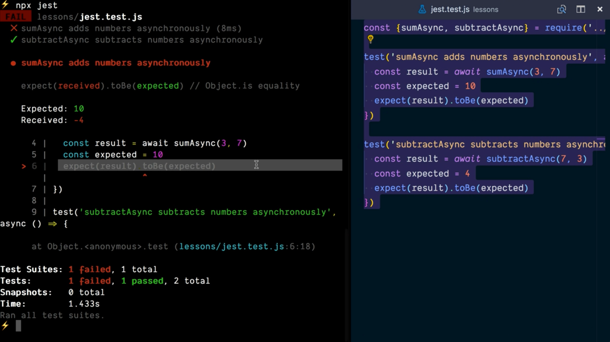

The testing framework we've written actually looks remarkably a lot like Jest. Rather than running `node --require`, and then instead of globals and so on and so forth, we could actually just use Jest directly.

If I run `npx jest`, 

#### Terminal
```bash
npx jest
```

jest will automatically pick up our `jest.test.js` file based off of that convention. 

#### jest.test.js
```javascript
const {sumAsync, subtractAsync} = require('../math')

test('sumAsync adds numbers asynchronously', async () => {
  const result = await sumAsync(3, 7)
  const expected = 10
  expect(result).toBe(expected)
})

test('subtractAsync subtracts numbers asynchronously', async () => {
  const result = await subtractAsync(7, 3)
  const expected = 4
  expect(result).toBe(expected)
})
```

It will show us really helpful error messages, and even a code frame to show us exactly where in our code that error was thrown.



These are some of the things that make jest such an awesome testing framework because the error messages are so clear.