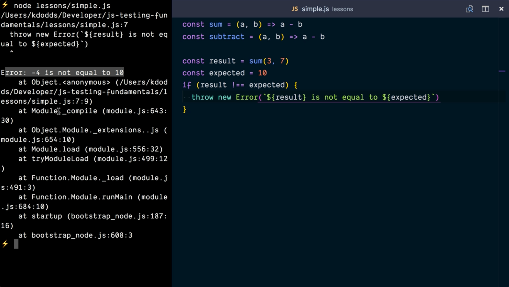

We have a bug in the `sum` function. It's doing subtraction instead of addition. We could easily fix this, but let's go ahead and write an automated test that can make sure that this bug never surfaces again.

An automated test in JavaScript is code that throws an error when things are unexpected. Let's do that. Let's get our `result` from the `sum` of three and seven. 

#### simple.js
```javascript
const result = sum(3, 7)
```

We will say our `expected` is 10. We can say if the `result` is not equal to the `expected` value, then we can throw a new error that says, "Result is not equal to expected."

```javascript
const expected = 10
if (result !== expected){
    throw new Error(`${result} is not equal to ${expected}`)
}
```

To run this, we can run `node lessons/simple.js`. 

We will get our error, "-4 is not equal to 10." 



If we replace this with addition and run that again, our script passes without throwing errors. This is the most fundamental form of a test.

```javascript
const sum = (a, b) => a + b
```

Let's go ahead and add another test for `subtract`. I am going to change this from `const` to `let`. 

```javascript
const subtract = (a, b) => a - b
```
We will say, `result` is now equal to subtract of seven and three, and our `expected` is now equal to four."

```javascript
result = subtract(7, 3)
expected = 4
```

We will just copy and paste this here. 

```javascript
if (result !== expected){
    throw new Error(`${result} is not equal to ${expected}`)
}
```
Save that and run our script again. It passes without error. In review, this is the most fundamental form of a test in JavaScript. It's simply a code that will throw an error when the result is not what we expect.

Let's go ahead and break this again. We'll run that script again. We're getting an error message. The Javascript testing framework is to make that error message as useful as possible so we can quickly identify what the problem is and fix it.