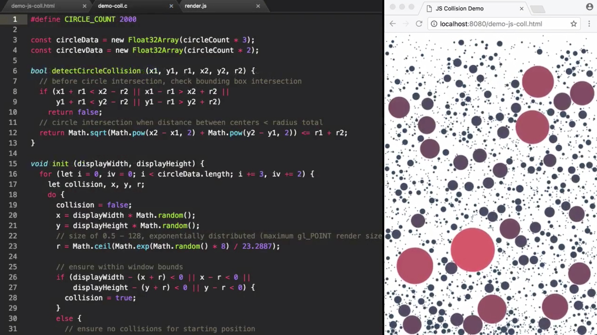
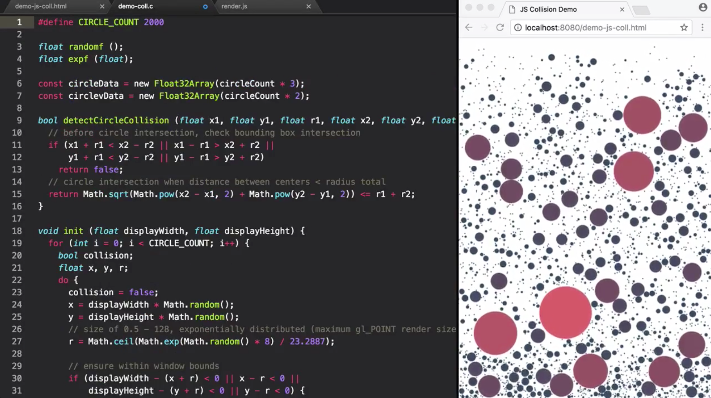

In this example, we're calculating the collisions between the circles on the page, which adds quite a performance overhead. If I increase the `circleCount` to just 2,000, we can already start to see a significant slowdown, so let's see if our conversation to WebAssembly can make this faster.

Without going into the details of the collision algorithm, we're just going to copy the JavaScript into our C file to begin the conversion. To go through the steps briefly, define `circleCount` as a macro, 

```cpp
#define CIRCLE_COUNT 2000
```

update the function signatures, 



add types to our variables, 


fix up the iteration to find our external maths functions, 



and update their calls, add includes for the `math` and `stdbool` libraries.

```cpp
#include <math.h>
#include <stdbool.h>

...
```

Our use of `sqrt`, `pow` and `ceil` can then be in-lined by the compiler by using these functions.

Next, define our `Circle` and `CircleV` structs and initialize arrays of these -- of the length, `CIRCLE_COUNT` -- for their static allocation. Add a get `circleCount` function and a `getCircleDataOffset` function to know where to find the address of the `Circle` position data in wasm memory.;

```cpp
#define CIRCLE_COUNT 2000

struct Circle {
	float x;
	float y;
	float r;
};

struct CircleV {
	float vx;
	float vy;
};

struct Circle circleData[CIRCLE_COUNT];
struct CircleVD circleData[CIRCLE_COUNT];

int getCircleCount () {
	return CIRCLE_COUNT;
}

struct Circle* getCircleDataOffset () {
	return &circleData;
}
```

Finally, we fix up the index access within our `circleData` `struct` arrays to correctly reference the data values. We can then compile using WasmFiddle, downloading the final WebAssembly binary file. In a new page, I can now include the wasm helper and use that to load the WebAssembly binary, which I've located at `./lib/dynamics-coll.wasm`.

The second argument of this function is the imports. We need to set the `env`, which contains a `randomf` and the `exp` function.

The promise gives us back the instantiated module, and we can then read off the `circleCount` and `circleData`_offset from the functions that we exported. We can construct our typed array data for the `circleData`, using the offset that we've been provided, as well as the fact that we know that it's going to be three times the `circleCount` in length in the WebAssembly memory.

```jsx
<!doctype html> 
	<title>WASM Demo</title>
	<body style="margin:0; overflow: hidden">
		<canvas id="canvas" style="width: 100vw; height: 100vh; display:block;"></canvas>
	</body>
	<script type="module">
		import render from './lib/render.js'

		function fetchAndInstantiateWasm (source, importObj) {
			return fetch(source)
			.then(response => {
				if (response.ok)
					return response.arrayBuffer();
				throw new Error('Unable to fetch wasm ${source}.')
			})
			.then(WebAssembly.compile)
			.then(module => {
				let instance = new WebAssembly.Instance(module, importObj);
				return instance.exports;
			});
		}

		fetchAndInstantiateWasm('./lib/dynamics-coll .wasm', {
			env: {
				randomf: Math.random,
				expf: math.exp
			}
		}).then(m => {
			const circleCount = m.getCircleCount();
			const circleDataOffset = m.getCircleDataOffset();

			const circleData = new Float32Array(m.memory.buffer, circleDataOffset, circleCount * 3);

			render(circleData, circleCount, m.init, m.timeStep)
		})
	</script>
```

Finally, we can render that `circleData`, passing the `init` and `timeStep` methods from our WebAssembly binary, into the render function. Putting the JS simulation on the left and the WebAssembly version on the right, we can compare the performance directly.

The unfortunate truth is that the JS version, on the left, actually ends up still faster than our WebAssembly. WebAssembly isn't a silver bullet for performance. It may just be that we're in the early days of optimization for WebAssembly in browsers, but we can get past this today if we approach performance with the right principles.