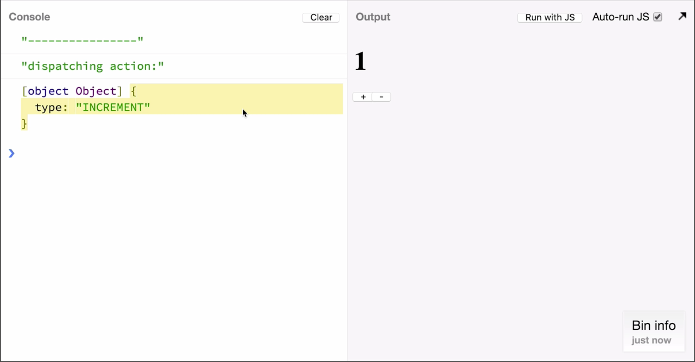
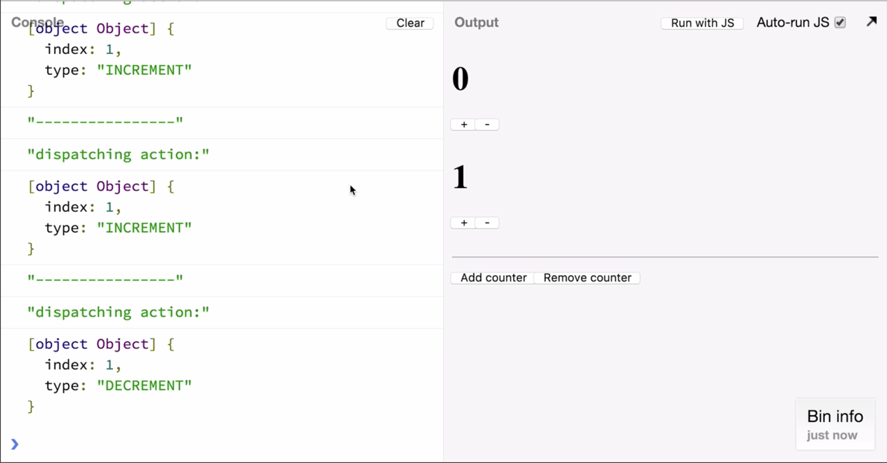
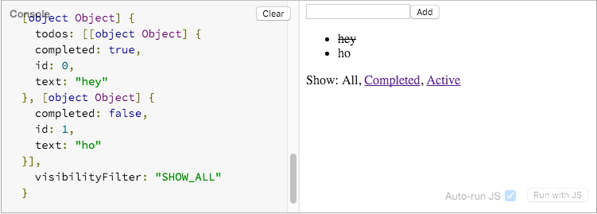

The second principle of Redux is that the state tree is read only. You cannot modify or write to it. Instead, anytime you want to change the state, you need to dispatch an action.

An action is a plain JavaScript object describing the change. Just like the state is the minimal representation of the data in your app, the action is the minimal representation of the change to that data.

The structure of the action object is up to you. The only requirement is that it has a tie property, which is not undefined. We suggest using strings, because they are serializable.

In different apps, you're going to have different types of actions. For example, in a counter app we only have increment and decrement actions. We don't pass any additional information, because this is all that is needed to describe these changes.

But say, for a counter release example, we have more actions. We have add counter action, we have a remove counter action, and anytime I change the individual counter, you can see that the increment and the decrement actions now have index. Because we need to describe which particular counter was changed.

This approach scales well to medium and complex applications. Anytime I add a todo, the components don't really know how exactly it's been added. All they know is that they need to dispatch an action with a type, add todo, and the text of the todo and a sequential ID.

If I toggle a todo, again, the components don't know how it happens. All they need to do is to dispatch an action with a type, toggle todo and pass in the ID of the todo I want to toggle.

The same is true for the visibility filter. Anytime I click on this control to change the currently visible todos, what really happens is this component dispatches an action with a type, set visibility filter, and pass in the desired filter string, filter filled.

But these are all plain objects, describing what happens in a wrap.

Now you know the second principle of Redux -- the state is read only. The only way to change the state tree is by dispatching an action. An action is a plain JavaScript object, describing in the minimal way what changed in the application. Whether it is initiated by a network request or by user interaction, any data that gets into the Redux application gets there by actions.
