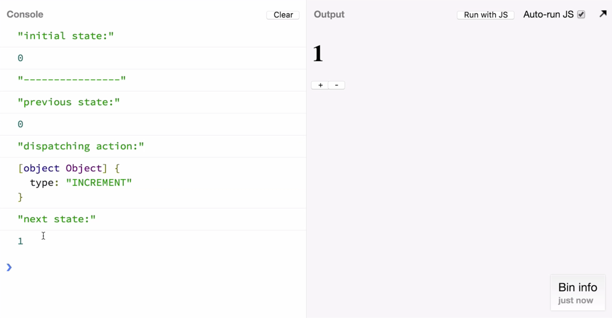
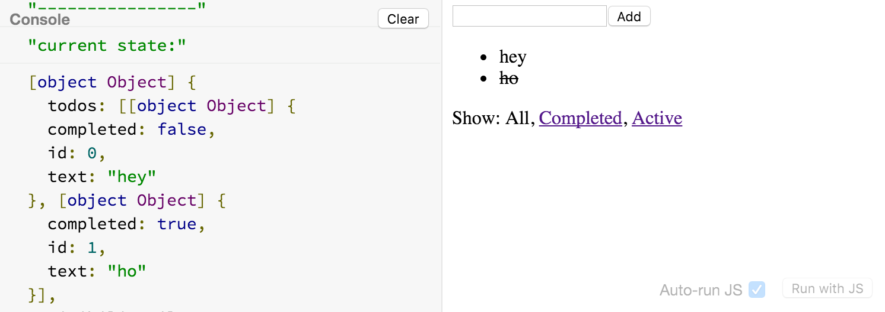

You might have heard that the UI or the view layer is most predictable when it is described as a pure function of the application state. This approach was pioneered by React but is now being picked up by other frameworks, such as Ember and Angular.

Redux complements this approach with another idea, that the state mutations in your app need to be described as a pure function that takes the previous state and the action being dispatched and returns the next state of your application.

Inside any Redux application, there is one particular function that takes the state of the whole application and the action being dispatched and returns the next state of the whole application. It is important that it does not modify the state given to it. It has to be pure, so it has to return a new object.

Even in large applications, there is still just a single function that manages how the next state is calculated based on the previous state of the whole application and the action being dispatched. It does not have to be slow.

For example, if I change the visibility filter, I have to create a new object for the whole state, but I can keep the reference to the previous version of the todos state, because it has not changed when I changed the visibility filter. This is what makes Redux fast.

Now you know the third and the last principle of Redux. To describe state mutations, you have to write a function that takes the previous state of the app, the action being dispatched, and returns the next state of the app. This function has to be pure. This function is called the "Reducer."
