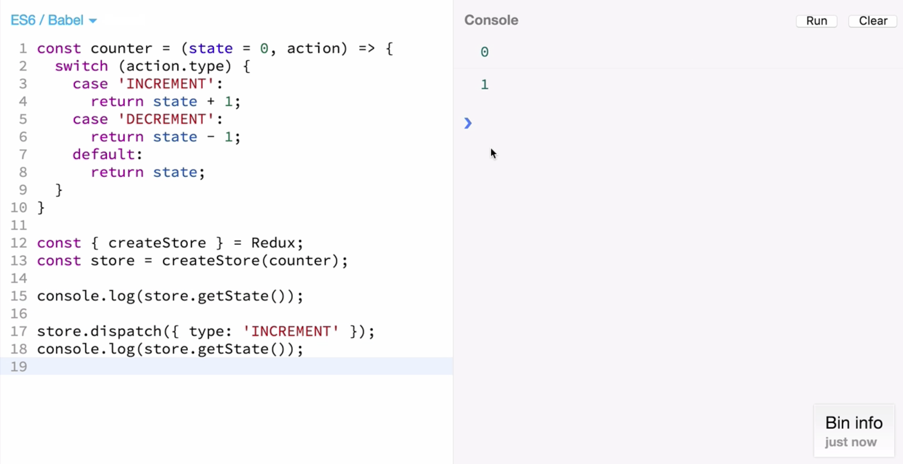
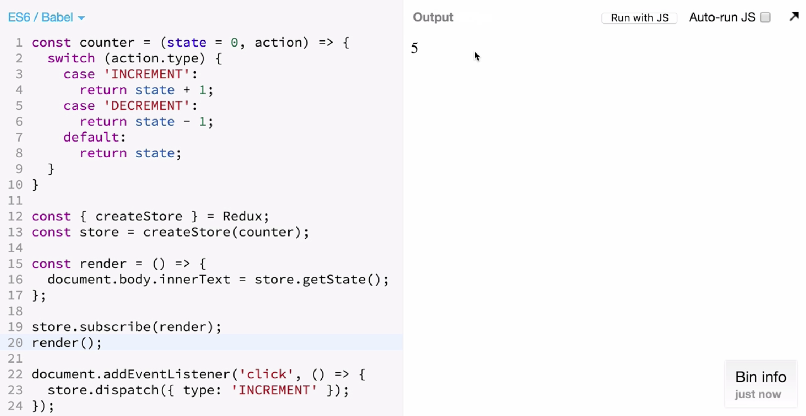

I added Redux to our application as a script act from CDNJS. This is the UMG build, so it exports a single global variable called Redux, with a capital R. In real applications, I suggest you to use NPM instead and a module bundler like webpack or Browserify, but the UMG build will suffice for our example.

I'm going to need just a single function from Redux called create store. I'm using ES6 destruction syntax here. It's equivalent to writing, "var creates store equals Redux.creates store" or, if you use NPM and something like Babel to transpile your ES6, you can write, "import creates store," notice the parenthesis, "from Redux."
``` javascript
const { createStore } = Redux;
```
This store binds together the three principles of Redux. It holds the current application's state object. It lets you dispatch actions. When you create it, you need to specify the reducer that tells how state is updated with actions.
``` javascript
const store = createStore(counter);
```
In this example, we're calling creates store with counter as the reducer that manages the state updates. This store has three important methods.

The first method of this store is called get state. It retrieves the current state of the Redux store. If we were on this, we're going to see zero because this is the initial state of our application.

The second and the most commonly used store method is called dispatch. It lets you dispatch actions to change the state of your application. If we log this store state after dispatch, we're going to see that it has changed.



Of course, always log into the console gets boring, so we're actually going to render something to the body with the help of the third Redux store method, called subscribe. It lets you register a callback that the Redux store will call any time an action has been dispatched, so that you can update the UI of your application. It will reflect the current application state.
``` javascript
store.subscribe(() => {
  document.body.innerText = store.getState();
});

document.addEventListener('click', () => {
  store.dispatch({ type: 'INCREMENT' });
});
```
I'm being very naive now. I'm not using React or anything. I'm just rendering the counter into the document body. Any time the body is clicked, I'm going to dispatch an action to increment this counter.



If you pay close attention, you will notice that the initial state, the zero, was not rendered. This is because I'm rendering inside the subscribe callback, but it doesn't actually fire the very first time.
``` javascript
const render = () => {
  document.body.innerText = store.getState();
};

store.subscribe(render);
render();
```
So I extract this logic into render method. I subscribe the render method to this store. I also call it once to render the initial state. Now it renders the zero, and the click increments the counter. This is our first working Redux application.
