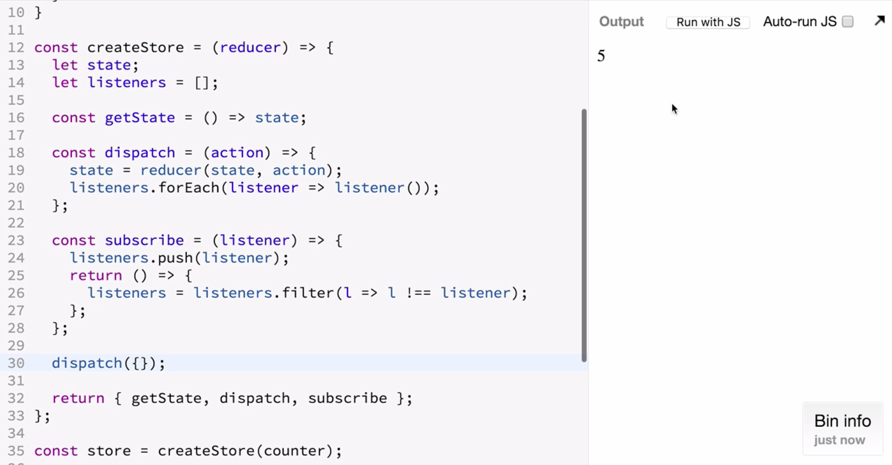

In the previous video we looked at how to implement a simple counterexample using the Create/Store function provided by Redux and the store object it returns that provides the get state method to get the current application state, the dispatch method, to change the current application state by dispatching an action, and the subscribe method to subscribe to the changes and re-render our application with the current state of the app.

If you're like me you prefer to understand the tools that you're using. In this tutorial we're going to re-implement the Create/Store function provided by Redux from scratch. The first and the only form of what we know so far argument to the Create/Store function is the reducer function provided by the application.

We know that the store holds the current state. We keep it in a variable, and the get state function is going to return the current value of that variable. This function, combined with the Dispatch function and a Subscribe function on a single object is what we call the Redux store.

``` javascript
const createStore = (reducer) => {
  let state;
  let listeners = [];

  const getState = () => state;

  const dispatch = (action) => {

  };
  const subscribe = (listener) => {

  };
  return { getState, dispatch, subscribe };
};
```

Because the Subscribe function can be called many times, we need to keep track of all the changed listeners. Any time it is called we want to push the newly listener into the array. Dispatching an action is the only way to change the internal state.

``` javascript
const subscribe = (listener) => {
  listeners.push(listener);
};
```

In order to calculate the new state we call the reducer with the current state and the action being dispatched. After the state was updated, we need to notify every changed listener, by calling it.

``` javascript
const dispatch = (action) => {
  state = reducer(state, action);
  listeners.forEach(listener => listener());
};
```

There is an important missing piece here. We haven't provided a way to unsubscribe a listener. Instead of adding a dedicated Unsubscribe method, we'll just return a function from the Subscribe method that removes this listener from the listeners' array.

``` javascript
const subscribe = (listener) => {
  listeners.push(listener);
  return () => {
    listeners = listeners.filter(l => l !== listener);
  };
};
```

Finally, by the time the store is returned we wanted to have the initial state populated. We're going to dispatch a dummy action just to get the reducer to return the initial value.

``` javascript
dispatch({});
```
Fi
This implementation of the Redux store apart from a few minor details in that case is, is the Create/Store was shipped with Redux.


