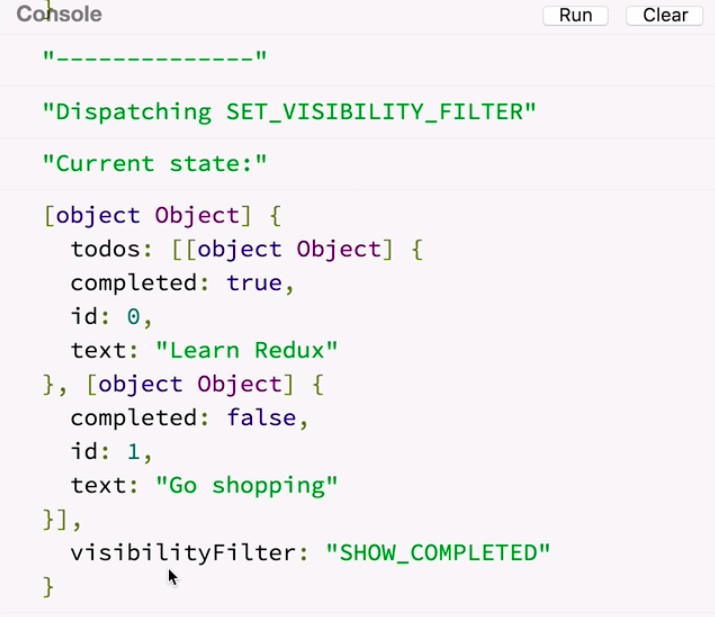

In the previous lesson, we established the pattern of reducer composition where one reducer can be called by another reducer to update items inside an array.

If we create a store with this reducer and log its state, we will find that the initial state of it is an empty array of to-dos. If we dispatch an add-to-do action, we will find that the corresponding to do has been added to the state array.

If we dispatch another add-to-do action, the corresponding to do will also be added at the end of the array and dispatch in a toggle to-do action with ID zero will flag the completed field of the to do with ID zero.

Representing the whole state of the application as an array of to-dos works for a simple example, but what if we want to store more information? For example, we may want to let the user choose which to-dos are currently visible with the visibility filter such as show completed, show all, or show active.

``` javascript
const visibilityFilter = (
  state = 'SHOW_ALL',
  action
) => {
  switch (action.type) {
    case 'SET_VISIBILITY_FILTER':
      return action.filter;
    default:
      return state;
  }
};
```

The state of the visibility filter is a simple string representing the current filter. It is changed by set visibility filter action.

To store this new information, I don't need to change the existing reducers. I will use the reducer composition pattern and create a new reducer that calls the existing reducers to manage parts of its state and combines the results in a single state object.

``` javascript
const todoApp = (state = {}, action) => {
  return {
    todos: todos(
      state.todos,
      action
    ),
    visibilityFilter: visibilityFilter(
      state.visibilityFilter,
      action
    )
  }
}
```

Now that the first time it runs, it will pass undefined as the state of the child reducers because the initial state of the combined reducer is an empty object, so all its fields are undefined. This gets the child reducers to return their initial states and populates the state object for the first time.

When an action comes in, it calls the reducers with the pass of the state that they manage and the action and combines the results into the new state object.

``` javascript
const store = createStore(todoApp);
```

This is another example of the reducer composition pattern, but this time we use it to combine several reducers into a single reducer that we will now use to create our store. The initial state of the combined reducer now contains the initial states of independent reducers. Any time an action comes in, those reducers handle the action independently.

This pattern helps scale Redux's development because different people on the team can work on different reducers handling the same actions without running into each other and causing merge conflicts.



Finally, I'm dispatching the set visibility filter action. You can see that it doesn't affect the to-dos, but the visibility filter field has been updated.
