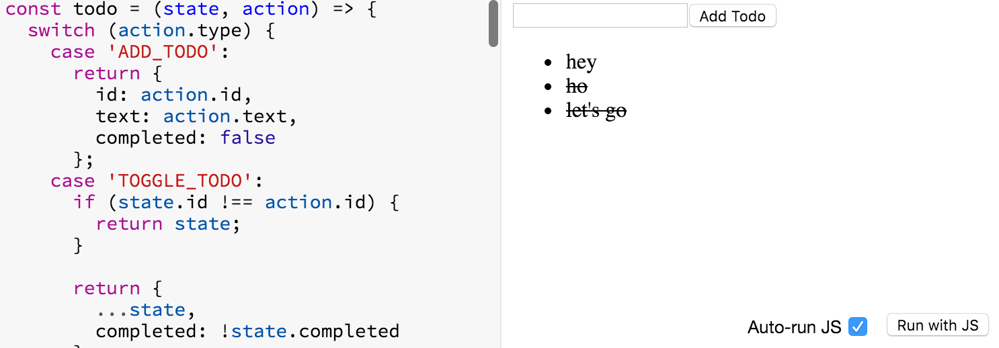

In the last lesson, we implemented a simple UI for the todo list application that is able to add new todos and view the existing todos in the list.

To add the todos, we dispatched the add todo action. In this lesson, we're going to dispatch the toggle todo action to toggle the completed state of the todos by clicking on them.

I'm scrolling down to my React component. I've got a list item here corresponding to the todo, so I'm adding the on click handler. When the user clicks on the list item, I want to dispatch an action to my store with a type toggle todo and the ID of the todo being toggled, which I get from the todo object.

The event handler knows which todo it corresponds to, so it is able to pass its ID in the action.

``` javascript
<ul>
          {this.props.todos.map(todo =>
            <li key={todo.id}
                onClick={() => {
                  store.dispatch({
                    type: 'TOGGLE_TODO',
                    id: todo.id
                  });         
                }}
              {todo.text}
            </li>
          )}
        </ul>
```

In the user interface, I want the completed todos to appear crossed out, so I'm adding this trial attribute to the list item. I'm going to use the text decoration property, which is going to be a line through when todo completed is true, and non when todo completed is false, so I get a normal looking todo.

``` javascript
style={{
  textDecoration:
    todo.completed ?
      'line-through' :
      'none'
}}>
```

Now, if I add a couple of todos, I can click on them and they're going to appear toggled, and I can toggle them back. Isn't that satisfying?



Let's recap how toggling the todo actually works.

It starts with me dispatching the toggle todo action inside my click handler, with a type toggle todo and the ID, which is the ID of the todo being rendered. I get the todo object as an argument to the array map call back inside my render method where I render all the todos.

When an action is dispatched, the store will call the root reducer, which will call the todos reducer with the array of todos and the action. In this case, the action type is toggle todo, so the todos reducer delegates handling of every todo to the todo reducer with a map function to call it for every todo item. The todo reducer receives the todo as state, and the action.

Again, we switch on the action type, and it matches toggle todo string. Now, for every todo whose ID does not match the ID specified in the action, we just return the previous state, that is the todo object, as it was.

However, if the ID of the todo matches the one specified in the action, we're going to return any object with all the properties of the original todo, but with the completed field equal to the opposite value of what it was.

The updated todo item will be included in the todos field under the new application state. Because we subscribe, the render function is going to get the next state of the application in store -- get state -- and pass the new version of the todos to the todo app component, which is going to render the updated todos.

Finally, this trial of the list item, the bands on the todo completed field, which we just updated, which is why it re-renders in a cross-child state.
