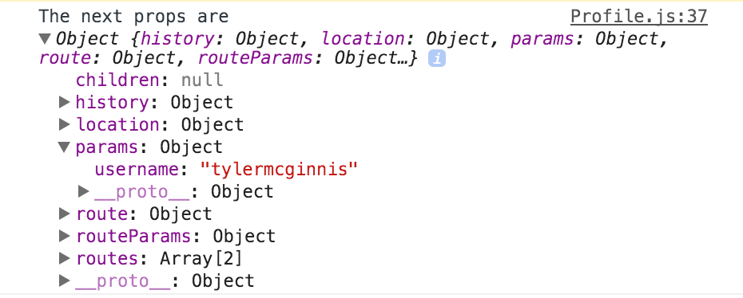

One thing you may have noticed as you were playing around with this is, every time we go to a new **route**, we're **refreshing** the **whole view**. If I go to another user, it refreshes the view. That's obviously not what we want, because we're building a **single-page** application and we don't want the **whole view to refresh**.

That's because we have a typo or a bug in one of our previous videos. Go ahead and go to the `searchGitHub` component. Right here, instead of being a `profile/`, we want it to be `/profile/`, and then the `username`. Once we do that, then we should get something like this. I'm going to go home, I'll type in a new `username`, and there we go.

### SearchGithub.js
``` javascript
handleSubmit: function() {
  var username = this.usernameRef.value;
  this.usernameRef.value = '';
  this.history.pushState(null, "/profile/" + username);
}
```

You'll notice here, if I type in a new `username` now, it doesn't **refresh** the **whole** view. This **data** is still the **same**, even though we're going to a new **route**. The reason for that is because we're receiving new **props** into our **components**, but we're not doing anything with those **props**. React gives us another handy little **lifecycle method** that we could hook into, which is called `componentWillReceiveProps`.

What this does is, whenever our `Profile` component receives new **props**, this callback function is going to get invoked. What's nice is, whenever react-router changes routes, because our **routing** is going through **props**, this function will get invoked, and then we'll have those new **props**.

Let's go ahead and see this. What I'm going to do is, inside of `componentWillReceiveProps`, let's just `console.log`. The next Props are with the `nextProps`.

### Profile.js
``` javascript
componentWillReceiveProps: function(nextProps){
  console.log('The next props are', nextProps);
}
```

What we should see here is, if I refresh this and go to a new `username`, we get these new **props** and, under **params**, we have the **username**.



Let's go ahead and change up our component a little bit. What I'm going to do is let's go ahead and make an `init` function. What's going to happen is we're going to **call** this data or this chunk of code when the **component mounts**, but also we want to **set up** a **listener** to the new user whenever we **receive new props**.

Let's go ahead and I'm going to copy this code and put it into my `init` function.

### Profile.js
```javascript
init: function(){
  var childRef = this.ref.child(this.props.params.username);
  this.bindAsArray(childRef, 'notes');

  helpers.getGithubInfo(this.props.params.username)
    .then(function(data){
      this.setState({
        bio: data.bio,
        repo: data.repos
      })
    }.bind(this))
},
```

Then, in `componentDidMount`, I'm gong to call `this.init`.

### Profile.js
```javascript
componentDidMount: function(){
  this.ref = new Firebase('https://github-note-taker.firebaseio.com/');
  this.init();
}
```

We don't want to query `this.props.params.username`, because what's going to happen is, when this `init` function runs, if we call it in `componentWillRecieveProps`, we're not giving it the new **props**.

If I'm on my own profile, `TylerMcGinnis`, if we type in a new user, `this.props.params.username` is still going to be `TylerMcGinnis`. What we want to do is let's go ahead and have this `init` function take in a `username`, and then we'll switch out all of these for that `username`.

### Profile.js
```javascript
init: function(username){
  var childRef = this.ref.child(username);
  this.bindAsArray(childRef, 'notes');

  helpers.getGithubInfo(username)
    .then(function(data){
      this.setState({
        bio: data.bio,
        repo: data.repos
      })
    }.bind(this))
},
```

Then what we can do is, whenever the component **receives props**, we're going to go ahead and **pass** `this.init(nextProps.params.username)`.

### Profile.js
``` javascript
componentWillReceiveProps: function(nextProps){
  this.init(nextProps.params.username);
}
```

Also, when our **component mounts**, we're still going to **pass** it `this.props.params.username`.

### Profile.js
```javascript
componentDidMount: function(){
  this.ref = new Firebase('https://github-note-taker.firebaseio.com/');
  this.init(this.props.params.username);
}
```

`Init` is now taking in the `username`, whether it's from the **params** itself or, when we receive new props, those next props coming in.

Let's go ahead and see if this works. Everything looks good. Webpack is running. Hit refresh. Let's go to Spencer's profile. `This.state.notes` is already **bound** to a Firebase reference.

The reason this is being thrown is because, in our `componentDidMounts`, we run `init`, and that comes in here and **binds** to our `notes` property on our **state**. Firebase isn't going to let us **bind** to **multiple** things, which make sense.

What we're going to do is, inside of `componentWillReceivesProps`, before we call `init` again, let's go ahead and call `this.unbind` notes.

### Profile.js
``` javascript
componentWillReceiveProps: function(nextProps){
  this.unbind('notes');
  this.init(nextProps.params.username);
}
```

Now when we receive **props**, we're going to **unbind** what we bound to in our component when it **mounted**, and then we're going to **rebind** to the new `username`.

Let's see if this works now. `TylerMcGinnis`, there we go. Our data loads, and we can go to any `username` we want here.
