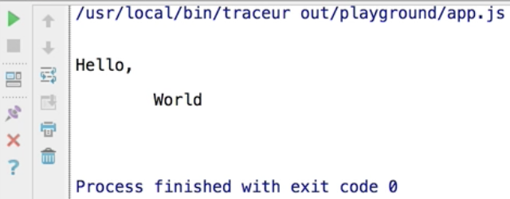

If you have ever worked with **strings** in **JavaScript**, you've most likely **concatenated** two strings by just saying the variable then plus and then adding a string to it, and then when you run it, you just get `Hello, World`, all put together.
```javascript
var salutation = "Hello";
var greeting = salutation + ", World";

console.log(greeting);
```
**ES6** allows you to put your **variables inside of your string**. I'm going to surround this with a **grave**. So I'll put one there and I'll put one here.

Then, instead of doing plus and then quote, I'll just surround this guy with the dollar sign, curly brace, and then close curly brace. You'll see if I rerun this, I'll get `Hello , World`.
```javascript
var greeting = `${salutation} , World`;
```
It actually **maintained this space** because I forgot to delete it. So if I delete that and run it again, then we'll get `Hello, World` without the space.
```javascript
var greeting = `${salutation}, World`;
```
It actually **respects white space** even across **multiple lines**. If I put some lines in here and if I say `hello, tab, tab, world`, and run this. You'll see I get some blank lines, hello all the way at the left and then a couple tabs, and then world, and then more blank lines.
```javascript
var greeting = `

${salutation}, 

    World
    
    
`;
```



I could pull off things like `hello you crazy world, how are you`, and rerun this and you can see, we can **manipulate strings** however we'd like.
```javascript
var greeting = `

${salutation}, 
  You
    Crazy       World

    How
  Are
      You  
    
`;
```
If I want to extract any of these into variables, I could just instead of `World` here, I could just do `place` and then I can do `place`. We'll just say `planet`, and rerun this, and you can see we get `hello, you crazy planet`, all the way out here.
```javascript
var place = "planet";
var greeting = `

${salutation}, 
  You
    Crazy       ${place}

    How
  Are
      You  
    
`;
```
It's also worth noting that you can do **expressions** inside of these braces. If you want to do `X + Y`, then just show `Y` and just show `X`, and then run this. You can see we get `1 + 2 = 3`, and then this is one.
```javascript
var x = 1;
var y = 2;
var equation = `${ x } + ${ y } = ${x + y}`

console.log(equation); // "1 + 2 = 3"
```
There's this string plus, there's two, there's the string equals, and then `X + Y` is the expression.

Lastly, is a basic introduction to **tagging** these **string templates** that I have. `It's` and then the hour of the day,`${new Date().getHours()}`, and then, `I'm sleepy`. If I run this, you'll see it's `15` or 3 o'clock, and that `I'm sleepy`.
```javascript
var message = `Its ${new Date().getHours()} Im sleepy`;

console.log(message); // "It's 15 I'm sleepy"
```
I don't get sleepy until after 20, so all I have here is this and how am I going to make this into a variable? Well, I can actually **parse** out this `message` and get this value and **change this string** based on this **value**.

I'm going to create a function called, `tag()`, and notice I don't put any sort of **parameters** or anything around this. I just type the **function name**.
```javascript
var message = tag`Its ${new Date().getHours()} Im sleepy`;
```
I'll say, `function tag`, you can name it whatever you want, `tag` or `parse`, or whatever, and then it takes these `strings` and the `...values`, these `strings` being an **array**.
```javascript
function tag(strings, ...values){
  console.log(strings); // [ 'It\'s', 'I\'m sleepy' ]
  console.log(values);  // [ 15 ]
}
```
We'll log this out. The **array** of `It's` and `I'm sleepy` are the two **strings**. This piece and this piece, and then the values are the values found in here.

When I log this out, this will be an **array** with just `15` in it. So switch this over to a value. We'll just make it an empty value, `${}`.
```javascript
var message = tag`Its ${new Date().getHours()} Im ${""}`;
```
Then, we'll say, if the `first value`, so value `0 < 20`. I'll assign the `second value` and say this should be `I'm awake`.
```javascript
function tag(strings, ...values){
  if(values[0] < 20){
    values[1] = "awake";
  }
}
```
Then, we will turn a new `string`. So two `back ticks`, and we'll just say, `` return `${strings[0]}${values[0]}${strings[1]}${values[1]}` ``

Then, once we log this out, you can see it says, `It's 15, I'm awake`, because `15` is less than `20` and we assign this second value which is this guy to `awake`.

Now, there's much more advanced stuff you can do with this such as **parsing HTML** and using **RegEx** and everything, but we're going to end right there for right now.