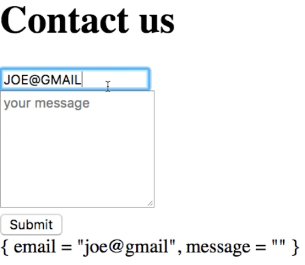

Instructor: [00:00] Notice that what we're doing now is essentially one-way data binding. We are taking the data from our `view` and putting it into our `model`, but not the other way around. This can sometimes be a problem.

[00:12] For example, let's say that you wanted emails to always be lowercase. When you receive the `InputEmail` message, you take the value of the email field, and you convert it to lowercase. 

#### Main.elm
```
update msg model =
    case msg of 
        InputEmail e ->
            ({model | email = e}, Cmd.none)
```

As a result of this, if I put caps on and I type 'JOE@GMAIL', you will see that now my view and my model have diverged. This can potentially be problematic, of course.



[00:41] The way to fix this would be to go into your `view` function, and where the `InputEmail` is populated, you could say `value model.email`. 

```
body = div []
  [ div []
    [ input
      [ placeholder "your email"
      , type_ "email"
      , onInput Inputemail
      , value model.email
      ] [] ]
  , div []
    [ textarea
      [ placeholder "your message"
      , rows 7
      ] [] ]
  ]
```

Now, you still have one-directional data flow, but you have two-way binding. Your `view` is based on your `model`, and your `model` reads from the `view`.

[01:00] For this to compile, I need to actually pass the model down from the main `view` function to `body`. 

```
view model =
    Html.form []
        [ header
        , body model
        , footer
        , div [] [model |> toString |> text]
        ]

body = div []
  [ div []
    [ input
      [ placeholder "your email"
      , type_ "email"
      , onInput Inputemail
      , value model.email
      ] [] ]
  , div []
    [ textarea
      [ placeholder "your message"
      , rows 7
      ] [] ]
  ]
```

Now, you can see that the problem has been fixed. You can't actually see that I'm typing capitals, but these capitals are immediately being converted to lowercase.