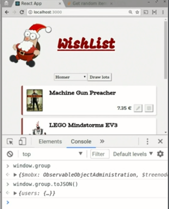

So far, all of our state has been hard-coded in our application, so it's time to integrate with the back ends. For that, we are going to reuse our `json-server` again.

We should, of course, populate it with some data. Here's a simple trick to make our store accessible from our devtools, from the browser console. We just assign it to some global variable.

#### index.js
```javascript
let group = (window.group = Group.create(initialState))
```

The convenient little thing about that is that we can now access our state from the console. You can even say, "Give me the JSON of the current state," which is basically the same as calling, "Get snapshot." Here is all our current states.



Let's simply stringify that and put it in our database, so there it is, our initial states. Homer actually has a wish list.

```javascript

{
    "suggestions_f": [
        {
            "name": "The Notebook",
            "price": 10.31,
            "image": "https://images-na.ssl-images-amazon.com/images/I/51ZXkAJNYWL._AC_US218_.jpg"
        },
        {
            "name": "LEGO Mindstorms EV3",
            "price": 349.95,
            "image": "https://images-na.ssl-images-amazon.com/images/I/71CpQw%2BufNL._SL1000_.jpg"
        }
    ],
    "suggestions_m": [
        {
            "name": "Machine Gun Preacher",
            "price": 7.35,
            "image": "https://images-na.ssl-images-amazon.com/images/I/91AFFK9fwkL._SY445_.jpg"
        },
        {
            "name": "LEGO Mindstorms EV3",
            "price": 349.95,
            "image": "https://images-na.ssl-images-amazon.com/images/I/71CpQw%2BufNL._SL1000_.jpg"
        }
    ],
    "users": {
        "a342": {
            "id": "a342",
            "name": "Homer",
            "gender": "m",
            "wishList": {
                "items": [
                    {
                        "name": "Machine Gun Preacher",
                        "price": 7.35,
                        "image":
                            "https://images-na.ssl-images-amazon.com/images/I/91AFFK9fwkL._SY445_.jpg"
                    },
                    {
                        "name": "LEGO Mindstorms EV3",
                        "price": 349.95,
                        "image":
                            "https://images-na.ssl-images-amazon.com/images/I/71CpQw%2BufNL._SL1000_.jpg"
                    }
                ]
            },
            "recipient": "ba32"
        },
        "5fc2": {
            "id": "5fc2",
            "name": "Marge",
            "gender": "f",
            "wishList": { "items": [] },
            "recipient": "65aa"
        },
        "663b": {
            "id": "663b",
            "name": "Bart",
            "gender": "m",
            "wishList": { "items": [] },
            "recipient": "a342"
        },
        "65aa": {
            "id": "65aa",
            "name": "Maggie",
            "gender": "f",
            "wishList": { "items": [] },
            "recipient": "5fc2"
        },
        "ba32": {
            "id": "ba32",
            "name": "Lisa",
            "gender": "f",
            "wishList": { "items": [] },
            "recipient": "663b"
        }
    }
}

```

Here's our data, so let's make sure it gets loaded automatically. Just drop our `initialState`. Now, there are no users in the application, and we can introduce the logic to load all the data.

```javascript
let initialState = { users: {} }
```

We are going to introduce an additional action, and it is an asynchronous `flow` again. We're going to load it with the `window.fetch` again. We're going to apply the JSON we receive to the users' map.

#### Group.js
```javascript
.actions(self => ({
    load: flow(function* load() {
        const response = yield window.fetch(`http://localhost:3001/users`)
        yield response.json()
    }),
```

To do that, we use a built-in function of mobx-state-tree, which is called `applySnapshot`, and `applySnapshot` is a very nifty feature. It compares the state it already has with the state it receives. It tries to update with as few changes as possible.

```javascript
.actions(self => ({
    load: flow(function* load() {
        const response = yield window.fetch(`http://localhost:3001/users`)
        applySnapshot(self.users, yield response.json())
    }),
```

When the application starts up, we can simply call, `load` on the `group`. 

#### index.js
```javascript
let group = (window.group = Group.create(initialState))
group.load()
```

That should start fetching our data, and here we have it. We have back our state, including our wish list and all our recipients after all, so the references were also appropriately de-serialized.

Maybe this is something that should happen always, this loading the data when the group is created. In that case, you can use life cycle hooks.

Now, we don't load anything, but we can define several actions with which has predetermined names, which has special meaning to mobx-state-tree. There's a special action, and it's called `afterCreate`. This is always called whenever an instance is created and the entire object is set up. After the case, we could simply call `self.load`.

#### Group.js
```javascript
.actions(self => ({
    afterCreate() {
        self.load()
    },
```

Our application now fetches data from the server. It does so automatically by using the `afterCreate` life cycle hook