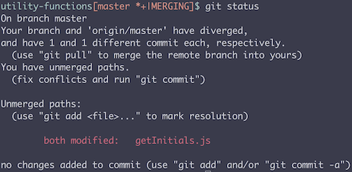
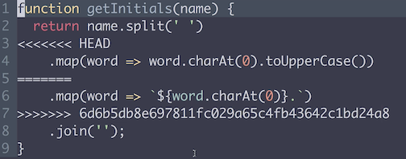

We're inside of a directory called `utility functions`, which is a Git repo, and we want to change this file here called `getInitials.js`. So, let's open that up in our editor. Inside this file we have a function called `getInitials`, which takes in a name and spits back the initials.

#### getInitials.js
```javascript
function getInitials(name) {
    return name.split(' ')
        .map(word => word.charAt(0))
        .join('');
}
```

For example, if we pass it in `"for your information"`, it would give us back `"fyi"`. For this change, we'd like to update the initials to be capitalized, so we'll be outputting `FYI` in all caps like this.

To do that, let's go down to line four, and after we grab the character from the word, let's say `toUpperCase`, then we'll save this file. 

```javascript
function getInitials(name) {
    return name.split(' ')
        .map(word => word.charAt(0).toUpperCase())
        .join('');
}
```

Now back in our command line, let's run `git status`, and we can see that `getInitials.js` has been modified, so let's stage and commit as usual.

Now that our changes have been staged and committed, let's run `git push`, but it says here that we can't push yet, because updates were rejected, because the remote contains work that we do not have locally, so that means we need to run a `git pull`. So, let me clear my screen here and I'll run `git pull`, but it says here that we have `"Merge conflicts in getInitials.js"`.

A merge conflict is when your local code changes and the remote code changes can't be merged automatically because there's been a change on the same line of code in both places. In this case, it looks like someone else has modified getInitials and pushed it to the remote, so when we try to push as well with the same file that has some changes on the same lines, it creates a conflict.

What we need to do is fix the conflicts, and then we'll be able to commit and push like normal. The first thing we need to do go run `git status` to see which files have a conflict.



Running `git status` becomes more helpful as there are more files that have conflicts in them, because it says that these are the `Unmerged paths`. If we had other paths that had been merged properly, they'd show up above that, and then the ones that could not be automatically merged show up here in the `Unmerged path` section. The file that we need to fix is `getInitials.js`.

After we've run `git status` and we have the list of the files that have conflicts, we need to open those in our editor, so let's open this `getInitials.js`. The file has been modified by Git to show where the conflicts are.

We can see here a `marker` that says `head`, and then there's equals signs, and then there's another market with arrows and a commit ID here. 



What this is saying is that the area between the first set of markers is our changes, so this is the code, the line that we changed.

Then, between the middle marker and the last marker, is the code from the remote that's having a conflict with our changes. Now we need to figure out what Git's not smart enough to do, which is what needs to be in this file that we should commit. There are three situations. The first is if we want to keep all of our code and discard the changes from the remote.

The second is the opposite of that, if we want to keep all the remote changes and discard our changes, and the third would be if there's a mixture of the two where we need to keep some pieces from both of the changes. In this case, it looks like on the remote a developer had added a new feature to add a period after each initial.

So, that means that if you were previously getting back `fyi` when passing in "for your information," now you will get `f. y. i.`, with the code that's located on the remote.

But with our feature, we also want to capitalize this letters so we get capital `F`, capital `Y`, and capital `I`. It looks like we're going to be using situation three, where we need a combination of both sets of changes. Now let's go down and remove these markers from the conflict, `<<<<<<< HEAD` and `>>>>>>> {numbers}`, and let's grab the important piece of our changes, so that would be this `toUpperCase`, and we'll add it to the changes from the remote. Now we can delete line three, so now our file is how we want it to be for our merge to be finalized. 

```javascript
function getInitials(name){
    return name.split(' ')
        .map(word => `${word.charAt(0).toUpperCase()}`)
        .join(' ');
}
```

We've introduced our changes into the changes from the remote, so let's save and close this file. Now we can stage and commit as normal. Finally, let's run `git push`, and because our conflict has been resolved, Git allowed us to push successfully.