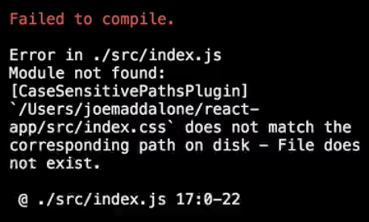

In order to set up an environment for working with **React**, we can use the `create-react-app` package available to us over `npm`. The installation for that is to `npm i`, then `create-react-app`. We'll throw in a tag `-g` there to install that globally. I've already got that installed. I'm going to go ahead and use the tool that is provided to us, which is `create-react-app`.
#### terminal
``` bash
$ npm i create-react-app -g
```
Then we pass in a directory that we'd want to use for our application. In my case, that's simply going to be `react-app`. 

``` bash
$ create-react-app react-app
```
This is going to take a couple of minutes to install. It'll install a series of scripts and a scaffolded application for us. Once that's in place, we'll go ahead and `cd` into our directory. We'll go ahead and load that up into our text editor.

``` bash
$ cd react-app
```
We'll go ahead and run our first script, which is `npm start`, which will launch the scaffolded out application. We can see that in the browser. 

``` bash
$ npm start
```
For the purposes of our lesson, we're going to go ahead and kill off a handful of files. We're going to kill everything except for `index.js` and `App.js` in the source directory and delete those guys.

Then, in our `index.html`, we're going to go ahead and recreate this guy. We're going to start to see some errors here, but that's OK. `index.html`, I'm going to call this guy `React App`. Then I'm going to create a target `<div>` here with an `id` of `root`. This is going to be the target for our components in the DOM.
#### index.html
``` javascript
<html lang="en">
<head>
  <meta charset="UTF-8">
  <title>React App</title>
</head>
<body>
  <div id="root"></div>
</body>
</html>
```
One interesting thing about `create-react-app` is, when we do have an error, we'll see that error right here in the browser. 



We'll also see that here in the terminal. In `App.js`, let's go ahead and kill this guy right now. The error we're seeing is because we deleted the `App.css`. I'm going to go ahead and kill this off right now.

We're going to `import React from 'react'`. Then we're going to create a quick constant variable here called `App`. This is going to be our first component. It's going to output an `<h1>` that says `Hello`. Then we're going to `export` that by `default`. 
#### App.js
``` javascript
import React from 'react';

const App = () => <h1>Hello</h1>

export default App
```
Now we're going to jump over here to our `index.js`. The only real problem that we have right now is that this is importing `index.css`.

Just to talk a moment about what's happening here, we're importing `React`, which is the library that allows us to build React components. We're also importing `ReactDOM`, which is the library that allows us to place our components and work with them in the context of the DOM. Then we're importing the component that we just worked on, the `App` component.
#### index.js
``` javascript
import React from 'react';
import ReactDOM from 'react-dom';
import App from './App';

ReactDOM.render(
  <App />,
  document.getElementById('root')
);
```
We're using `ReactDOM.render` to render that component in its **JSX** format to the target that we created, that `<div>` with an `id` of `root`. If I go ahead and save this, we should be back up and running. We've got `Hello` there. We've also got live reload enabled. If I change this to `Hi`, we'll get a reload right there. We can see our component now renders out `Hi`. We are good to start learning React.