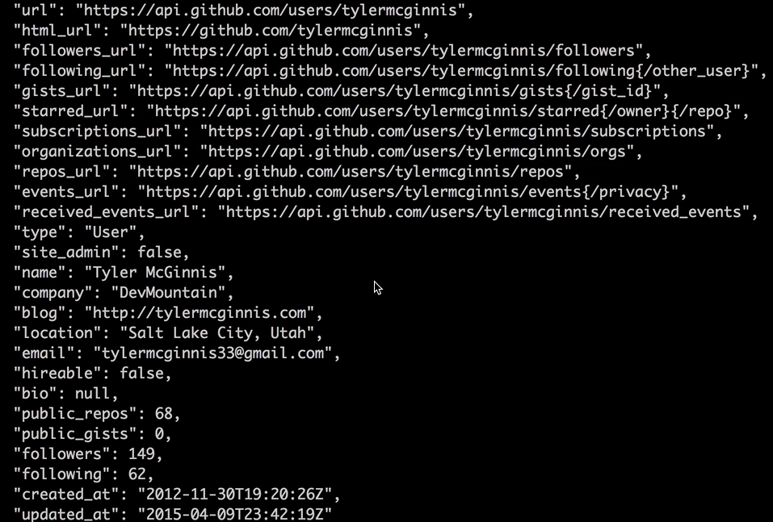

Let's go ahead and make the profile component. I'm going to go ahead to my `Components` folder and create a new file called `Profile.js`, I'm going to `require('react-native')` and also, going to `require` the `Badge` component we just built.

And then, I'm going to use the structuring to get everything I need, `Text`, `View`, `StyleSheet` and `ScrollView`. 

####Profile.js
```javascript
var React = require('react-native');
var Badge = require('./Badge');

var {
    Text,
    View,
    StyleSheet,
    ScrollView
}
```

`ScrollView` is a new one we haven't used yet, a new component we haven't used yet. Basically, what it allows you to do is, it's like view, but it's a view that can scroll, it's pretty straightforward. OK, set my styles. 

```javascript
var styles = StyleSheet.create({
  container: {
    flex: 1
  },
  buttonText: {
    fontSize: 18,
    color: 'white',
    alignSelf: 'center'
  },
  rowContainer: {
    padding: 10
  },
  rowTitle: {
    color: '#48BBEC',
    fontSize: 16
  },
  rowContent: {
    fontSize: 19
  }
});
```

Now, we're going to create our `Profile` class. That, of course, `extends react.Component`, and then we export it.

```javascript
class Profile extends React.Component{
    render(){

    }
};

module.exports = Profile;
```

In our `render` method, what our UI is going to look like. If you remember, it's going to have the `Badge`, and then, it's going to have all of the locations, the followers, the email and the bio of the user we looked up with GitHub.

This is where we were going to use `<ScrollView>`. This `style` is going to be `styles.container`. Now, what we're going to do, we're going to render our first `Badge` component we made.

Remember, we need to pass it the `userInfo`. 

```javascript
class Profile extends React.Component{
    render(){
        <ScrollView style={styles.container}>
            <Badge userInfo={this.props.userInfo} />
        </ScrollView>
    }
};
```

What's interesting is we are taking are most apparent component, which is our main GS component. We're getting the users info, and then, we are passing that all the way down to this `Profile`, but we're also going to pass it down to `Badge`. You can pass data down as deep as you want.

We need to take all of the data that we are getting from GitHub and organize it in a way to looks good on the screen. What I'm going to do is I'm going to come up to the top of render, I'm going to stay inside of render, and I'm going to cache the `userInfo` property, just to save me some typing.

```javascript
class Profile extends React.Component{
    render(){
        var userInfo = this.props.userInfo;

        ...
    }
}
```

Now, if we go and check out what GitHub gives us back, we are in our terminal, we are just going to curl that end point.

####Terminal
```bash
$ curl 'https://api.github.com/user/tylermcginnis'
```

Notice it gives us back a lot of stuff, and a lot of stuff we don't really care about. 



We're not really going to show the ID, we are not going to really show the subscription URL or any of those things.

What we're going to do is we're going to make an array of everything we are interested in getting from that response object, or from the user object we are passing in called `topicArr`. And so, we're interested in the `'company'`, `'location'`, `'followers'`, `'following'`, `'email'`, `'bio'`, as well as the list of `'public_repos'`.

####Profile.js
```javascript
...
render(){
    var userInfo = this.props.userInfo;
    var topicArr = ['company', 'location', 'followers', 'following', 'email', 'bio', 'public_repos' ];
}
...
```

You'll notice here again that all of the strings or properties on the object we are getting back from GitHub. We are going to map to over each one of these items, and create a `<View>` component for each of these items. That way, when we show our list, once we're finished mapping, we'll have almost an array of view components that we can then use down in the `<ScrollView>`.

If you're unfamiliar with `map`, all what allows you to do is it allows you to group over every item in an array, and it modifies that item and returns a new array. We're going to call this variable `list` and it's going to equal our `tipicArr.map`. We're going to use that arrow syntax here. Map gives us the `item`, as well as the `index`.

We're going to check to see `if` the item we're looking for, the very first iteration will be `company`. If user info does not have a `company` property, then, just `return` an empty `<View>`. 

```html
...
var topicArr = ['company', 'location', 'followers', 'following', 'email', 'bio', 'public_repos' ];
var list = topicArr.map((Item, index) => {
    if(!userInfo[item]){
        return <View key={index} />
    }
});
...
```

What happens is a lot of the times, different people fill out their GitHub profile differently.

Some people might include their company, and some people might not, we want to check for that. You'll notice we're using a `key` property on our `return`. Anytime you use `.map`, because react will use these keys to figure out what changed in the list for better optimization.

Each of these items in this list, each of the values you give to the `key` attribute need to be unique so that react can do that dipping. If that part of the user's profile is filled out, what we want to do is then `return` this `<View>`.

It's going to have a `key`, as well, we are going to give it a key of `{index}`. Again, if you're not used to `.map`, all this index is, is the position of whatever iteration we are on.

```html
var topicArr = ['company', 'location', 'followers', 'following', 'email', 'bio', 'public_repos' ];
var list = topicArr.map((Item, index) => {
    if(!userInfo[item]){
        return <View key={index} />
    } else {
        return(
            <View key={index}>

            </View>
        )
    }
});
...
```

On `company`, the index is going to be zero, `location` it's one, `followers` it's two, et cetera. In this view, we're going to have another view, to style as our real container.

Then, we're going to have some `<View>` styles `{styles.rowContainer}`, we're going to have some text style `{styles.rowTitle}`, we're going to leave this `<Text>` blank for now, just to finish off this component. This is going to be `{userInfo[item]}`. 

```html
var list = topicArr.map((Item, index) => {
    if(!userInfo[item]){
        return <View key={index} />
    } else {
        return(
            <View key={index}>
                <View style={styles.rowContainer}>
                    <Text style={styles.rowTitle}> ??? </Text
                    <Text style={styles.rowContent}> {userInfo[item]} </Text>
                </View
            </View>
        )
    }
});
...
```

The goal is to loop through the entire array, and to have the `title` be the item in the array. `company`, `location`, will be written in that first `<Text>` component and then, have the second `<Text>` component be that value. The problem here is, if we just loop through this array, noticed this isn't really formatted the way we want it, especially `public_repos`. We want something like `Public Repos`.

What we're going to do in our first `<Text>` component, is we are going to create a function that'll format our data for us. We're going to say `getRowTitle`, we're going to pass in our `userInfo` object, and then, the specific `item` we are on. 

```html
...
<View style={styles.rowContainer}>
    <Text style={styles.rowTitle}> {this.getRowTitle(userInfo, item)} </Text
    <Text style={styles.rowContent}> {userInfo[item]} </Text>
</View>
...
```

Then what we'll do is up above the `render` function, we'll create a `getRowTitle` function. Pass in the `user`, and the `item`, then, what we want to do is we want to check if the `item` is `public_repos`, because if it's any of the other items in the array, we can just capitalize the first letter, but if it's `public_repos`, we need to strip out the underscore.

We're going to say `item = (item === 'public_repos')`, then, item is going to equal the same thing it is, except we're going to replace the underscore with a space, `? item.replace('_', ' ')` . If it's not, it'll just be item, `: item;`.

```javascript
getRowTitle(user, item){
    item = (item === 'public_repos') ? Item.replace('_', ' ') : item;
}
```

And then, we need to check if the first letter is a thing, or even if item is a thing and it's a string, `item[0]`, then, go ahead and take that first letter, upper case it, `item[0].toUpperCase()`, and tack it on that other word. If it's not, just return item, `item.slice(1) : item;` .

```javascript
getRowTitle(user, item){
    item = (item === 'public_repos') ? Item.replace('_', ' ') : item;
    return item[0] ? item[0].toUpperCase() + item.slice(1) : item;
}
```

Here, what's going to happen is if the word is, "company," we're going to take the C, capitalize it, and then, add on O-M-P-A-N-Y.

Now, we should get the proper title and the proper value. Now, notice that we saved all of these into a `list` variable. This `list` variable is now an array full of `<View>` components. We can do down in `<ScrollView>` is that we just render `{list}` to the screen.

```javascript
<ScrollView style={styles.container}>
    <Badge userInfo={this.props.userInfo} />
    {list}
</ScrollView>
```

So, we should see the badge. Under that, we should see, all laid out, all of the items in our list array. Let's check that now. We enter your username, view profile, and there we go, there's all our information.

