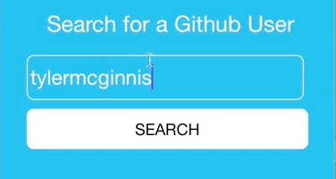
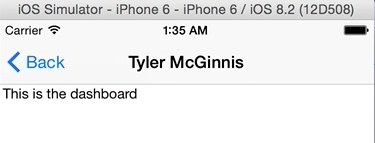
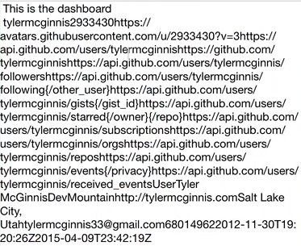

Our dashboard component, there's the image of the user, there's also a view profile button, a view repositories button, and take notes button. All of these will go to different routes, which we'll build later on.

The first thing we need to do is actually build our `Dashboard` component. Let's go to our `Components` file, and create a new file called `Dashboard.js`. Then, just the usual, we're going to `require('react-native')`. We're going to the structural object, which will allow us to get the `Text` component and the `View` component.

####Dashboard.js
```javascript
var React = require('react-native')

var {
    Text, 
    View
} = React;
```

We'll need a few more, but we'll get those later. Then, we're going to go into create a `class` called `Dashboard`, which `extends React.Component`. I always like to do modular exports immediately because I find that's something I always forget. I do that right away so I don't forget that.

```javascript
class Dashboard extends React.Component{

};

module.exports = Dashboard;
```

Inside of render, we're going to `return` what we want the UI to look like. Let's just set it to a `View` for now, with some `Text` inside of it. 

```javascript
class Dashboard extends React.Component{
    render(){
        return (
            <View>
            <Text> </Text>
            </View
        )
    }
};
```

I'm going to go ahead and add some style to this immediately above our `Dashboard` class, 

```javascript
var styles = StyleSheet.create({
  container: {
    marginTop: 65,
    flex: 1
  },
  image: {
    height: 350,
  },
  buttonText: {
    fontSize: 24,
    color: 'white',
    alignSelf: 'center'
  }
});
```

you'll notice we are using style sheets so we'll have to require that as well.

```javascript
var {
    Text, 
    View,
    StyleSheet
} = React;
```

Then, what we'll do is in the `<View>`, we're going to give a `style` of `{styles.container}`.

```javascript
...
    <View style={styles.container}>
...
```

Let's see if this works. Now what should happen is when we click on `HandleSubmit` when we click on the `TouchableHighlight` button, `HandleSubmit` should run. It should make a request to get some GitHub data.

When that data is back, we should go to this new route, `This.props.navigator.push`, which is our `Dashboard` route. Let's see if everything is working.Type in a username, there we go, this is the dashboard. 





One thing we also want to check and you'll notice here is when we initially started first talking about react, we talked about how it was really good at managing state because each component manages its own state and each component can pass any data or even its state down to child's components.

Notice here, in our `Main.js` file, when we go to this new route for the dashboard, we have this response so we're passing in as a property to the dashboard component, `passProps: {userInfo: res}`. What we can do here in `Dashboard.js` now is in order to access the property we passed in, we're going to do `this.props.userinfo` in a new `<Text>` component.

```javascript
class Dashboard extends React.Component{
    render(){
        return (
            <View>
            <Text> This is the dashboard. </Text>
            <Text> {this.props.userInfo} </Text>
            </View
        )
    }
};
```

What this will do is this should be the data from GitHub that we should see rendered. It'll be at jSON, but it will get the point across that we have some data coming from GitHub, let's see if this works now. There we go, there's our data.

