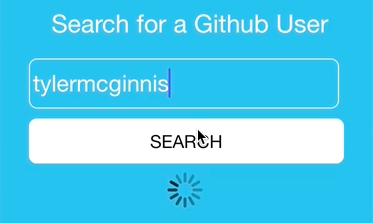
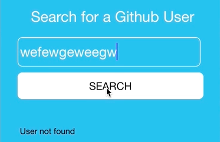

If I search for username, the data's loading when I click Search, but we don't get that loading indicator bar. Even though we have that `isLoading` property on the state object, we're not really using it yet. Another thing, the `Main` component is missing. If I search for a username that's not found, it doesn't give me any feedback. Let's go ahead and add those things.

First, we're going to create a variable in the `render` of the `Main.js` file called `showErr`. What this is going to be is it's going to be a `<Text>` element which will show if there's an error and not show if there's not an error. We're going to say, `this.state.error`, if that's a thing, then `showErr` is going to be this `<Text>` component with the actual name of the error there, `{this.state.error}`. If it's not a thing, then just render this empty `<View></View>`.

#### Main.js
```javascript
var showErr = {
    this.state.error ? <Text> {this.state.error} </Text : <View></View>
};
```

Down in `return`, what we can do is we can throw `showErr` below the `TouchableHighlight` button. 

```html
...
    </TouchableHighlight>
    {showErr}
...
```

Now, if there's an error, this will show with the error message. If there's not, then nothing will show. Also, what we want to do is, earlier we added `ActivityIndicatorIOS` to our requirements. We actually want to use that.

What's going to happen is you'll notice that we're keeping track of this `isLoading` state the whole time. We want to say if `isLoading: true`, go ahead and show this spinner. If it's not, then don't show it.

Down between the `</TouchableHighlight>` and `{showErr}`, we're going to type `ActivityIndicatorIOS`. We're going to give it a few properties like `animating`. `animating` is a Boolean so this is going to be the `true` or `false` and this is what will tackle that if it shows. `color` we'll just set it to a nice `#111`. `size`, let's have it be `large`. Then, we'll end that off.

```html
...
    </TouchableHighlight>
        <ActivityIndicatorIOS
            animating={this.state.isLoading}
            color="#111"
            size="large">
        </ActivityIndicatorIOS>
    {showErr}
...
```

Now, what should happen is we click on our button. It runs `handleSubmit`. That goes and runs the `TouchableHighlight` function. It sets the state loading to `true`. Then, `isLoading` is going to be `true` until we get a response back from our fetch call or our fetch invocation which will then set `isLoading` to `false`, either if there's an error or if the data is correct. Let's see if this works now.

Let's go ahead and search for username. What we expect to see is when I hit Search, we should see a spinning indicator right below the button. There it is. 



Now, if I search for a username that doesn't exist, we should see "user not found." There we go.

