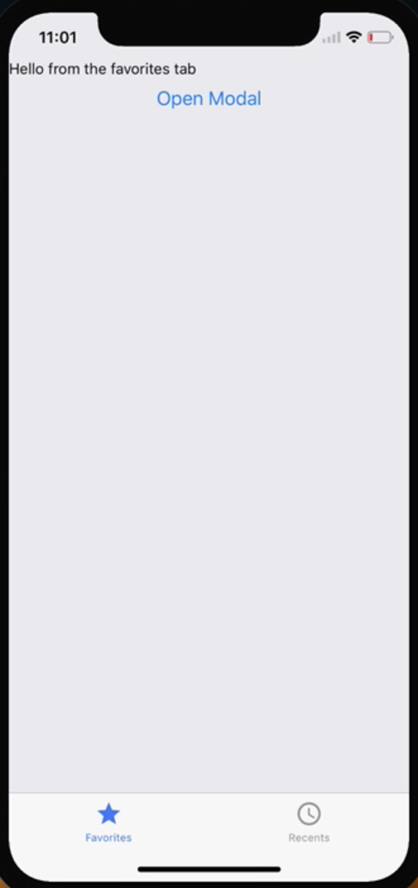
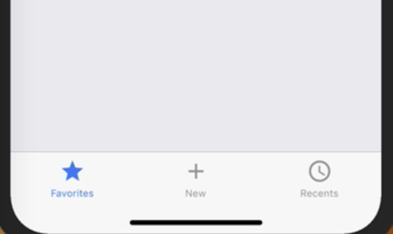

Instructor: [00:00] We're starting off with an application that's using a `TabNavigator` to render two screens -- one being `Favorite`, one being `Recents`.



[00:07] On our Favorite screen, we can go ahead and open a Modal which again is a very basic component. This time it's being rendered via a `StackNavigator` of a `mode` of `modal` which is allowing it to come up from the bottom of the screen.

[00:19] Now what we want to do is replace this button which is allowing us to open the Modal and be able to open it via the tab, or something similar to when you're adding a new picture to Instagram. To do this, what we're going to do is first go up to our `Imports` from React Native and `import` a `View`.

```javascript
import React from 'react';
import { Button, View, SafeAreaView, Text } from 'react-native';
import { StackNavigator, TabNavigator } from 'react-navigation';
import { MaterialCommunityIcons } from '@expo/vector-icons';
```

[00:35] We're then going to go to our `TabNavigator`. We want this to show up between our `Favorites` and our `Recents`, so we'll go between those and add it in here. 

```javascript
const MainApp = TabNavigator({
  Favorites: {
    screen: Favorites,
    navigationOptions: {
      title: 'Favorites',
      tabBarIcon: ({ tintColor }) => <MaterialCommunityIcons color={tintColor} name="star" size={26} />
    },
  },
  New: {
    screen: View,
    navigationOptions: ({ navigation }) => ({
      title: 'New',
      tabBarIcon: ({ tintColor }) => <MaterialCommunityIcons color={tintColor} name="plus" size={26} />,
      tabBarOnPress: () => {
        navigation.navigate('Modal');
      },
    }),
  },
  Recents: {
    screen: Recents,
    navigationOptions: {
      title: 'Recents',
      tabBarIcon: ({ tintColor }) => <MaterialCommunityIcons color={tintColor} name="clock" size={26} />
    },
  },
});
```

We want to specify a key for this screen which is going to be `New`. We're going to specify it a `screen` that should be rendered, and we're just going to `render` a basic `View` because you're not actually going to see the screen at any point.

[00:55] We're then going to specify some `navigationOptions`. Using our `navigationOptions`, we can actually specify a `function` and from this `function` we want to `return` an `object`.

[01:04] We'll specify our title that should be used in the navigation bar which we'll set to `New`. We're also going to specify a `tabBarIcon` and this `tabBarIcon` is coming from the `MaterialCommunityIcons` which is via ExpoVectorIcons.

[01:18] Now what's really interesting is our `tabBarOnPress` which allows us to actually override what happens when this `tabBar` item is pressed. When this happens, what we're going to do is actually -- from our `navigationOptions` -- our first argument, we can go ahead and destructure it and access `navigation` just like we would on a normal screen.

```javascript
  New: {
    screen: View,
    navigationOptions: ({ navigation }) => ({
      title: 'New',
      tabBarIcon: ({ tintColor }) => <MaterialCommunityIcons color={tintColor} name="plus" size={26} />,
      tabBarOnPress: () => {
        navigation.navigate('Modal');
      },
    }),
```

[01:39] Now from within our `tabBarOnPress`, we can say `navigation.navigate` and we can specify the screen we want opened which is going to be `Modal`. Again, we've got access to our parent screens that are registered in parent navigators.

[01:53] Now when we save this, the application's going to re-render, and you can see that we've got this new item down here. 



We go to Favorites, it goes to Favorites. If we go to Recents, it goes to Recents. If we press New, it'll go ahead and open up that Modal from the bottom like we would expect it to, like it did when we had the button on our Favorites screen.